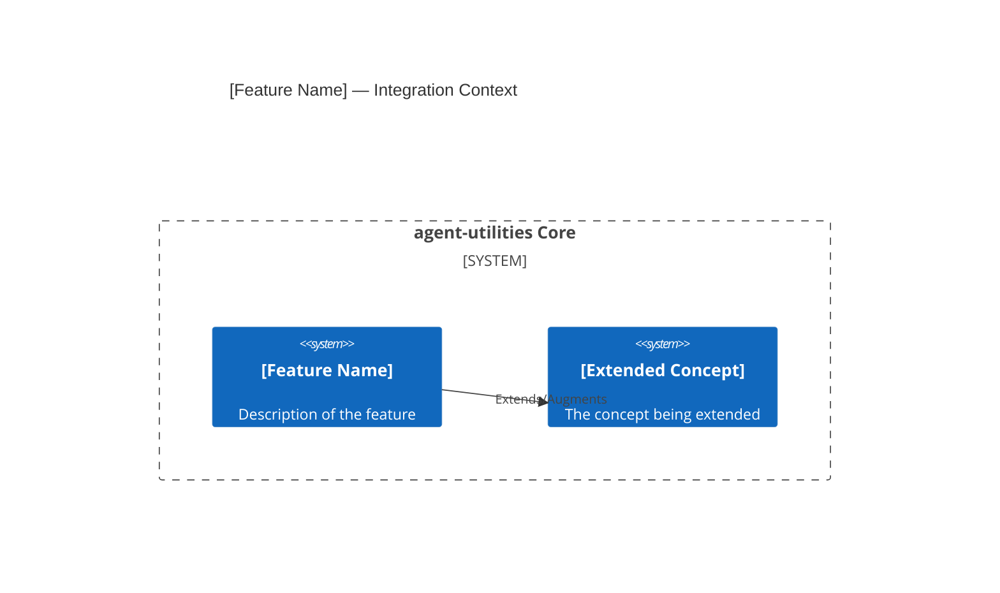

# Design Document: [Feature Name]

> Every feature begins with a design document. This gates creation through
> the Knowledge Graph to enforce the **Extend-Before-Invent** principle.

## KG Analysis (Required)

<!-- The agent MUST complete this section before creating a spec -->

### Nearest Existing Concepts

<!-- Run: kg_search("<feature description>", top_k=5) -->

| Concept ID | Name | Similarity | Pillar |
|---|---|---|---|
| | | | |

### Extension Analysis

<!-- Which existing concept/pillar can be extended? -->

- **Primary Extension Point**: [CONCEPT:ID — leave blank if none found]
- **Extension Strategy**: [augment | compose | specialize | new]
- **New Concept Required?**: [Yes/No — if Yes, fill New Concept Proposal below]

### New Concept Proposal (Only if extension is impossible)

> ⚠️ Only fill this section if NO existing concept can be extended.
> The Knowledge Graph is the arbiter — if similarity ≥ 70% to an existing
> concept, you MUST extend rather than create new.

- **Proposed ID**: CONCEPT:[PILLAR]-[N.NN]
- **Augments Pillar**: [ORCH | KG | AHE | ECO | OS]
- **15-Phase Pipeline Integration**: [Which phase(s) this wires into]
- **Justification**: [Why this cannot be expressed as an extension]

## C4 Context Diagram

<!-- Mermaid C4 showing where this feature integrates into the 5-pillar topology -->

## Data Flow

<!-- How data flows through the 5 pillars for this feature -->

1. **ORCH**: How does the orchestrator discover/invoke this feature?
2. **KG**: What nodes/edges does this feature read/write?
3. **AHE**: Does this feature participate in self-improvement cycles?
4. **ECO**: Is this exposed as an MCP tool or A2A capability?
5. **OS**: What guardrails/policies govern this feature?

## Risk Assessment

- **Blast Radius**: [Which existing modules are affected by this change]
- **Backward Compatible**: [Yes/No]
- **Breaking Changes**: [List any breaking changes]
