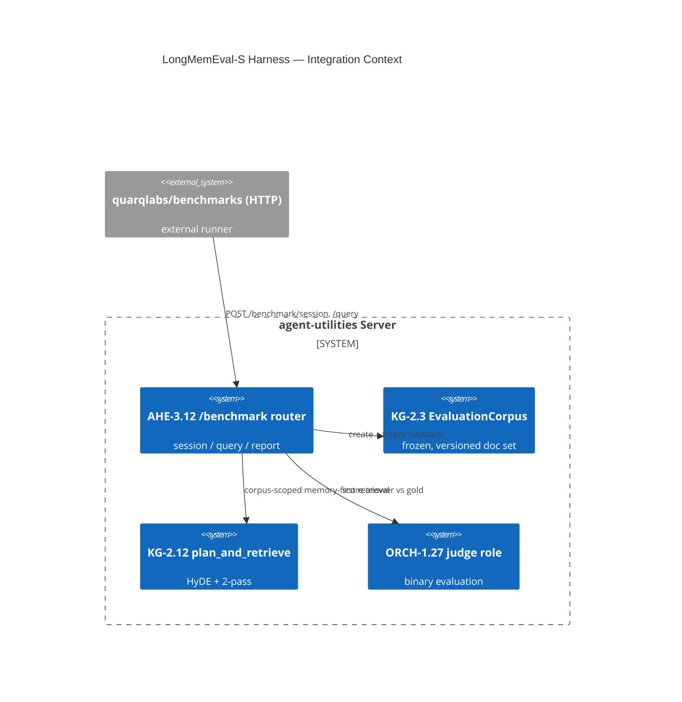

# Design Document: LongMemEval-S Validation Harness (AHE-3.12)

> A FastAPI `/benchmark` surface + frozen evaluation corpus + CI floor gate that lets us prove the
> memory-first synergy (ORCH-1.27 + KG-2.11/2.12/2.13) meets or beats Quarq's 98.2% on
> LongMemEval-S — driven by Quarq's own HTTP benchmark runner (`quarqlabs/benchmarks`) pointed at
> our server unmodified.

## Research Provenance

| Source | Location | Behavior | Our upgrade |
|---|---|---|---|
| Quarq benchmark runner | `quarqlabs/benchmarks` (HTTP) | POSTs sessions + questions to a FastAPI server, judges with an LLM | Same HTTP contract; our corpus is **frozen + versioned** (`EvaluationCorpus`) so runs are reproducible (Quarq re-derives FAISS each run) |
| Eval pipeline | article "Evaluation Pipeline" | wipe → feed haystack (8-msg chunks) → sync learning → ask → judge | Haystack chunks ingested as **episodic** memory (KG-2.11); learning via KG-2.13; per-question provenance persisted |

## KG Analysis (Required)

### Nearest Existing Concepts

| Concept ID | Name | Similarity | Pillar |
|---|---|---|---|
| KG-2.3 | Unified Retrieval (EvaluationCorpus) | 0.78 | KG-2 |
| AHE-3.4 | Query Decomposition / eval | 0.74 | AHE-3 |
| AHE-3.2 | Agentic Evolution | 0.70 | AHE-3 |
| KG-2.6 | Retrieval Quality Gate (nDCG) | 0.69 | KG-2 |
| KG-2.12 | Memory-First Retrieval | 0.66 | KG-2 |

### Extension Analysis

- **Primary Extension Point**: `AHE-3.2`/`AHE-3.4` (evaluation/evolution) — similarity ≥ 0.70, MUST extend.
- **Reuses**: `evaluation_corpus.CorpusManager` (create/freeze/get_document_ids), the KG-2.12 pipeline, the KG-2.6 `compute_ndcg`, the ORCH-1.27 `judge`/`generator` roles, the `server/routers/core.py` router pattern.
- **Extension Strategy**: `augment` — one new FastAPI router + pure scoring helpers + a CI gate script.
- **New Concept Required?**: Yes — `AHE-3.12`, sub-concept of AHE-3, as the standalone reusable LongMemEval harness (per user decision: standalone harness feature).

### New Concept Proposal

- **Proposed ID**: `CONCEPT:AHE-3.12`
- **Augments Pillar**: AHE (+KG-2 retrieval)
- **15-Phase Pipeline Integration**: Governance phase (validation gate).
- **Justification**: Distinct, reusable evaluation surface measuring the memory-first stack end-to-end against an external benchmark; not expressible as a retrieval or evolution concept alone.

## C4 Context Diagram

## Data Flow

1. **ORCH**: `/benchmark/query` runs the KG-2.12 pipeline; the `generator` role synthesizes, the `judge` role scores.
2. **KG**: `/benchmark/session` ingests haystack messages as episodic memory and freezes a corpus; per-question results persist as provenance.
3. **AHE**: The accuracy report is the validation signal for the whole synergy epic.
4. **ECO**: Exposed as FastAPI routes mounted in `build_agent_app` — Quarq's HTTP runner targets them directly.
5. **OS**: `scripts/check_longmemeval.py` gates CI on a frozen subset floor (default 95%); full 500-q run is nightly/on-demand.

## Risk Assessment

- **Blast Radius**: new `server/routers/benchmark.py`, one `include_router` line in `server/app.py`, `routers/__init__.py` export, new `scripts/check_longmemeval.py`. Additive.
- **Backward Compatible**: Yes — new routes only.
- **Breaking Changes**: None.

## Wiring (Wire-First, ≤3 hops)

- HTTP `POST /benchmark/query` → router → `engine.search_hybrid(mode="hyde")` → `plan_and_retrieve` ≤ 3 hops.
