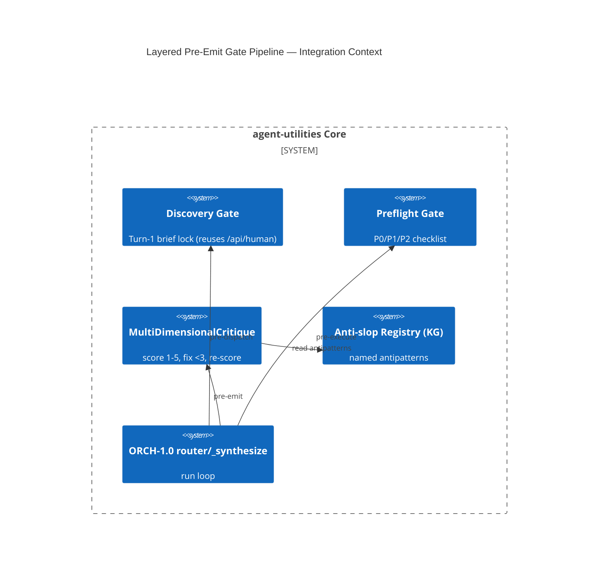

# Design Document: Layered Pre-Emit Gate Pipeline (AU-AHE.harness.pre-emit-quality-gate)

> Assimilates open-design's quality culture as a wired-in pipeline: **discovery-form brief lock →
> P0/P1/P2 preflight checklist → 5-dimensional self-critique (score 1–5, fix any <3, re-score)**,
> composed via a documented **dominant-layer prompt precedence**, reading a KG-stored **anti-slop
> antipattern registry**. No output escapes the loop without passing. Part of EPIC 3 (Quality Gates).

## Research Provenance

| Source | Location | Behavior assimilated |
|---|---|---|
| open-design discovery + critique | `apps/daemon/src/prompts/discovery.ts:40-127,217-232` | Turn-1 question form; P0/P1/P2 preflight; 5-dim critique with re-score loop |
| open-design prompt precedence | `apps/daemon/src/prompts/system.ts:8-29`; `deck-framework.ts` | Documented layer order; hard rules beat soft; mode-framework pinned last |
| open-design anti-slop list | `apps/daemon/src/prompts/discovery.ts:258-270` | Named reject patterns + honest-placeholder rule |

**Superiority delta:** open-design's gates are **prompt-only** — they live in a system prompt and are
trusted to self-apply. agent-utilities makes them **executable gates wired into the run loop** whose
pass/fail scores are **persisted and fed to the evolution engine (AHE-3.2)**, so the gates themselves
improve over time and the antipattern registry is a queryable KG asset, not static prose.

## KG Analysis (Required)

### Nearest Existing Concepts
<!-- kg_search("preflight checklist multi-dimensional self critique quality gate before output", top_k=5) -->

| Concept ID | Name | Similarity | Pillar |
|---|---|---|---|
| AHE-3.1 | Continuous Evaluation / Adversarial Verification | 0.66 | AHE-3 |
| AHE-3.0 | Agentic Harness Core | 0.58 | AHE-3 |
| AU-OS.governance.reactive-multi-axis-budget | Guardrails & Safety Boundaries | 0.49 | OS-5 |
| ORCH-1.0 | Core Orchestration Engine | 0.40 | ORCH-1 |
| KG-2.0 | Active Knowledge Graph | 0.33 | EG-KG.compute.backend |

> Highest 0.66 < 0.70 → **new concept justified**. AHE-3.1 evaluates *after* a run for learning; AU-AHE.harness.pre-emit-quality-gate
> is a *blocking pre-emit pipeline* (discovery + checklist + critique composition) that gates output. The
> `MultiDimensionalCritique` class is implemented as an **extension of AHE-3.1**, but the layered gate
> composition is the new concept.

### Extension Analysis
- **Primary Extension Point**: `AHE-3.1` (`harness/evaluation_engine.py`) for the critique; `ORCH-1.0` router seam for the discovery/preflight gates.
- **Extension Strategy**: `augment` AHE-3.1 with `MultiDimensionalCritique`; `compose` the three stages into a pipeline.
- **New Concept Required?**: Yes (the layered composition + dominant-layer precedence).

### New Concept Proposal
- **Proposed ID**: `CONCEPT:AU-AHE.harness.pre-emit-quality-gate`
- **Augments Pillar**: AHE (hooks ORCH-1.0 router + KG-2.0 storage)
- **15-Phase Pipeline Integration**: Phase 1 (Discovery gate, pre-dispatch) + Phase 4 (pre-emit critique).
- **Justification**: A blocking, multi-stage, re-scoring pre-emit gate with documented prompt-layer precedence is distinct from post-hoc evaluation.

## C4 Context Diagram

## Data Flow
1. **ORCH**: discovery gate sits between `router_step`→`dispatcher_step`; preflight in `executor` pre-execute; critique at `parallel_engine._synthesize` before return.
2. **KG**: antipattern registry stored/queried in KG-2.0; critique scores persisted as nodes.
3. **AHE**: critique scores feed the eval/evolution engine (AHE-3.1/3.2) — gates self-improve.
4. **ECO**: per-skill `critique.policy` (E5) toggles the critique stage; discovery reuses `/api/human` forms.
5. **OS**: a failing P0 (blocking) short-circuits emit; guardrail integration (AU-OS.governance.reactive-multi-axis-budget).

## Risk Assessment
- **Blast Radius**: new `harness/preflight_gate.py`, `harness/evaluation_engine.py` (+`MultiDimensionalCritique`), `graph/_router_impl.py` (gate seam), `graph/parallel_engine.py` (`_synthesize` hook). Touches the hot path → must be feature-flagged and default-on-soft (warn) before default-on-block.
- **Backward Compatible**: Yes when gates default to `warn`; `block` mode opt-in per policy/skill.
- **Breaking Changes**: None in `warn` mode; `block` can change outputs (intended).

## Wiring (Wire-First, ≤3 hops)
- `graph_orchestrate` → `router_step` → discovery gate = **2 hops**.
- run loop → `_synthesize` → critique = **2 hops**.
