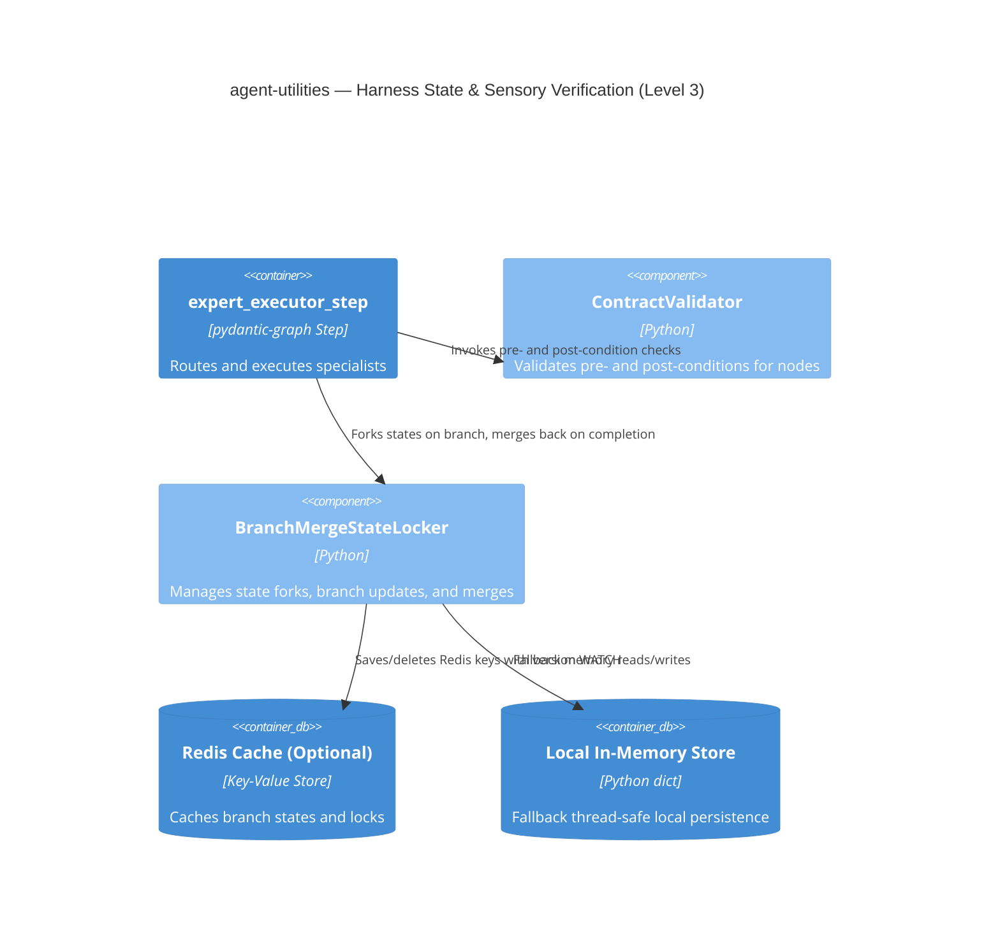

# Design: Transactional State Manager and Sensory Validation (CONCEPT:AU-AHE.evaluation.backtest-harness)

## 1. Context & Motivation

This document details the architectural design for extending `agent-utilities` with stateful harness capabilities inspired by **arXiv:2605.18747**.

Specifically, we address two high-priority structural gaps:
1. **Transactional State Convergence (`BranchMergeStateLocker`)**: Introducing git-like parallel state branching and three-way merging to resolve race conditions in concurrent multi-agent workspaces.
2. **Sensory Execution Verification (`ContractValidator`)**: Implementing declarative pre-conditions and post-conditions for execution nodes to ensure safety and system correctness under sandbox constraints.

---

## 2. Component Diagram (C4 Level 3)

---

## 3. High-Level Design (Pillar Integration)

### 3.1 BranchMergeStateLocker
The `BranchMergeStateLocker` inherits from `OptimisticStateLocker` to preserve all existing locking functionality. It adds three core abstractions:
* **Fork**: Creates a staged parallel state copy associated with a unique branch name.
* **Update**: Modifies the branched state independently from the main thread.
* **Merge**: Integrates branch changes back to the base branch, executing three-way recursive merges and custom conflict resolvers.

### 3.2 ContractValidator
The `ContractValidator` registers a schema contract (`ToolContract`) per step/node. During execution:
* **Pre-Check**: Asserts environmental conditions before launching an agent.
* **Post-Check**: Asserts structural and logical criteria against output schemas (using Pydantic validation) before propagating state transitions.

---

## 4. Concurrency Model Decision

We implement a **hybrid Redis/Local memory model**. State branches are kept lightweight and fast in memory/Redis hash structures, bypassing disk-write delays. Physical file modification (source code files) remains backed by traditional git/filesystem operations.
