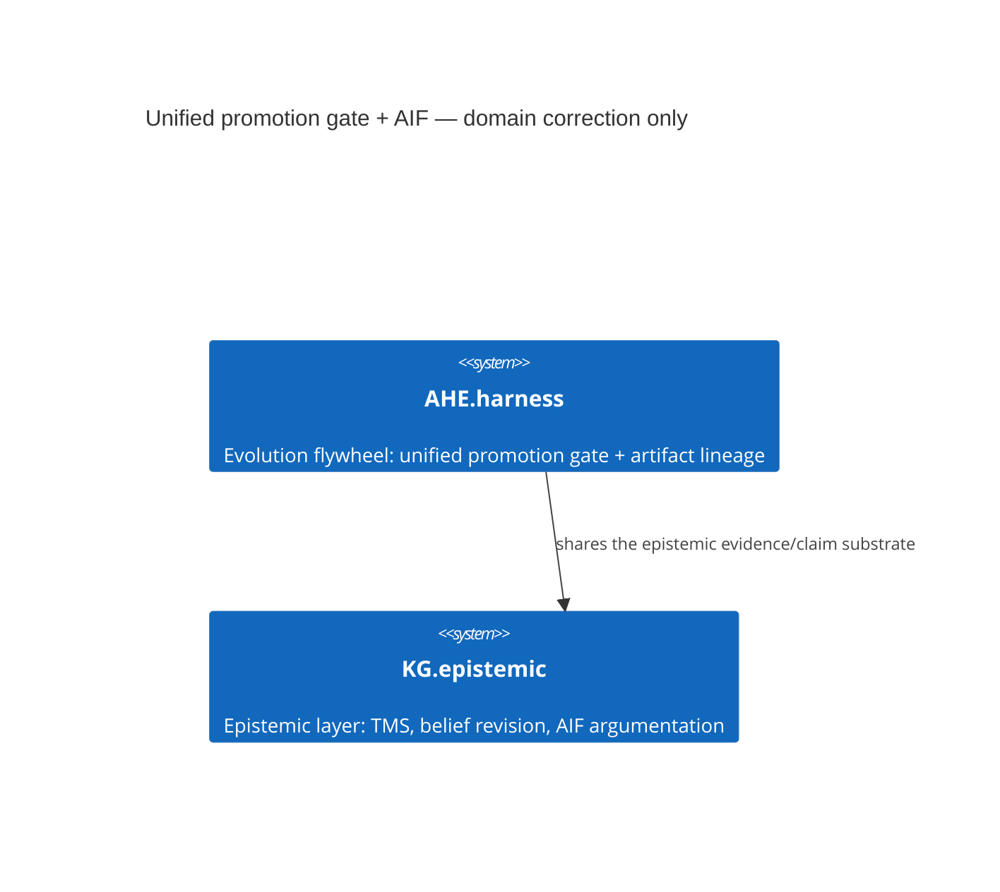

# Design Document: Closed-vocab domain fix for the unified promotion gate + AIF markers

> Every feature begins with a design document. This gates creation through
> the Knowledge Graph to enforce the **Extend-Before-Invent** principle.

## Context

`scripts/check_domain_vocab.py` (`agent_utilities/governance/domain_vocab.yaml`)
enforces a CLOSED domain vocabulary per pillar: a concept id's `<domain>`
segment must be a curated, registered domain — never minted ad hoc. Three
existing markers had minted their domain directly from a vocabulary
*signal* keyword instead of the domain it maps to:

- `AU-AHE.evolution.unified-promotion-gate` / `AU-AHE.evolution.unified-artifact-lineage`
  used `evolution` as a domain name, but `domain_vocab.yaml` only lists
  `evolution`/`evolve` as **signal keywords** under the real closed domain
  `AU-AHE.harness`.
- `AU-KG.argumentation.aif` used `argumentation` as a domain name, but
  `domain_vocab.yaml` only lists `argumentation` as a **signal keyword**
  under the real closed domain `AU-KG.epistemic`.

This is not a new feature — it is a mechanical rename to the domain the
vocabulary already maps these concepts to, closing a
`check_domain_vocab.py` violation. Recorded here because
`check_concept_governance.py` treats any textually-new `CONCEPT:` id
(including a rename) as requiring a referencing design document.

## KG Analysis (Required)

### Nearest Existing Concepts

| Concept ID | Name | Similarity | Pillar |
|---|---|---|---|
| `AU-AHE.harness.capability-ratchet` | Capability Ratchet | 0.70 | AHE |
| `AU-KG.epistemic.paraconsistent-tms` | Paraconsistent TMS | 0.65 | KG |

### Extension Analysis

- **Primary Extension Point**: `AU-AHE.harness` / `AU-KG.epistemic` — both are
  the already-registered closed-vocab domains these concepts' own signal
  keywords (`evolution`/`evolve`, `argumentation`) map to.
- **Extension Strategy**: `augment` — same concept, corrected domain segment.
- **New Concept Required?**: No.

### Renamed Concepts

- `AU-AHE.evolution.unified-promotion-gate` → `AU-AHE.harness.unified-promotion-gate`
  (`agent_utilities/orchestration/artifact_promotion.py`,
  `agent_utilities/orchestration/action_policy.py`,
  `agent_utilities/harness/evolve_agent.py`,
  `agent_utilities/knowledge_graph/research/auto_merge.py`,
  `agent_utilities/knowledge_graph/research/skill_evolution.py`) — the
  single unified gate an artifact (skill/prompt/policy candidate) must pass
  before promotion out of the evolution flywheel.
- `AU-AHE.evolution.unified-artifact-lineage` → `AU-AHE.harness.unified-artifact-lineage`
  (`agent_utilities/models/knowledge_graph.py`,
  `agent_utilities/knowledge_graph/research/evolution_state.py`) — the
  cross-vector artifact-version lineage record read by the promotion gate.
- `AU-KG.argumentation.aif` → `AU-KG.epistemic.aif`
  (`agent_utilities/knowledge_graph/argumentation/__init__.py`,
  `agent_utilities/knowledge_graph/argumentation/aif.py`,
  `agent_utilities/mcp/tools/argument_tools.py`) — Argument Interchange
  Format (AIF) support for representing argumentation structures
  (claims/premises/attacks) in the epistemic layer.

## C4 Context Diagram

