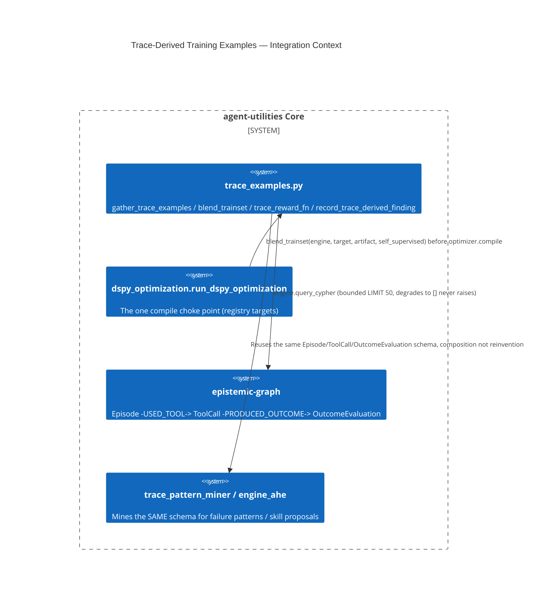

# Design: KG-Trace-Derived DSPy Training Examples (CONCEPT:AU-AHE.optimization.trace-derived-training-examples)

> Closes a cohesive-loop gap in the DSPy optimization subsystem: the observability
> flywheel already mines `:Episode -[:USED_TOOL]-> :ToolCall -[:PRODUCED_OUTCOME]->
> :OutcomeEvaluation` provenance for FAILURE patterns
> (`knowledge_graph/research/trace_pattern_miner.py`,
> `knowledge_graph/orchestration/engine_ahe.py::propose_new_skill_from_experience`), but
> the DSPy optimizer (`harness/dspy_optimization.py`) only ever compiled against
> self-supervised / synthetic trainsets — `make_optimization_metric`'s own
> `reward_fn`/`reward_weight` parameters existed but no caller ever passed them.

## KG Analysis (Required)

### Nearest Existing Concepts

| Concept ID | Name | Similarity | Pillar |
|---|---|---|---|
| AU-AHE.optimization.optimizable-target-registry | Optimizable-target registry + generalized DSPy driver | high (same module, same compile call) | AU-AHE |
| AU-AHE.optimization.real-optimization-metric | Real optimization metric (graded, reward-blendable) | high (the `reward_fn`/`reward_weight` params this closes the loop on already existed here) | AU-AHE |
| AU-AHE.optimization.candidate-replaces-incumbent-only | Scheduled sweep + promotion gate | medium (same propose-only/never-auto-apply posture) | AU-AHE |
| AU-AHE.harness.harness-evolution | Agentic Harness Engineering (evolution loop) | medium (the loop this closes a gap in) | AU-AHE |

### Extension Analysis

- **Primary Extension Point**: CONCEPT:AU-AHE.optimization.optimizable-target-registry
  (`harness/dspy_optimization.py::run_dspy_optimization`) — the one compile choke point every
  registry-target caller (`EvolveAgent._dspy_optimize_cluster`, `EvolveAgent.harden_agent_prompt`)
  already goes through.
- **Extension Strategy**: compose — a new sibling module (`harness/trace_examples.py`) that reads
  the SAME `Episode`/`ToolCall`/`OutcomeEvaluation` schema `trace_pattern_miner` and `engine_ahe`
  already mine, over the SAME `engine.query_cypher` surface every other KG-reading optimizer helper
  uses (`gather_optimization_data`), and is called from inside `run_dspy_optimization` before
  `optimizer.compile`. No new trace store, no new LLM call, no bypass of the endpoint-safe DSPy LM
  adapter (`dspy_lm_adapter.dspy_optimization_guard`).
- **New Concept Required?**: Yes — the behavior (trace-observed reward becomes optimizer training
  signal) is new even though it composes entirely with existing infrastructure; it is not a pure
  augmentation of the registry concept's existing scope (compile mechanics), it is a new *data
  source* for that compile.

### New Concept Proposal

- **Proposed ID**: CONCEPT:AU-AHE.optimization.trace-derived-training-examples
- **Augments Pillar**: AHE
- **15-Phase Pipeline Integration**: Evolution / self-improvement loop (Evaluate → Distill →
  Optimize phases) — feeds the Optimize phase's trainset from the Evaluate phase's own outcome
  ledger, closing the loop instead of leaving it one-directional.
- **Justification**: A failing (or passing) production trace attributed to a prompt/tool/skill
  becomes a labeled negative/positive `dspy.Example` with a real reward, not a synthetic one — this
  is a genuinely new capability (traces → training signal), expressed as composition over existing
  primitives rather than new infrastructure.

## C4 Context Diagram

## Data Flow

1. **ORCH**: No new orchestrator surface — reached transparently through the existing
   `graph_orchestrate action=optimize_component` / evolution-cycle callers of
   `run_dspy_optimization` (`EvolveAgent._dspy_optimize_cluster`,
   `EvolveAgent.harden_agent_prompt`).
2. **KG**: Reads `:Episode -[:USED_TOOL]-> :ToolCall -[:PRODUCED_OUTCOME]-> :OutcomeEvaluation`
   (tool-attributed) and `:Episode` tagged by skill/agent name (`e.tags`) joined to the same
   outcome edge. Best-effort writes one `:DSPyTraceOptimizationFinding` node per pass
   (`record_trace_derived_finding`, via `engine.add_node` when supported).
3. **AHE**: Directly participates in the self-improvement loop — a real `OutcomeEvaluation.reward`
   now steers `make_optimization_metric`'s blend (`reward_fn=trace_reward_fn`,
   `reward_weight=0.3` when traces were found), and a failing trace becomes a labeled negative
   few-shot-adjacent example (blank response, `failure_reason` populated) that `BootstrapFewShot`
   can never mistake for a demonstration to imitate.
4. **ECO**: No new MCP/A2A surface — transparent to `graph_orchestrate action=optimize_component`
   and the `KG_DSPY_OPTIMIZATION` scheduled tick, both already exposed.
5. **OS**: No new config surface; `engine` is optional and DEFAULT-ON (resolves
   `IntelligenceGraphEngine.get_active()` when a caller doesn't thread one through), and both
   `EvolveAgent` call sites thread `self.knowledge_engine` explicitly.

## Endpoint safety

`trace_examples.py` only ever reads the graph and builds plain Python/`dspy.Example` data — it
makes **no LLM call**. The compile itself continues to run under
`dspy_lm_adapter.dspy_optimization_guard` exactly as before; this design adds a data source, not a
new execution path.

## Status

Implemented: `agent_utilities/harness/trace_examples.py` (`TraceExample`, `gather_trace_examples`,
`blend_trainset`, `trace_reward_fn`, `record_trace_derived_finding`), wired into
`agent_utilities/harness/dspy_optimization.py::run_dspy_optimization` (blends before
`optimizer.compile`, defaults the metric's `reward_fn` to `trace_reward_fn`). Covered by
`tests/unit/harness/test_trace_examples.py`. Documented in
`docs/architecture/evolvable_surface.md` ("Closing the loop — trace-derived training examples").
