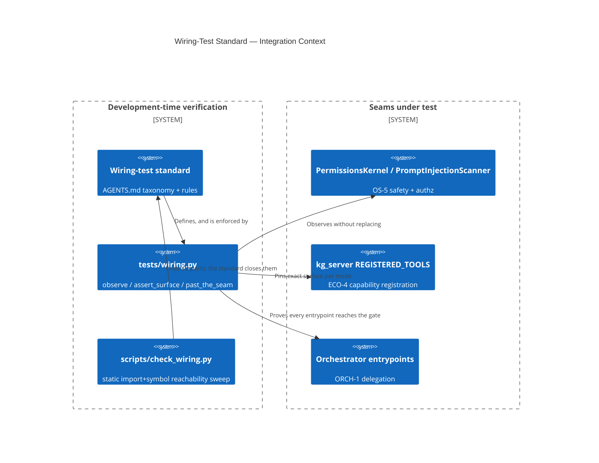

# Design Document: Wiring-Test Standard (AU-AHE.evaluation.wiring-test-taxonomy)

> A four-level test taxonomy — **unit / wiring / contract / live-path** — written into `AGENTS.md`,
> plus an executable helper kit (`tests/wiring.py`) that makes a *wiring* test as cheap to write as
> a unit test. The operator's ask: *"we really need to fully adopt a design that tests the intricate
> wiring between concepts and components."*

## Problem

Six capabilities shipped **built, unit-tested, and unreachable** — `security/guardrails.PolicyEngine`
(in the safety layer, zero live callers), KV forking (no caller ever passed `kv_page_keys`),
`graph_mine(ocel_mode="mine")` (built a `ChangeEnvelope` and discarded it),
`AdmissionPolicy.decide`, the reasoning-topology package, `NeuralRelationPrediction`. Each passed
every test it had, because every test it had was a *unit* test — and a unit test makes **no claim
about reachability**. Three further mechanisms manufacture green signal for code that never runs
(test files outside `pytest.ini` `testpaths`; `MagicMock(spec=[])` standing in for a module that may
not exist; tests gated behind optional extras CI never installs), and a public-contract regression
(118 MCP tools served instead of ~11, all five fleet meta-tools missing) sailed through a merge gate
with 9,922 passing tests because **nothing asserted what we expose**.

The common root is a missing vocabulary: the repo had one word, "test", for four different claims.

## KG Analysis (Required)

### Nearest Existing Concepts
<!-- kg_search("test that proves a component is invoked from a live entrypoint, contract test for a public surface", top_k=5) -->

| Concept ID | Name | Similarity | Pillar |
|---|---|---|---|
| `AU-AHE.evaluation.reads-avoided-feedback` | retrieval-quality feedback loop | 0.41 | AU-AHE |
| `AU-AHE.assimilation.baseline-overfit-gate` | evaluation-corpus overfit ratchet | 0.38 | AU-AHE |
| `AU-OS.safety.prompt-injection-scanner` | live safety gate (a *subject* of the standard) | 0.31 | AU-OS |
| `AU-ECO.mcp.tool-mode-standardization` | one surface builder per `MCP_TOOL_MODE` | 0.30 | AU-ECO |
| `AU-ECO.mcp.intent-surface-condensed-collapse` | the intent surface this standard pins | 0.29 | AU-ECO |

> Highest 0.41 < 0.70 → **new concepts justified**. Every neighbour is a *runtime* evaluation or
> gating mechanism; none is a **development-time verification discipline**. The existing Wire-First
> section in `AGENTS.md` is prose guidance with no executable form and no vocabulary distinguishing
> the claims different tests can make.

### Extension Analysis
- **Primary Extension Point**: the existing `AGENTS.md` *Wire-First — reachable ≠ invoked* section
  (extended in place — not a rival section) and `scripts/check_wiring.py` (referenced, not changed).
- **Extension Strategy**: `specialize` — Wire-First states *that* a live caller must exist; this
  states **what test proves it**, and ships the primitives.
- **New Concept Required?**: Yes — three, all in `AU-AHE.evaluation`.

### New Concept Proposal
- `CONCEPT:AU-AHE.evaluation.wiring-test-taxonomy` — the four-level taxonomy and the honest claim
  each level can make. Marker lives in the exemplar wiring tests it governs.
- `CONCEPT:AU-AHE.evaluation.live-path-probe` — `tests/wiring.py`'s `observe`/`observe_all`/
  `past_the_seam`: a **pass-through recorder** that leaves the production implementation running, so
  a test can assert a seam was *reached* without mocking it. This is the primitive that did not
  exist; `unittest.mock.patch` replaces the seam and therefore can only prove that the test's own
  mock was called.
- `CONCEPT:AU-AHE.evaluation.surface-contract-test` — `assert_surface`: exact-set pinning of a
  public surface with an `invariant=` subset for members that must survive **every** mode/profile
  (the five fleet meta-tools), parameterisation labelling, and an actionable missing/unexpected diff.

## C4 Context Diagram

## Data Flow

1. **ORCH**: the delegation exemplar drives every public `Orchestrator` coroutine that accepts a
   task and asserts each reaches the real `PromptInjectionScanner.scan_text`; a coverage guard fails
   when a new entrypoint appears that is not in the parameterised list.
2. **KG**: none at runtime — this is development-time. The concepts are ingested like any other, so
   `graph_code` can answer "which seams have wiring tests?" from the `CONCEPT:` markers.
3. **AHE**: the taxonomy is the vocabulary the evolution/assimilation pipeline uses when it judges
   whether a generated capability is "done"; `check_wiring.py`'s ratchet is its static counterpart.
4. **ECO**: the contract exemplar pins `kg_server.REGISTERED_TOOLS` — the dispatch registry behind
   both the MCP tools and the whole REST route table — as mode-**in**dependent, complementary to the
   *served*-surface contract test (`tests/unit/mcp/test_served_tool_surface.py`).
5. **OS**: the safety exemplar proves `create_agent` reaches a real `PermissionsKernel` and that a
   tampered identity fails closed — the authorization boundary for every MCP tool an agent can call.

## Boundary against the static-gate lane

`fix/wire-first-reachability-gate` owns **static** detection: AST/import-graph sweeps in
`scripts/check_wiring.py` (`--check-symbol-reachability`, `--check-test-collection`,
`--check-mock-hygiene`, `--check-extras-gating`) ratcheted against a baseline. It answers *"is there
a suspect?"* over the whole repo, cheaply, with a known false-positive rate.

This lane owns **dynamic proof**: the taxonomy, the helper kit, and exemplar tests that execute the
live path. It answers *"is this specific edge real?"* — the question a static tool cannot answer,
because an import edge proves loadability and never invocation.

They compose: the gate produces the worklist, the standard says what closes an item. Neither
subsumes the other, and neither is live validation.

## Risk Assessment

- **Blast Radius**: additive. One `AGENTS.md`/`AGENTS.head.md` section replaced in place, one new
  test-only module (`tests/wiring.py`, not shipped in the package), three new test files. No
  production code changed, no new dependency (stdlib + pytest only).
- **Backward Compatible**: Yes.
- **Breaking Changes**: none. The superseded five Wire-First steps are all preserved inside the new
  rules (trace the path → rule 1; default ON → rule 4; live-path test → rule 1 + the taxonomy;
  `check_wiring.py` + its blind spots → "The ceiling"; no silent storage → rule 7).
- **Known limitation, stated in the standard itself**: a wiring test proves an *edge* under real
  construction. It is not live validation — real transports, auth, engines and serialisation are
  only proven by running the thing.
