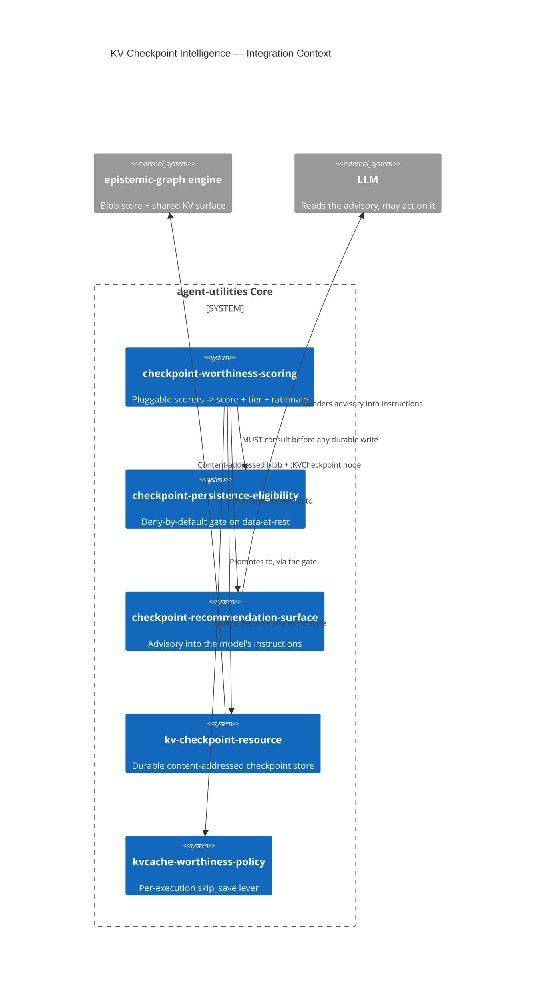

# Design Document: KV-Checkpoint Intelligence

> Checkpoint the LLM's KV cache at *good moments*, chosen by the agent, the user, or the
> system — and decide, under governance, whether such a checkpoint may outlive the session.
>
> Concepts introduced: `CONCEPT:AU-KG.memory.checkpoint-worthiness-scoring` ·
> `CONCEPT:AU-OS.governance.checkpoint-persistence-eligibility` ·
> `CONCEPT:AU-ORCH.optimization.checkpoint-recommendation-surface`.

## KG Analysis (Required)

### Nearest Existing Concepts

| Concept ID | Name | Similarity | Pillar |
|---|---|---|---|
| `AU-ORCH.optimization.kvcache-worthiness-policy` | per-execution KV store-worthiness (`skip_save` lever) | ~70% | ORCH |
| `AU-KG.memory.kv-checkpoint-resource` | KV checkpoints as content-addressed graph resources | ~65% | KG |
| `AU-KG.backend.kvcache-vllm-connector` | `EpistemicGraphKVBackend`, the L2 store + snapshot/fork | ~45% | KG |
| `AU-ORCH.optimization.provider-prompt-cache` | Anthropic/OpenAI native prompt cache fold | ~40% | ORCH |
| `AU-KG.memory.semantic-response-cache` | opt-in semantic response cache | ~30% | KG |

### Extension Analysis

- **Primary Extension Point**: `CONCEPT:AU-KG.memory.kv-checkpoint-resource` (the storage
  primitive) and `CONCEPT:AU-ORCH.optimization.kvcache-worthiness-policy` (the nearest
  scoring notion).
- **Extension Strategy**: compose. `kv-checkpoint-resource` already answers **how** to store
  a checkpoint durably and safely — content-addressed blob, `:KVCheckpoint` node, fail-closed
  cross-tenant/stale-policy load. It is reused unchanged as the durable tier; not one line of
  its contract is altered. What did not exist is anything that decides **when** a checkpoint
  is worth taking, **where** it should live, or **whether** it may become data-at-rest.
- **New Concept Required?**: Yes — three, for three genuinely separable decisions with
  different owners (see below).

### New Concept Proposal

#### 1. `CONCEPT:AU-KG.memory.checkpoint-worthiness-scoring`

- **Augments Pillar**: KG (memory family), consuming ORCH run telemetry.
- **Why not extend `kvcache-worthiness-policy`**: that concept answers a different question
  about a different subject. It scores **one execution** and emits **one boolean lever**
  (`lmcache.skip_save`) threaded into `kv_transfer_params` for the serving engine; its inputs
  are prompt/history token counts known before the call. This concept scores **the state of a
  whole accumulated context** *after* work has happened — how expensive it was to build, how
  converged the retrievals are, how grounded the claims are, whether contradictions are open —
  and emits a **tier** plus an inspectable rationale. Merging them would put a per-request
  inference-path lever and a per-context governance-adjacent judgement behind one name, and the
  first must stay cheap enough to run on every call while the second must be rich enough to
  justify a retention decision.
- **Justification**: the deliverable is a *framework* (pluggable `CheckpointScorer` +
  registry + weighted aggregation with first-class abstention), not a heuristic. It needs its
  own identity because operators extend it — registering and removing scorers is the supported
  public operation.

#### 2. `CONCEPT:AU-OS.governance.checkpoint-persistence-eligibility`

- **Augments Pillar**: OS (governance).
- **Justification**: a KV cache is derived from user content. Writing one to the blob store is
  **data-at-rest**; keeping it past its session is **retention**. Those are governance
  questions with a different owner than caching, and folding them into the scoring concept
  would let a performance decision silently authorize a privacy one. Kept separate so the gate
  can be reasoned about, defaulted to deny, and replaced wholesale without touching scoring.
  **Open dependency:** the residency/classification/retention policy itself is undefined for
  this platform (deferred `D-5.1-3` / `D-KCI-1`); the default gate therefore denies unless an
  explicit operator grant is present and reports every unanswerable question on every decision.

#### 3. `CONCEPT:AU-ORCH.optimization.checkpoint-recommendation-surface`

- **Augments Pillar**: ORCH (optimization), delivered through the agent factory.
- **Justification**: the operator's requirement is that the system **recommend** and the model
  **decide**. Getting a structured verdict into a model's context without disturbing runs that
  never engage the layer is a distinct mechanism (context-local publish → dynamic instructions)
  from computing the verdict, and it is the piece most likely to be replaced independently
  (e.g. delivered as a tool result or a channel message instead).

## C4 Context Diagram

## Data Flow

1. **ORCH**: `TieredCheckpointManager` is the single entry point for all three triggers —
   `checkpoint_now` (user/agent), `recommend` (agent), `observe` (system-autonomous). The
   advisory reaches the model through `agent/factory.py`'s `@agent.instructions` hook, which
   renders the empty string when nothing is published, so an untouched run is unchanged.
2. **KG**: reads nothing on the decision path (all scorer inputs are caller-supplied
   measurements — the layer never queries the graph to score). On promotion it writes one
   `:KVCheckpoint` node plus its `:Blob` via the existing `KVCheckpointStore`, with the
   score, drivers, blockers, deciding gate and unresolved policy questions in `provenance`.
3. **AHE**: not yet. The recorded verdicts (`KVCACHE_CHECKPOINT_RECOMMENDATIONS{tier}`,
   `KVCACHE_CHECKPOINT_TIER_OPS{trigger,tier,outcome}`) are the substrate a future loop would
   use to tune weights against realized reuse; no self-improvement cycle consumes them today
   and none is claimed.
4. **ECO**: `graph_kv_checkpoint` gains `recommend` | `checkpoint_now` | `promote` | `explain`
   | `ram_stats`, with the REST twin auto-mounted from the existing `ACTION_TOOL_ROUTES` entry.
5. **OS**: `checkpoint-persistence-eligibility` is a required gate on every durable write,
   deny-by-default, replaceable only in code via `set_persistence_eligibility_gate()`. The RAM
   tier enforces the same fail-closed tenant check as the durable tier.

## Risk Assessment

- **Blast Radius**: `agent_utilities/kvcache/*` (3 new modules, no existing file's behaviour
  changed), one additive `@agent.instructions` hook in `agent/factory.py`, five additive
  actions on `graph_kv_checkpoint`, two new counters. Nothing removes or alters an existing
  code path.
- **Backward Compatible**: Yes. The advisory renders `""` unless something scores a moment, so
  prompts are byte-identical for every run that does not engage the layer; the three existing
  `graph_kv_checkpoint` actions are untouched; no new dependency and no new env var.
- **Breaking Changes**: None.
- **Deliberate conservatism to review**: under the default gate an agent may *recommend*
  durable persistence but cannot *authorize* it, so the operator's "the agent determines a
  checkpoint is worthy of persistence beyond a session" scenario is recommendable-but-refused
  until a real eligibility policy is registered. This is the safe reading of an unresolved
  privacy question, not an oversight — see `D-KCI-1`.
