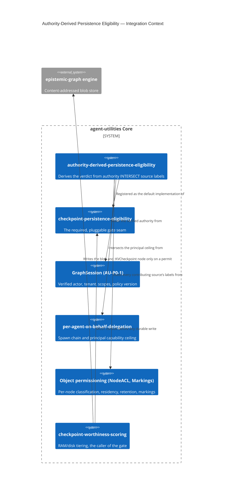

# Design Document: Authority-Derived KV-Persistence Eligibility

> Decide, **systematically and automatically**, whether a KV-cache checkpoint may become
> data-at-rest — by deriving the answer from the authority the context was assembled under
> and the governance labels of every source that contributed to it, rather than from an
> operator-supplied policy table or a per-request grant flag.
>
> Concept introduced: `CONCEPT:AU-OS.governance.authority-derived-persistence-eligibility`.
>
> Closes `D-KCI-1` and the policy-source half of `D-5.1-3`. Residuals recorded as
> `D-KA-1` / `D-KA-2` / `D-KA-3` in `reports/deferred/lane-kv-authz.md`.

## KG Analysis (Required)

### Nearest Existing Concepts

| Concept ID | Name | Similarity | Pillar |
|---|---|---|---|
| `AU-OS.governance.checkpoint-persistence-eligibility` | the required, pluggable gate on every durable KV write | ~85% | OS |
| `AU-OS.identity.per-agent-on-behalf-delegation` | spawn delegation chain + principal capability ceiling | ~55% | OS |
| `AU-P0-4` (connector fail-closed permissions) | `ExternalAccess.quarantined()` — unknown ACL never means public | ~50% | ECO |
| `AU-P0-1` (`GraphSession`) | the one explicit identity/tenant/scope/policy currency | ~45% | OS |
| `AU-OS.identity.idp-agnostic-role-inheritance` | IdP roles/groups projected into the effective capability set | ~35% | OS |

### Extension Analysis

- **Primary Extension Point**: `CONCEPT:AU-OS.governance.checkpoint-persistence-eligibility`
  — the gate itself. Its `PersistenceEligibilityGate` protocol, its position on the
  persistence path, its "RAM never implies disk consent" invariant, and its
  `set_persistence_eligibility_gate()` code seam are all reused **unchanged**.
- **Extension Strategy**: specialize. The parent concept says *that* a gate must be
  consulted and *what shape* it has; it deliberately shipped no rule, because the platform
  had no source of truth for residency/classification/retention (`D-5.1-3`). This concept
  supplies **the rule** — and supplies it as a derivation over authority the platform
  already carries, so that no new source of truth had to be invented.
- **New Concept Required?**: Yes — one. See below.

### New Concept Proposal

#### `CONCEPT:AU-OS.governance.authority-derived-persistence-eligibility`

- **Augments Pillar**: OS (governance family), consuming OS identity
  (`GraphSession` + `SpawnDelegation`) and ECO/KG governance labels (`NodeACL`, markings).
- **Why not extend the parent concept in place**: the parent is a *contract* — a required
  seam with a deny-by-default posture, valuable on its own and independently replaceable
  (`AlwaysDenyEligibility` still satisfies it). This is a *decision procedure* that plugs
  into that seam. Collapsing the two would mean a deployment could not adopt the seam
  without also adopting this rule, and could not narrow the rule without appearing to
  remove the gate. They have different owners: the seam is owned by whoever owns the
  persistence path; the rule is owned by whoever owns data governance.
- **Why not extend `per-agent-on-behalf-delegation`**: that concept owns *identity
  propagation* — building the chain, minting the run token, and narrowing **tool scope**
  under a staged rollout. This concept **consumes** its `ceiling` for a different purpose
  and, critically, with different semantics: it intersects unconditionally in every
  rollout posture and treats an unresolvable ceiling as a denial. Folding a data-at-rest
  rule into a tool-scope rollout concept would tie a security invariant to a soak flag.
- **Justification**: "may this context come to rest here?" is a composition of two
  independently-owned lattices (authority ∩ labels) that no existing concept composes.
  The composition — not either input — is the thing being named.

## The rule

> A checkpoint may be written to disk **only into the tenancy of the session that produced
> it**, and only where the caller's *effective* authority dominates the **most restrictive**
> composition of **every** contributing source's labels.

| Half | Read from | Composition |
|---|---|---|
| **Authority** | verified `GraphSession` (`actor` / `tenant` / `scopes` / `policy_version`) ∩ ambient `SpawnDelegation.ceiling` | intersection |
| **Labels** | each contributing source's `NodeACL.classification` / `.data_residency_regions` / `.retention_days` + its mandatory markings | classification = **max**, residency = **set intersection**, retention = **min**, markings = **union** |

**Inheritance is restrictive; delegation is non-increasing.** Adding a source can only make
a checkpoint *less* persistable. Adding a delegation hop can only *reduce* authority.

**Which trigger fired is provenance, not authority.** All three checkpoint paths are gated
identically, so the operator's "an agent decides a checkpoint is worth persisting" case is
legitimate exactly when the agent acts under an authority that already covers the
material — enforced, not asserted.

## C4 Context Diagram

## Data Flow

1. **ORCH**: unchanged entry points. `TieredCheckpointManager.promote()` derives the
   authority **at promotion time** (not at checkpoint time), so a credential that has since
   expired or a delegation that has since been revoked refuses a write that would have been
   permitted earlier. Contributing sources ride the RAM record from `checkpoint_now` /
   `observe`, so the labels a checkpoint is judged against are the ones its content came
   from.
2. **KG**: reads each contributing source's `NodeACL` and mandatory markings through the
   existing permissioning layer; a read that fails yields an **unlabelled** source, which
   denies. On a permit, the full derivation (authorizing actor, delegation chain, composed
   label, contributing source ids, every check with its verdict) is flattened onto the
   `:KVCheckpoint` node's `provenance`.
3. **AHE**: not yet, and none is claimed. `KVCACHE_CHECKPOINT_TIER_OPS{outcome}` already
   distinguishes `eligibility_denied`, which is the substrate a future loop would use to
   surface systematically under-labelled sources; nothing consumes it today.
4. **ECO**: `graph_kv_checkpoint` loses `operator_grant`, renames `initiator` → `trigger`,
   and gains `sources_json`. The tenant is now bound to the verified session — a payload
   tenant that disagrees is refused rather than preferred. The REST twin follows
   automatically from the existing `ACTION_TOOL_ROUTES` entry.
5. **OS**: this **is** the OS guardrail. Absence denies on every axis (no session, no
   declared sources, a source missing any label, an empty residency intersection, an
   unresolvable delegation ceiling), and each refusal names the source or axis that caused
   it. `set_persistence_eligibility_gate()` remains the only way to change the rule, and
   `set_source_label_resolver()` is the matching seam for a deployment whose labels live in
   an external governance catalog.

## Risk Assessment

- **Blast Radius**: `agent_utilities/kvcache/eligibility.py` (rewritten),
  `kvcache/tiering.py` (authority + sources threaded through), `kvcache/__init__.py`
  (exports), `mcp/tools/engine_surface_tools.py` (session binding, argument changes), and
  two additive optional fields on `models/company_brain.NodeACL`. No other caller exists in
  the workspace.
- **Backward Compatible**: **No** — deliberately. See breaking changes.
- **Breaking Changes**:
  - `OperatorGrantEligibility` and the `operator_grant` argument are **removed**. Over the
    MCP surface `initiator="user", operator_grant=true` were values any caller could simply
    assert, which made a deny-by-default gate defeatable by any caller that chose to lie.
    Removing them is the point of the change, not a side effect of it.
  - `PersistenceRequest.initiator` → `.trigger`; the MCP argument follows.
  - `TieredCheckpointManager.checkpoint_now/observe/promote` drop `operator_grant` and gain
    `sources`.
- **Deliberate divergence to review**: the delegation ceiling is intersected
  **unconditionally**, *not* through `security.delegation.enforce_ceiling`, which is a no-op
  under the shipped `ENABLE_DELEGATED_IDENTITY=warn` posture. An observe-before-enforce soak
  is a reasonable trade for tool scope and an unacceptable one for data-at-rest; reusing
  `enforce_ceiling` would have let every delegated spawn exceed its delegator for the entire
  soak window. An unresolvable ceiling likewise denies here, where `enforce_ceiling`
  correctly declines to narrow.
- **Residual requiring a human**: the derivation is automatic, but its inputs are not yet
  populated. `data_residency_regions` / `retention_days` are new and default to
  **undeclared**, so today only `PUBLIC`-classified sources self-declare and persist;
  everything else must be labelled by its owner first (`D-KA-1`). That is a data-governance
  act, not a policy table, and it fails closed until it happens.
