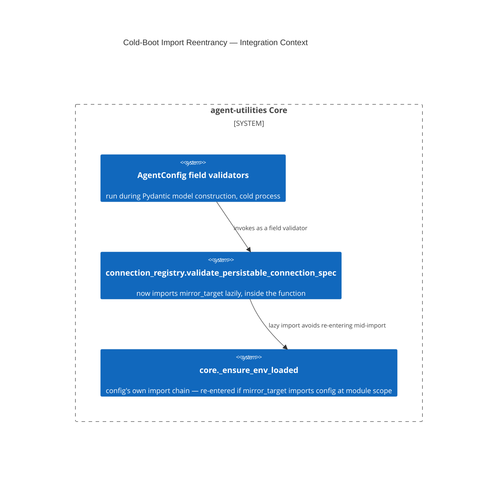

# Design Document: Cold-Boot Import Reentrancy Guard

CONCEPT:AU-OS.deployment.cold-boot-import-reentrancy

## KG Analysis (Required)

### Nearest Existing Concepts

| Concept ID | Name | Similarity | Pillar |
|---|---|---|---|
| `AU-OS.deployment.workspace-venv-reconciler` | a different deployment-time correctness concern (venv sync, not import ordering) | 0.15 | OS |

No existing concept covers import-ordering correctness inside `AgentConfig`'s
own validator chain — new failure class.

### Extension Analysis

- **Primary Extension Point**: `agent_utilities/knowledge_graph/core/
  connection_registry.py` (`validate_persistable_connection_spec`).
- **Extension Strategy**: augment — move a module-level import into the one
  function that uses it (lazy import), matching the lazy-import discipline a
  sibling validator in the same module already used for the same reason.
- **New Concept Required?**: Yes — this is a distinct, previously-unnamed
  failure class (cold-boot import reentrancy through a Pydantic field
  validator), not a variant of an existing concept.

### New Concept Proposal

- **Proposed ID**: `CONCEPT:AU-OS.deployment.cold-boot-import-reentrancy`
- **Augments Pillar**: OS (domain `deployment`)
- **15-Phase Pipeline Integration**: process bootstrap (before Phase 0) — this
  fires during `AgentConfig` construction, which happens before any pipeline
  phase runs.
- **Justification**: `connection_registry.py` imported `mirror_target` at
  **module level**. On a genuinely cold process (fresh `sys.modules`, no
  prior import of `agent_utilities.core.config`) where `kg_connections` is
  non-empty, `AgentConfig`'s own field validator's import chain re-enters
  `_ensure_env_loaded` **mid-import** — Python's module-not-yet-fully-bound
  state — producing `ImportError: partially initialized module`, surfaced to
  the caller as an opaque `ConfigurationSourceError` with no hint that the
  actual cause was import ordering, not configuration content. This
  reproduced as a real ~13-minute production `CrashLoopBackOff` on
  `platform/graph-os` (see `reports/deferred/lane-sweep-venv-obs.md`, D-SVO-1)
  — it does **not** reproduce in any warm process (a dev shell, `pytest`,
  a REPL that already imported `config` once), which is why the regression
  test spawns a genuine subprocess rather than asserting in-process.

## C4 Context Diagram

## Data Flow

1. **ORCH**: none — this fires before any orchestration surface exists.
2. **KG**: `connection_registry` validates `kg_connections` entries at
   config-construction time, before any graph connection is opened.
3. **AHE**: none.
4. **ECO**: none.
5. **OS**: this IS the OS-pillar bootstrap-correctness invariant: no module
   reachable from an `AgentConfig` field validator may import anything that
   transitively re-imports `core.config` at module scope.

## Risk Assessment

- **Blast Radius**: every cold-start process that constructs `AgentConfig`
  with a non-empty `kg_connections` — i.e. every real deployment, not test
  runs (which typically warm-import config first).
- **Backward Compatible**: Yes — pure internal reordering, no signature change.
- **Breaking Changes**: None.
- **What would make this wrong later**: the fix is a **surgical, one-off**
  lazy import, not a systemic guarantee. `reports/deferred/lane-sweep-venv-obs.md`
  (D-SVO-1, closed) explicitly asks for a follow-up lint/CI check so a future
  PR cannot reintroduce a module-level import anywhere in the import graph
  reachable from an `AgentConfig` field validator — **that check does not
  exist yet**. Any new module-level import added to that reachable graph
  reproduces the identical class of bug, undetected until the next genuinely
  cold boot.
