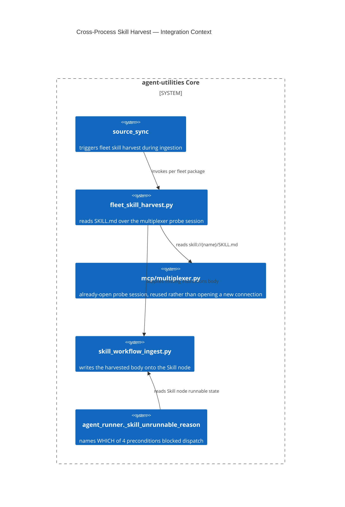

# Design Document: Cross-Process Fleet Skill Harvest + Named Runnable Preconditions

> Introduced in `8ca4360e` ("harvest fleet skill bodies cross-process so they
> become runnable", D-DG-1). `AU-ORCH.dispatch.named-runnable-precondition`
> is a small (~65-line) diagnostic slice of the same commit and is documented
> here alongside it rather than in isolation, per the commit's own scope.

CONCEPT:AU-ECO.mcp.cross-process-skill-harvest ·
CONCEPT:AU-ORCH.dispatch.named-runnable-precondition

## KG Analysis (Required)

### Nearest Existing Concepts

| Concept ID | Name | Similarity | Pillar |
|---|---|---|---|
| `AU-ECO.mcp.fleet-meta-tools-always-on` | adjacent fleet-gateway reliability concern, different failure mode | 0.35 | ECO |
| `AU-ORCH.dispatch.workitem-consent-gate` | a different dispatch-precondition (consent, not runnability) | 0.30 | ORCH |

### Extension Analysis

- **Primary Extension Point**: `knowledge_graph/ingestion/
  fleet_skill_harvest.py` (new), `mcp/multiplexer.py` (probe session reuse),
  `orchestration/agent_runner.py` (`_skill_unrunnable_reason`).
- **Extension Strategy**: new module (harvest) + augment (existing runnable
  check gains named reasons instead of one generic message).
- **New Concept Required?**: Yes for both.

### New Concept Proposal

1. **`AU-ECO.mcp.cross-process-skill-harvest`** — measured root cause: only
   25 of 257 ingested `Skill` nodes were runnable, and **0** for ServiceNow.
   Fleet packages are deliberately **not** co-installed into graph-os's own
   venv (`AGENTS.md` — *Dependency discipline*), so in-process
   `importlib.metadata` discovery structurally cannot see their skill
   bodies. An alternative of wiring `ingest_one → ingest_runnable_skill`
   directly was tried and rejected — measured **zero** overlap with the
   actual gap, "not the win". Fix instead pulls each skill's `SKILL.md` body
   over the multiplexer's already-open probe session
   (`skill://{name}/SKILL.md` as an MCP resource read), so a skill becomes
   runnable without installing its package into graph-os's process.
2. **`AU-ORCH.dispatch.named-runnable-precondition`** — `"skill X not found
   or runnable"` used to collapse **four** structurally different failure
   states (never ingested / ingested-but-bodyless / harvested-but-child-
   unreachable / present-but-not-dispatchable) into one unactionable
   message. `_skill_unrunnable_reason()` now names each of the four ordered
   preconditions independently (`server_reachable`, `skill_body_served`,
   `server_exposes_tools`, `no_local_provider_conflict`).

- **Augments Pillar**: ECO (domain `mcp`) for the harvest mechanism; ORCH
  (domain `dispatch`) for the diagnostic-naming slice.
- **15-Phase Pipeline Integration**: Phase 2 (Plan/Discover) — skill harvest
  runs during `source_sync`; the named-precondition check runs at dispatch
  time, before a skill is invoked.
- **Justification**: no existing concept covers pulling runnable content
  across a process boundary without co-installation, nor naming which of
  several ordered preconditions blocked a specific skill.

## C4 Context Diagram

## Data Flow

1. **ORCH**: `agent_runner` consults the named-precondition check before
   attempting to dispatch a skill.
2. **KG**: `Skill` nodes gain a real `instructions` body without requiring
   the owning package to be installed in graph-os's venv.
3. **AHE**: none directly — but a runnable skill becomes eligible for the
   evolution/evaluation surfaces that depend on skill dispatch.
4. **ECO**: the harvest reuses the multiplexer's existing probe session —
   no new connection type, no new server.
5. **OS**: respects the standing *Dependency discipline* rule (never
   co-install fleet packages into graph-os) rather than working around it.

## Risk Assessment

- **Blast Radius**: every fleet skill whose body was previously unreachable
  (232 of 257 at measurement time).
- **Backward Compatible**: Yes — additive; skills that were already runnable
  are unaffected.
- **Breaking Changes**: `_skill_unrunnable_reason`'s message format changed
  from one generic string to four distinct named reasons — any caller
  pattern-matching the old exact string must be updated (none found in this
  codebase at time of writing).
- **What would make this wrong later**: harvest does not install anything
  and does not change `ingest_runnable_skill`'s contract — it only supplies
  the missing body. It would go wrong if a child process rate-limits or
  blocks the harvest budget, or if a future skill provider stops exposing
  `skill://{name}/SKILL.md` as a resource (the harvest has no fallback path
  if that resource contract changes).
