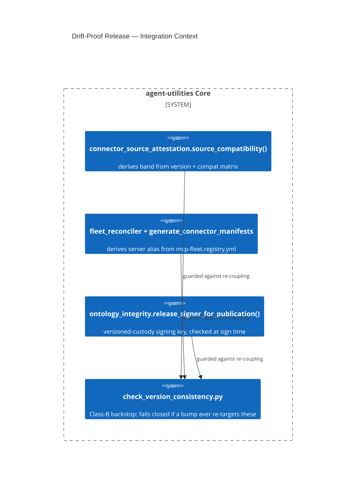

# Design Document: Drift-Proof Release & Versioning

> The full design already exists as
> [`docs/architecture/drift_proof_release.md`](../../../docs/architecture/drift_proof_release.md)
> (written and committed alongside the code in `ae3ac4d3`, with follow-ups
> `ad05fc15`/`a1f3206e`/`ad7277d9`). `docs/concept_reservations.yaml` already
> records all three ids below with a `design_ref`, confirming a design doc was
> produced at the time — it was simply never placed under
> `.specify/design/**/*.md`, the one location the gate greps. This file is a
> **pointer + condensed summary**; the architecture doc is authoritative.

CONCEPT:AU-KG.ontology.derived-compatibility-band ·
CONCEPT:AU-KG.ontology.registry-derived-server-alias ·
CONCEPT:AU-KG.ontology.release-key-rotation

## KG Analysis (Required)

### Nearest Existing Concepts

| Concept ID | Name | Similarity | Pillar |
|---|---|---|---|
| `AU-OS.governance.precommit-all-files-safety` | a different drift-prevention mechanism (unstaged-diff safety, not release values) | 0.30 | OS |
| `AU-KG.ontology.dedicated-tbox-graph` | ontology durability, adjacent domain, unrelated failure mode | 0.20 | KG |

No existing concept covers "a release value that can drift between two
restatements" — genuinely new, and the operating principle ("prevent drift by
construction, not by detection") applies uniformly across all three, which is
why they share one design page.

### Extension Analysis

- **Primary Extension Point**: none — three independent Class-A ("cannot
  drift because there is no second copy") fixes unified by one page because
  each was found via the same real incident review.
- **Extension Strategy**: new (three concepts, one shared design doc).
- **New Concept Required?**: Yes.

### New Concept Proposal

1. **`AU-KG.ontology.derived-compatibility-band`** — real incident, 2026-07-28:
   `.bumpversion.cfg` rewrote `SOURCE_COMPATIBILITY` on every version bump,
   checked for **exact string equality**; a routine patch bump ("2.1.0 →
   2.1.1") invalidated all 68 signed provider attestations, 22 minutes after
   the re-signing key was believed lost. Fix: the band is now *derived*
   (`>=MAJOR.MINOR.0,<MAJOR+1`) from the one version authority, validated by
   *containment* not equality, and `check_version_consistency.py` fails
   closed (`bumpversion-attestation-coupling`) if any bump target ever
   reaches the attestation module again.
2. **`AU-KG.ontology.registry-derived-server-alias`** — 27 providers restated
   their MCP server alias divergently from `mcp-fleet.registry.yml` (e.g.
   `github-agent` vs. the deployed `github-mcp`); 9 more had no registry
   entry at all. Fix: the alias is now *derived* from the registry; an
   unregistered provider or a disagreeing preset fails closed before any
   signed manifest is projected.
3. **`AU-KG.ontology.release-key-rotation`** — real incident, 2026-07-28: the
   release-signing seed's source of truth was a bare `env://` value — a local
   file overwritten in place with no version history — and looked destroyed.
   `ontology.lock`'s pinned key was checked only at *admission* time, long
   after signing already happened with the wrong key. Fix:
   `release_signer_for_publication()` requires versioned custody
   (`vault://`/`secret://` only, never a bare env var);
   `assert_signing_key_matches_locks()` refuses to sign with a key the lock
   doesn't pin, checked **at signing time**; rotation is a recorded ledger
   entry (`deploy/release/signing-key-rotation.yml`). Follow-up `ad7277d9`
   (D-DP-2) added version-pinned KV v2 reads (`path#field@version`) so even
   OpenBao's "latest" pointer cannot silently regress the key later.

- **Augments Pillar**: KG (domain `ontology`, alongside the other
  connector-attestation/manifest concepts already there).
- **15-Phase Pipeline Integration**: release/promotion phase — evaluated at
  connector-manifest generation, attestation admission, and release signing.
- **Justification**: each closes a *specific, already-occurred* incident where
  a value restated in a second location silently disagreed with its
  authority; no existing concept named this failure class for release
  artifacts specifically.

## C4 Context Diagram

## Data Flow

1. **ORCH**: none directly — release/CI-time concern.
2. **KG**: `connector_source_attestation` records + `ontology.lock` are the
   authorities these three concepts protect from silent drift.
3. **AHE**: none.
4. **ECO**: connector manifest generation (`generate_connector_manifests.py`)
   is the consumer of the derived alias + band.
5. **OS**: `check_version_consistency.py` is the fail-closed backstop for all
   three; `security/secrets_client.py` enforces versioned-only custody for
   the signing key.

## Risk Assessment

- **Blast Radius**: every signed provider attestation (68+) and every fleet
  connector manifest.
- **Backward Compatible**: Yes — existing attestations signed under an older
  version remain valid under the containment check.
- **Breaking Changes**: None.
- **What would make this wrong later**: `release-key-rotation`'s host/CI
  provisioning is still incomplete — `reports/deferred/lane-openbao-custody.md`
  records D-OC-1 as partially verified (the OpenBao field name and public key
  were confirmed to match `ontology.lock` on the live vault) and D-OC-1/D-OC-2
  as still **OPEN**, pending a release host/CI pipeline that does not yet
  exist in this workspace to set the required env vars. This gap is recorded
  honestly rather than implied closed.
