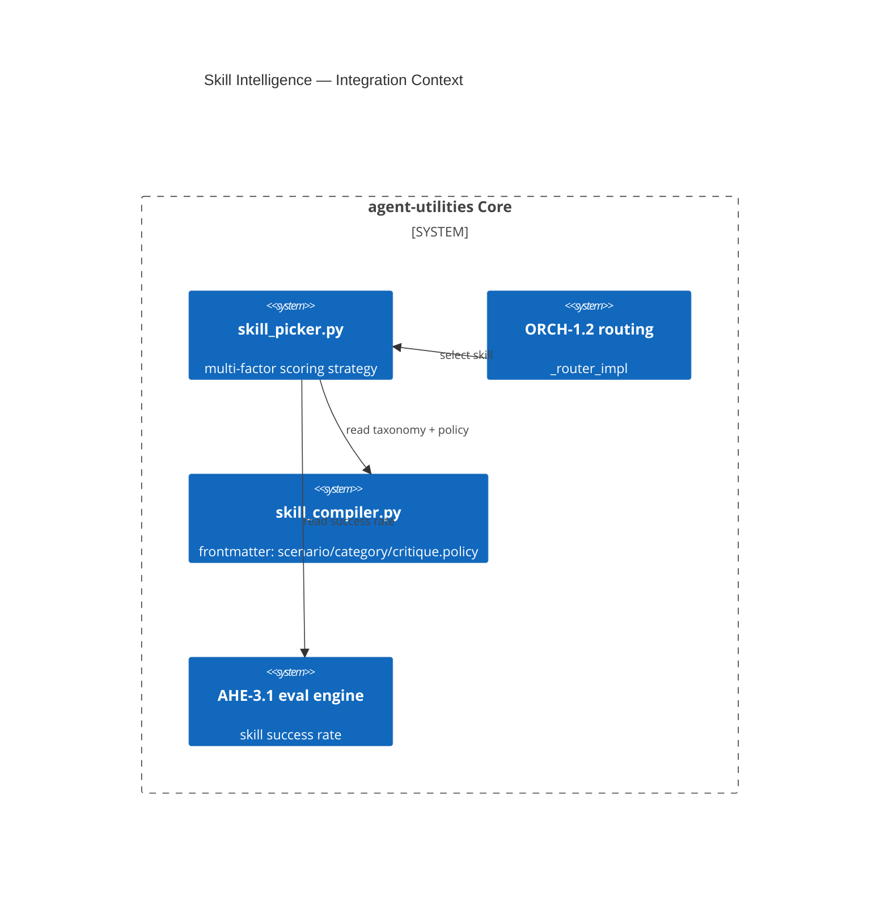

# Design Document: Skill Intelligence — Scenario Taxonomy + Eval-Scored Picker (EPIC 5)

> Extension-only (no new CONCEPT:ID). Assimilates open-design's scenario-grouped skill taxonomy and adds
> a **self-improving** skill picker whose scoring **includes prior success rate from the eval engine**, plus
> a `SKILL.md` manifest carrying a per-skill `critique.policy` override. Extends ECO-4.0 (skill
> registration), ORCH-1.2 (routing), AHE-3.1 (success-rate feed).

## Research Provenance

| Source | Location | Behavior assimilated |
|---|---|---|
| open-design skill taxonomy | `apps/daemon/src/skills.ts:71,204-225` | `scenario` (design/marketing/operation/engineering/finance/hr/sales/personal) + `category` + `source`, inferred from frontmatter/body |
| open-design SKILL.md | `apps/daemon/src/skills.ts:34-102`; `skills/*/SKILL.md` | self-contained manifest; `od.critique.policy` required\|opt-out\|opt-in\|null; shadow built-ins by id; i18n |

**Superiority delta:** open-design's picker is keyword/scenario match. agent-utilities scores candidates
with a **multi-factor function that reads historical success rate from the eval engine (AHE-3.1)** — a
picker that *learns which skills actually work* — and routes through the existing capability index, which
a static picker cannot.

## KG Analysis (Required)

### Nearest Existing Concepts
<!-- kg_search("skill discovery picker scenario taxonomy success rate scoring routing", top_k=5) -->

| Concept ID | Name | Similarity | Pillar |
|---|---|---|---|
| ORCH-1.2 | Specialist Routing & Discovery | 0.74 | ORCH-1 |
| AU-ECO.mcp.toolkit-live-discovery | Dynamic Capability Ingestion & Discovery | 0.72 | AU-ECO.connector.plane-provisioning-auth |
| ORCH-1.28 | Composable Skills + Generic Adapter | 0.70 | ORCH-1 |
| AHE-3.1 | Continuous Evaluation | 0.55 | AHE-3 |
| ECO-4.0 | Tool Interface & MCP Factory | 0.48 | AU-ECO.connector.plane-provisioning-auth |

> Highest 0.74 ≥ 0.70 → **MUST extend, no new concept**. The picker is a new routing *strategy* under
> ORCH-1.2; the taxonomy/critique-policy fields extend AU-ECO.mcp.toolkit-live-discovery/skill_compiler.

### Extension Analysis
- **Primary Extension Point**: `ORCH-1.2` (`graph/routing/strategies/`) for the picker; `AU-ECO.mcp.toolkit-live-discovery`/`workflows/skill_compiler.py` for frontmatter.
- **Extension Strategy**: `augment` (new routing strategy + frontmatter fields + eval-feed read).
- **New Concept Required?**: No.

## C4 Context Diagram

## Data Flow
1. **ORCH**: routing invokes `skill_picker.pick(query, context)`; the picked skill seeds the ExecutionManifest.
2. **KG**: skills are nodes; scenario/category are properties; success-rate read from eval traces.
3. **AHE**: the picker reads AHE-3.1 win-rates; outcomes feed back (self-improving loop).
4. **ECO**: `skill_compiler` parses extended frontmatter; critique gate (AU-AHE.harness.pre-emit-quality-gate) honors `critique.policy`.
5. **OS**: no new policy surface.

## Risk Assessment
- **Blast Radius**: new `workflows/skill_picker.py`, `workflows/skill_compiler.py` (frontmatter fields), `graph/routing/strategies/` (register strategy). Additive.
- **Backward Compatible**: Yes — picker is a new strategy; untagged skills get inferred scenarios; missing success-rate defaults to neutral prior.
- **Breaking Changes**: None.

## Wiring (Wire-First, ≤3 hops)
- `_router_impl` routing → `skill_picker.pick` = **1 hop**.
- `critique gate` → reads `skill.critique.policy` = **1 hop**.
