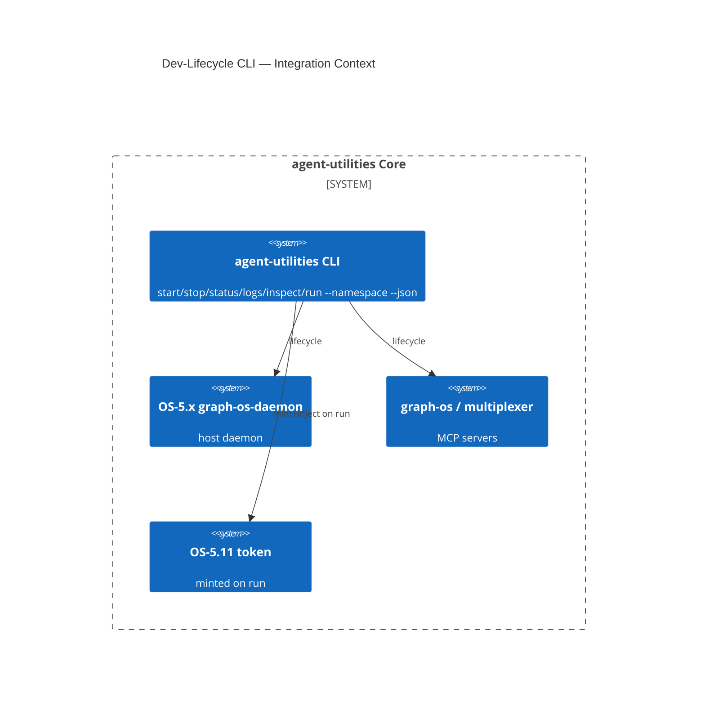

# Design Document: Unified Dev-Lifecycle CLI + Ubiquitous Glossary (EPIC 6)

> Extension-only for the CLI/glossary (the run-scoped token is its own concept, OS-5.11). Assimilates
> open-design's `tools-dev`: one console-script controlling start/stop/status/logs/inspect/run with
> `--namespace` isolation and `--json`, replacing scattered scripts/docker invocations. Plus a CI-checked
> `CONTEXT.md` ubiquitous-language glossary complementing `concepts.yaml`. Extends OS-5.1/5.2.

## Research Provenance

| Source | Location | Behavior assimilated |
|---|---|---|
| open-design tools-dev | `tools/dev/src/index.ts:100-600`; `AGENTS.md:110-150` | One CLI: start/stop/status/logs/run/inspect; sidecar stamps; `.tmp/<namespace>/...`; `--namespace`; `--json` |
| open-design CONTEXT.md | `CONTEXT.md` | Versioned domain glossary: single-source term defs + `Avoid:` + relationship cardinalities |

**Superiority delta:** open-design orchestrates daemon/web/desktop for one app. agent-utilities' CLI also
**mints run-scoped tokens (OS-5.11)** and drives the existing **consolidated KG daemon (OS-5.x,
`graph-os-daemon`)** and MCP/gateway processes, giving operators one control plane over a multi-agent
system — and the glossary is **CI-synced against the concept registry**, which open-design's is not.

## KG Analysis (Required)

### Nearest Existing Concepts
<!-- kg_search("unified dev lifecycle CLI start stop status logs namespace daemon control", top_k=5) -->

| Concept ID | Name | Similarity | Pillar |
|---|---|---|---|
| OS-5.1 | Security & Auth / daemon | 0.72 | OS-5 |
| OS-5.2 | Cognitive Scheduler | 0.71 | OS-5 |
| AU-OS.config.gateway-service-dashboard | Gateway Service Dashboard | 0.62 | OS-5 |
| ECO-4.0 | Tool Interface & MCP Factory | 0.40 | AU-ECO.connector.plane-provisioning-auth |
| ORCH-1.0 | Core Orchestration Engine | 0.35 | ORCH-1 |

> Highest 0.72 ≥ 0.70 → **MUST extend, no new concept** for the CLI/glossary. The CLI is an operational
> console over OS-5.1/5.2 daemon/scheduler. (OS-5.11 token has its own design doc.)

### Extension Analysis
- **Primary Extension Point**: `OS-5.1`/`OS-5.2` (daemon/scheduler), `pyproject.toml [project.scripts]`.
- **Extension Strategy**: `augment` — a new console-script wrapping existing daemon/MCP/gateway lifecycle; CI guardrail for the glossary.
- **New Concept Required?**: No (CLI/glossary). Token = OS-5.11 (separate).

## C4 Context Diagram

## Data Flow
1. **ORCH**: `run <agent> <task>` dispatches through the orchestration entry; `inspect` queries run state.
2. **KG**: `status` reads daemon/queue state from the KG/daemon; logs aggregated per namespace.
3. **AHE**: not directly.
4. **ECO**: new console-script entry; reuses existing `graph-os`/`graph-os-daemon`/`mcp-multiplexer` scripts.
5. **OS**: `--namespace` isolates state under `.tmp/agent-utilities/<namespace>/`; `run` mints OS-5.11 token; glossary CI-checked.

## Risk Assessment
- **Blast Radius**: new `agent_utilities/cli/` (or extend `__main__.py`), `pyproject.toml` script entry, `docs/CONTEXT.md`, a CI guardrail script. Additive.
- **Backward Compatible**: Yes — existing scripts (`graph-os`, `graph-os-daemon`) remain; CLI orchestrates them.
- **Breaking Changes**: None.

## Wiring (Wire-First, ≤3 hops)
- `agent-utilities` console-script → lifecycle ops = **1 hop**.
- `run` → engine dispatch (+ OS-5.11 mint) = **2 hops**.
