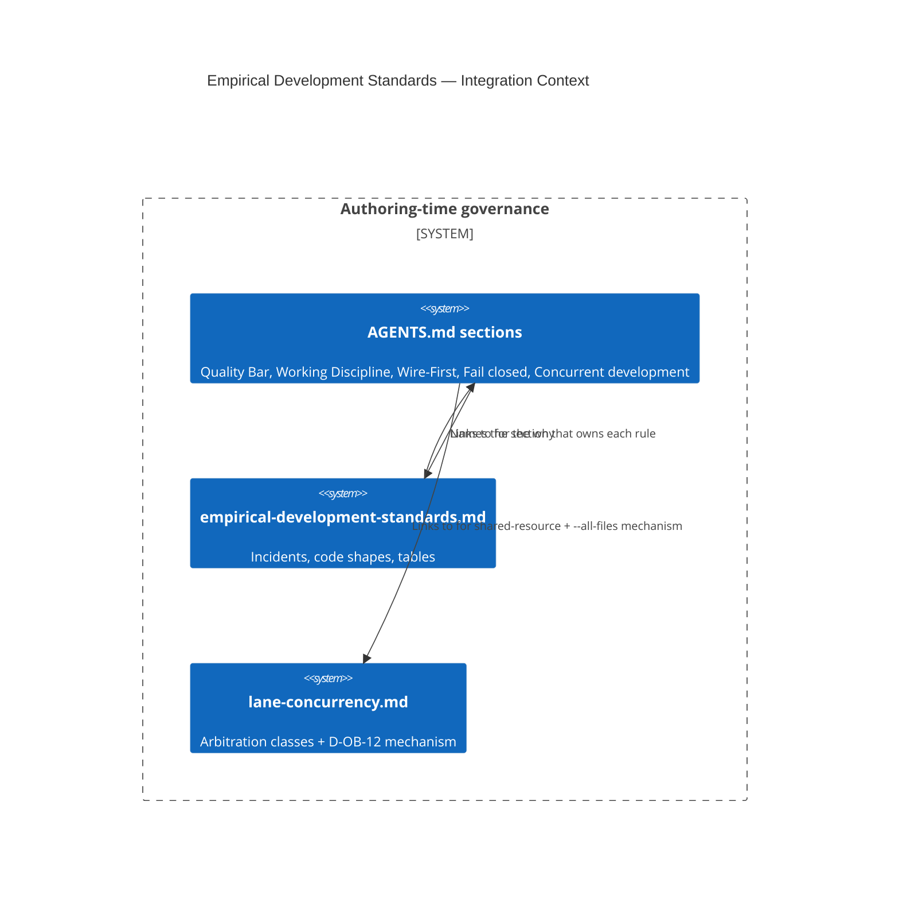

# Design Document: Empirical Development Standards (evidence, fail-closed, interruption)

> Codifies twelve development standards that were enforced ad-hoc across ~40 lane
> briefs on 2026-07-31 but appeared nowhere in the repo (`grep` count 0 for each).
> Rules live in [`AGENTS.md`](../../../AGENTS.md); evidence lives in
> [`docs/architecture/empirical-development-standards.md`](../../../docs/architecture/empirical-development-standards.md).

This is a **governance/documentation** feature, not a runtime one: it adds no module,
no tool and no code path. Three concept ids are proposed so the standards are
addressable in the KG the same way the lane-concurrency standards are
(`AU-OS.governance.lane-arbitration-classes`, `…canonical-checkout-immutable`).

## KG Analysis (Required)

### Nearest Existing Concepts

| Concept ID | Name | Similarity | Pillar |
|---|---|---|---|
| `AU-OS.governance.fail-closed-claim-check` | fail-closed claim check | high, but **scoped to one check** — it is a single call site's policy, not the general reader/caller contract | AU-OS |
| `AU-P0-4` (connector ACL defaults) | fail-closed connector ACL | medium — one subsystem's default, already live | AU-OS |
| `AU-OS.governance.lane-arbitration-classes` | concurrent-lane arbitration | medium — owns *shared-resource* collisions, not *interruption* | AU-OS |
| `AU-OS.governance.append-only-fragment-fold` | fragment/fold ledger discipline | low — mechanism, not evidence standard | AU-OS |
| `AU-OS.governance.precommit-all-files-safety` | safe `--all-files` wrapper | low — the wrapper, not the cost-of-tooling rule | AU-OS |

### Extension Analysis

- **Primary Extension Point**: `AU-OS.governance.fail-closed-claim-check` (for §2.1) and
  `AU-OS.governance.lane-arbitration-classes` (for §3).
- **Extension Strategy**: **augment** for the two existing sections that already own an
  idea; **new** for the failure-mode family, which has no owner.
- **New Concept Required?**: **Yes**, for three of the twelve rules. The other nine are
  folded into sections that already own them and take **no** new id:
  - *Quality Bar* absorbs "never silence a failure" (it already forbids silencing a
    *check*; this widens the same rule rather than creating a sibling).
  - *Working Discipline* absorbs the evidence rules (premise, instrument, refutation,
    closure) as one new habit bullet alongside "Verify against a goal".
  - *Wire-First* absorbs the instrument rule at the test-verdict level (rule 8) by
    cross-reference — deliberately **not** restated, per "one rule, one message".
  - *Concurrent development* absorbs commit-cadence, long-hook restarts and `ps -p`
    as rule 7.

### New Concept Proposal

Existing `fail-closed-*` concepts each pin **one** call site's policy. None states the
general contract — *what a reader must return when it cannot read, and what its callers
must then do* — which is the invariant five separate gates violated identically. That
generality is why it cannot be expressed as an extension of any one of them.

- **Proposed ID**: `CONCEPT:AU-OS.governance.fail-closed-degraded-read`
  - **Augments Pillar**: OS
  - **Justification**: A tolerant reader returning `[]`/`0`/`False` on failure is
    indistinguishable at the call site from a healthy empty result. Five safety gates
    (rate limiter, blast-radius check, autoscaler cooldown, CI retry cap, prompt-scanner
    preflight) each read a degraded KG as a clean bill of health, so all five stand down
    **together**, and only when the KG is down. Contract: return `None` (or raise) on
    failure; callers deny, defer or escalate.
- **Proposed ID**: `CONCEPT:AU-OS.governance.verified-write-state-advance`
  - **Augments Pillar**: OS
  - **Justification**: "Write-then-mark-seen" — setting `consumed`/`processed`/a cursor
    regardless of whether the guarded write succeeded — permanently forecloses the retry,
    which is strictly worse than crashing. Contract: the state advance is derived from the
    write's confirmed result and ordered after it.
- **Proposed ID**: `CONCEPT:AU-OS.governance.premise-revalidation`
  - **Augments Pillar**: OS
  - **Justification**: A deferred item records the world *as it was when written*. ~8
    items in one day were worked whose stated blocker had since become false. Contract:
    re-verify the premise of any item you did not just write; a falsified premise closes
    the item, and that closure is the work.

**15-Phase Pipeline Integration**: none — these are authoring-time standards read by
agents and humans from `AGENTS.md`. They are enforced socially plus by the gates that
already exist (`lane-guard`, the Quality Bar suite, `check_concept_governance`).

## C4 Context Diagram

## Data Flow

1. **ORCH**: no dispatch surface. The orchestrator reads `AGENTS.md` as context like any
   other session, so the rules apply to delegated runs identically.
2. **KG**: the three ids become addressable concepts; the architecture doc is ingested
   with the rest of `docs/**` and is reachable from `mkdocs.yml` nav.
3. **AHE**: §1.4 (a refuted hypothesis is a result) and §1.5 (never manufacture a closure)
   are directly about what the evolution loop is allowed to record as an outcome — a
   fabricated closure poisons the register the loop learns from.
4. **ECO**: not exposed as a tool.
5. **OS**: this *is* the OS/governance surface. No new guardrail script; the rules ride
   the existing `lane-guard`, Quality Bar and concept-governance gates.

## Risk Assessment

- **Blast Radius**: documentation only — `AGENTS.md` (regenerated from `AGENTS.head.md`),
  `docs/architecture/{empirical-development-standards,lane-concurrency}.md`, `mkdocs.yml`,
  and the regenerated `README.md` concept block. No module changes.
- **Backward Compatible**: Yes.
- **Breaking Changes**: None. One editorial move: the D-OB-12 `pre-commit --all-files`
  mechanism was relocated from `AGENTS.md` to `lane-concurrency.md` (which already
  classified the resource) and its verbatim restatement in the lane-finishing steps was
  collapsed to a cross-reference — an application of the new "one rule, one message" rule,
  and the source of the byte headroom the new sections needed.
- **Size constraint**: `AGENTS.md` is capped at 81,920 bytes by
  `test_agents_md_is_small_and_clean`. Rules go in `AGENTS.md`; evidence goes in the
  linked doc. Detail is **moved out**, never rules dropped.
