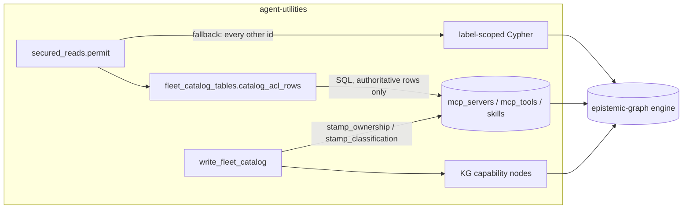

# Design Document: Fleet-catalog ACL projection

Realises `CONCEPT:AU-KG.ingest.fleet-catalog-acl-projection`.

## KG Analysis (Required)

### Nearest Existing Concepts

| Concept ID | Name | Similarity | Pillar |
|---|---|---|---|
| AU-KG.ingest.fleet-catalog-relational-tables | Relational read model for the MCP/skill fleet catalog | high | AU-KG |
| AU-OS.state.unified-durable-state-externalization | Durable state externalized out of process memory | medium | AU-OS |
| AU-KG.identity.tenant-scoped-authorization | Tenant/actor-scoped authorization on graph reads | medium | AU-KG |

### Extension Analysis

- **Primary Extension Point**: `CONCEPT:AU-KG.ingest.fleet-catalog-relational-tables`
- **Extension Strategy**: specialize
- **New Concept Required?**: Yes — see below.

### New Concept Proposal

- **Proposed ID**: `CONCEPT:AU-KG.ingest.fleet-catalog-acl-projection`
- **Augments Pillar**: KG
- **Justification**: the relational-tables concept covers *mirroring fleet
  capability rows into SQL so reads are cheap*. It deliberately says nothing
  about **authorization**, because the original tables carried no ACL columns
  at all — `secured_reads._durable_access_rows` had to fall back to Cypher for
  every id, which is the specific cost this work removes. Projecting the ACL
  stamp into the relational tier is a distinct decision with its own
  correctness obligation (a projected ACL must never be *weaker* than the KG's
  own), so it is specialized rather than folded into the parent.

## Problem

`secured_reads._durable_access_rows` answers "may this actor see these node
ids?" It needs `classification`, `external_access`, `_owner_id` and
`_shared_scope`. None of those existed on `mcp_servers` / `mcp_tools` /
`skills`, so every authorization check — including on the fleet hot path —
went to Cypher, contributing to the measured per-tool round trips that
saturated the engine during fleet registration.

## Decision

Project the ACL stamp into the relational tier, and read it from there when
(and only when) SQL can answer authoritatively.

- Migration `0004_acl_projection_columns` (ledgered + checksummed, applied as
  `ALTER TABLE ADD COLUMN` against an already-deployed store — a
  `CREATE TABLE IF NOT EXISTS` edit is a documented silent no-op here) adds
  `acl_classification` / `acl_owner_id` / `acl_shared_scope` to
  `mcp_servers` / `mcp_tools` / `skills`, plus `kg_node_id` to `mcp_tools` /
  `skills` (their own `id` is a discovery-grant-suffixed *row* identity, not
  the KG node id).
- Columns are named `acl_*` because `skills.classification` already exists and
  means something unrelated (the skill_type display label).
- The writer stamps them via the *same* `tenant_sharing.stamp_ownership` /
  `stamp_classification` the matching KG node write uses, so the two
  projections cannot drift.

## Fail-closed obligation

- Legacy rows keep the ACL columns `NULL` on purpose: there is no verified
  actor context to reconstruct retroactively, and `NULL` lets a reader
  distinguish **"SQL has no opinion"** from **"unrestricted"**. Conflating
  those two would silently grant access.
- An id is answered from SQL **only** if its row carries a non-empty
  `acl_classification`. Absent rows, un-stamped rows, an unmigrated schema, or
  any raised exception all fall through to the existing (label-scoped) Cypher
  path — never to a grant.
- The catalog being empty is a live, expected state (its writer is the hourly
  `fleet-tool-schema-sync`), so "empty" must behave as "no opinion", not as
  "nothing is restricted".

## C4 Context Diagram

## Verification

- Migration applies to an already-deployed step-3-shape store; existing rows
  and data survive; `kg_node_id` is reconstructed; ACL columns stay `NULL`.
- Divergence / too-new schema guards still refuse.
- A SQL-authoritative id resolves via SQL with no Cypher round trip; a
  non-fleet id falls back; a present-but-unstamped row also falls back; a
  raising SQL surface degrades to Cypher; `permit()` denies end-to-end when
  neither path can answer.
