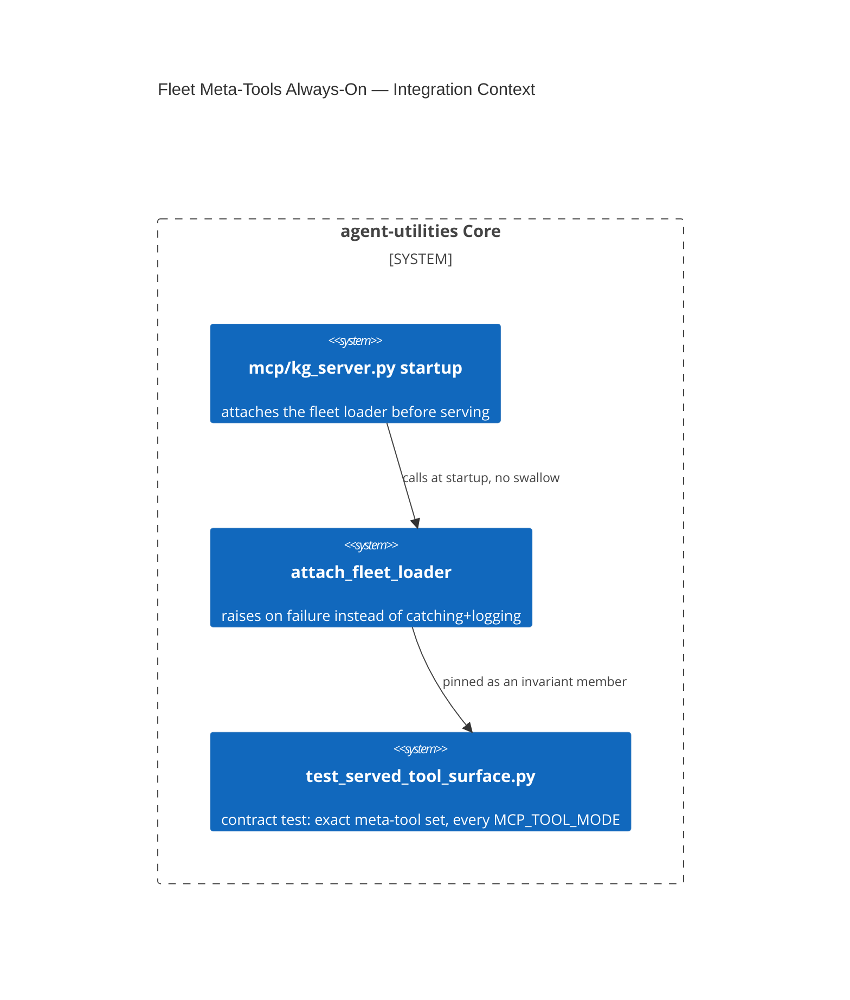

# Design Document: Fleet Meta-Tools Are Mode-Independent (Fail-Loud Fleet Loader Attach)

CONCEPT:AU-ECO.mcp.fleet-meta-tools-always-on

## KG Analysis (Required)

### Nearest Existing Concepts

| Concept ID | Name | Similarity | Pillar |
|---|---|---|---|
| `AU-OS.governance.truthful-state-invariant` | sibling truthfulness bug in the same subsystem (multiplexer status reporting) | 0.35 | OS |
| `AU-ECO.multiplexer.running-vs-dispatchable-metrics` | adjacent multiplexer-health concept, different layer (metrics, not startup) | 0.25 | ECO |

### Extension Analysis

- **Primary Extension Point**: `mcp/kg_server.py` (fleet loader attach at
  startup), `mcp/child_resilience.py`.
- **Extension Strategy**: augment — change a silent-degrade failure mode to
  fail-loud at startup.
- **New Concept Required?**: Yes — no existing concept named "the five fleet
  meta-tools must be present regardless of `MCP_TOOL_MODE`".

### New Concept Proposal

- **Proposed ID**: `CONCEPT:AU-ECO.mcp.fleet-meta-tools-always-on`
- **Augments Pillar**: ECO (domain `mcp`)
- **15-Phase Pipeline Integration**: process startup, before Phase 0 —
  `find_tools`/`load_tools`/`unload_tools`/`list_catalog`/`multiplexer_status`
  are the five meta-tools that must exist independent of condensed/verbose/
  both tool-surface mode.
- **Justification**: a real production incident — an SDK-rename `ImportError`
  inside `child_resilience` silently dropped `attach_fleet_loader` via
  `except Exception: logger.error(...)`, downgrading the server to serve
  **118 ungated tools with no `load_tools` at all** and no visible signal
  to a caller beyond a server-side log line nobody was watching. Alternative
  (status quo — catch the attach failure and log it) is explicitly rejected:
  it produced a silently-wrong served surface with no way to detect it short
  of manually counting tools against an expected baseline. Fix: the attach
  now `raise ... from exc` on failure — a hard startup failure — for any
  directly-served graph-os process; the comment carves out that this is
  "only for a directly-served process" (an embedded/offline build with no
  fleet loader is a different, not-yet-existing deployment mode).

## C4 Context Diagram

## Data Flow

1. **ORCH**: none directly — startup-time gate, before any orchestration.
2. **KG**: none.
3. **AHE**: none.
4. **ECO**: this IS the ECO-pillar fleet-gateway invariant — the five
   meta-tools are the only way any caller discovers/loads the rest of the
   fleet, so their absence would silently disable the entire fleet-gateway
   model regardless of `MCP_TOOL_MODE`.
5. **OS**: fail-loud-on-startup is the OS-pillar posture this enforces —
   never a degraded-but-running server.

## Risk Assessment

- **Blast Radius**: every graph-os process boot; a regression here again
  serves the entire ungated fleet with zero visibility.
- **Backward Compatible**: Yes for correct configurations — a working attach
  is unaffected. Breaking for any deployment whose fleet loader attach was
  already silently broken (it will now fail to start instead of serving
  degraded) — this is the intended behavior change.
- **Breaking Changes**: startup now hard-fails where it previously degraded
  silently. Intentional.
- **What would make this wrong later**: if a legitimate deployment mode is
  added where the fleet loader is genuinely expected to be unavailable (an
  embedded/offline build, per the comment's carve-out), this boundary would
  need re-checking — today no such mode exists, so the always-fail-loud
  posture is unconditionally correct.
