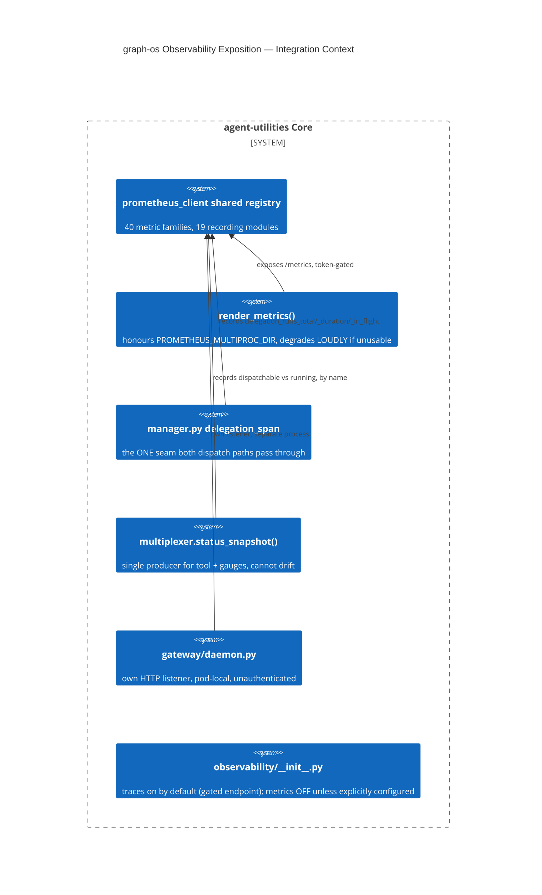

# Design Document: graph-os Metrics/Trace Exposition (Delegation, Child-Health, Multiprocess, OTLP)

> All six concepts below trace to one observability epic: the core exposition
> fix is commit `daa26dec` ("expose graph-os metrics, delegation +
> child-health series, OTLP traces" — 4 of the 6 concept ids are its literal
> `CONCEPT:` trailer); `daemon-metrics-listener` and
> `otlp-metrics-exporter-gated` trace to the sibling WIP-then-landed commit
> `9d305595` covering the standalone gateway daemon's metrics HTTP listener.
> Real, substantive prose for every one of these already exists in
> `docs/architecture/observability.md` and the introducing commit messages —
> this doc is a formalization + KG-analysis wrapper, not new narrative.

CONCEPT:AU-OS.observability.delegation-run-metrics ·
CONCEPT:AU-OS.observability.multiprocess-registry-guard ·
CONCEPT:AU-OS.observability.otlp-trace-fanout ·
CONCEPT:AU-ECO.multiplexer.running-vs-dispatchable-metrics ·
CONCEPT:AU-OS.observability.daemon-metrics-listener ·
CONCEPT:AU-OS.observability.otlp-metrics-exporter-gated

## KG Analysis (Required)

### Nearest Existing Concepts

| Concept ID | Name | Similarity | Pillar |
|---|---|---|---|
| `AU-OS.observability.literal-service-topology-labels` | sibling observability-privacy concept, different concern (redaction, not exposition plumbing) | 0.40 | OS |
| `AU-OS.governance.truthful-state-invariant` | the multiplexer's status-truthfulness fix that `running-vs-dispatchable-metrics` deliberately keeps in lockstep with | 0.45 | OS |

### Extension Analysis

- **Primary Extension Point**: `agent_utilities/observability/
  gateway_metrics.py`, `agent_utilities/observability/__init__.py`,
  `agent_utilities/gateway/daemon.py`, `agent_utilities/orchestration/
  manager.py`, `agent_utilities/mcp/multiplexer.py`.
- **Extension Strategy**: augment — the metrics/tracing machinery already
  existed (40 metric families, 19 recording modules feeding one shared
  `prometheus_client` registry); this makes it actually **reachable and
  correct**, not a new subsystem.
- **New Concept Required?**: Yes — six concepts, one cohesive exposition
  fix, each an independently falsifiable guarantee.

### New Concept Proposal

**Root problem, stated once (from the `daa26dec` commit message):** the
metrics machinery was already built and simply never reachable — `GET
/metrics` returned 404 because `server_factory` registers the route only
when `not remote_network or metrics_token is not None`, and the live
deployment runs streamable-http on `0.0.0.0` with `MCP_METRICS_TOKEN_REF`
unprovisioned. **That gate is a security control working as designed and is
left intact** — the token is provisioned in OpenBao instead (a deployment
concern, not a code fix).

1. **`AU-OS.observability.delegation-run-metrics`** — delegation had **no**
   telemetry: `DISPATCH_*` only covered the queue-consumed worker, not the
   in-process `Orchestrator.execute_agent`/`execute_workflow` calls that
   `graph_orchestrate` actually takes. Adds `delegation_runs_total`/
   `_duration_seconds`/`_in_flight`, recorded at the **one** seam both entry
   points pass through (`manager.py`'s `delegation_span`). Cancellation is
   counted as `cancelled`, never `error` — an operator-cancelled run must
   never pollute error-rate alerting.
2. **`AU-OS.observability.multiprocess-registry-guard`** — `render_metrics()`
   now honours `PROMETHEUS_MULTIPROC_DIR`. Default stays the single-process
   registry (correct for the actual deployment shape: one process per pod
   plus a separate gateway container); a **set-but-unusable** value degrades
   loudly at ERROR rather than silently under-reporting every other worker —
   the classic `prometheus_client` multi-worker footgun, deliberately not
   defaulted on because it needs a shared writable dir + dead-worker
   cleanup this deployment shape doesn't have.
3. **`AU-OS.observability.otlp-trace-fanout`** — honours the OTel-standard
   `OTEL_EXPORTER_OTLP_TRACES_ENDPOINT` so spans can go to Tempo while a
   different base collector keeps metrics — no invented knob. Auth is
   re-resolved against the actual trace destination so a different host
   never receives the base collector's credentials. Export failure is soft
   but **never silent**: ERROR on first failure, throttled to ~60s, INFO on
   recovery.
4. **`AU-ECO.multiplexer.running-vs-dispatchable-metrics`** — multiplexer
   child health kept process-up and tools-callable apart **by name**:
   `*_process_running`/`*_servers_running` are process-level facts only,
   while `*_tools_dispatchable`/`*_servers_dispatchable` require the breaker
   closed **and** a mounted tool. `status_snapshot()` is the single producer
   for both the `multiplexer_status` tool and these gauges "so they cannot
   drift" — the exact discipline `AU-OS.governance.truthful-state-invariant`
   generalizes elsewhere in the same file.
5. **`AU-OS.observability.daemon-metrics-listener`** — half the package's 48
   metric families were structurally uncollectable because the standalone
   gateway-daemon entry point (`python3 -m agent_utilities.gateway.daemon`)
   ran no HTTP server at all. Fix: `prometheus_client.start_http_server` as
   a background thread. Deliberately does **not** add authentication (unlike
   graph-os's bearer-gated `/metrics`) — justified inline as pod-local-only
   exposure, a different trust boundary than the internet/gateway-facing
   surface.
6. **`AU-OS.observability.otlp-metrics-exporter-gated`** — `_setup_otel`
   used to always build a `MeterProvider` against a derived
   `{base}/v1/metrics` even though **neither** real OTLP destination
   (Langfuse, Tempo) accepts metrics — pure wasted retries and log noise.
   Fix: gated behind the OTel-standard `OTEL_EXPORTER_OTLP_METRICS_ENDPOINT`,
   absent by default; Prometheus `/metrics` remains the one real metrics
   path. (Follow-up finding, D-DM-2: Langfuse's `/v1/metrics` now returns a
   lenient 200-that-discards instead of a 404 — explicitly does not change
   this fix's correctness, but a reader should not mistake the 200 for "it
   works now.")

- **Augments Pillar**: OS (domain `observability`) for five; ECO (domain
  `multiplexer`) for the sixth, because it is specifically a fleet-health
  metric, not a general observability concern.
- **15-Phase Pipeline Integration**: cross-cutting — scrape-time (all
  metrics), and the delegation seam specifically (Phase 3, Execute).
- **Justification**: each closes a specific, previously-unreachable or
  incorrect telemetry gap in an already-built pipeline; none is a variant of
  an existing concept.

## C4 Context Diagram

## Data Flow

1. **ORCH**: `delegation_span` wraps the sole `execute_agent`/
   `execute_workflow` seam `graph_orchestrate` calls.
2. **KG**: none directly — telemetry about the system, not graph data.
3. **AHE**: none — these are operational metrics, not learning signals.
4. **ECO**: the multiplexer health split is the fleet-gateway's own
   ECO-pillar surface (`multiplexer_status` tool + Prometheus gauges,
   single producer).
5. **OS**: this is the OS-pillar observability plane end to end — the
   security-gated `/metrics` route is left intact; the token is provisioned
   via OpenBao, a deployment concern outside this code change.

## Risk Assessment

- **Blast Radius**: every metric consumer (Grafana dashboards, alerting) and
  every trace consumer (Tempo).
- **Backward Compatible**: Yes — all additive; existing `/metrics` security
  gate untouched.
- **Breaking Changes**: None.
- **What would make this wrong later**:
  - If a future gauge-producing code path bypasses `status_snapshot()` and
    computes its own liveness check, it reintroduces the exact drift
    `running-vs-dispatchable-metrics` and the sibling truthful-state-
    invariant RCA both exist to prevent.
  - If the deployment topology changes to genuine multi-worker-per-pod
    without `PROMETHEUS_MULTIPROC_DIR` being revisited, metrics silently
    under-report again.
  - If Langfuse's now-lenient `/v1/metrics` 200-discard is ever mistaken for
    "metrics export works," per D-DM-2's explicit warning.
  - `daemon-metrics-listener`'s no-auth posture would need re-deriving if the
    standalone daemon is ever exposed outside its pod network.
