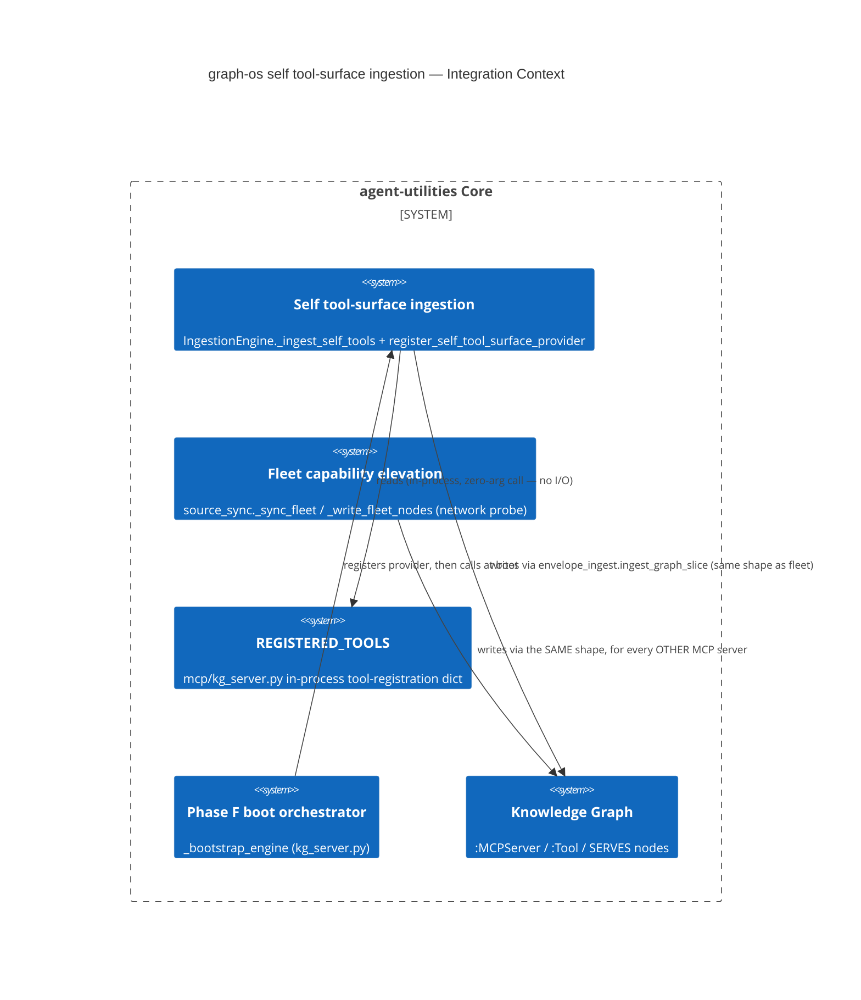

# Design Document: graph-os self tool-surface ingestion

> Every feature begins with a design document. This gates creation through
> the Knowledge Graph to enforce the **Extend-Before-Invent** principle.

## KG Analysis (Required)

### Nearest Existing Concepts

| Concept ID | Name | Similarity | Pillar |
|---|---|---|---|
| AU-KG.ontology.capability-node-aliases-lexical | Fleet capability elevation (`_sync_fleet`/`_write_fleet_nodes`, `source_sync.py`) | high | AU-KG |
| AU-KG.query.vendor-agnostic-traversal | `IngestionEngine` / the `MCP_SERVER` adaptor (`_ingest_mcp_server`) | high | AU-KG |
| AU-KG.ingest.capability-writeback | Content-hash delta-skip registry — `MCP_SERVER`/`SKILL` are explicitly excluded (own freshness semantics) | med | AU-KG |

### Extension Analysis

- **Primary Extension Point**: the existing `MCP_SERVER` capability-elevation shape — `source_sync._write_fleet_nodes` (one `:MCPServer` node, one `:Tool` node per surfaced tool, a `SERVES` edge, committed through `envelope_ingest.ingest_graph_slice`). `IngestionEngine._ingest_self_tools` reuses this exact node/edge shape and commit primitive verbatim.
- **Extension Strategy**: specialize.
- **New Concept Required?**: Yes — see justification below.

### New Concept Proposal

- **Proposed ID**: `CONCEPT:AU-KG.ingest.self-tool-surface`
- **Augments Pillar**: KG
- **15-Phase Pipeline Integration**: Ingestion (capability discovery) → Graph write (envelope commit) → boot hydration (Phase F orchestrator).
- **Justification**: every other `MCP_SERVER` source is discovered by **probing a live server over MCP transport** (`_sync_fleet` → `MCPMultiplexer.probe_catalog`). Applying that same discovery mechanism to graph-os's own tool surface is structurally unsafe: it would make graph-os a network client of itself mid-request (`engine.py`'s `self_names` skip exists precisely to prevent this self-probe deadlock — see the module comment above `register_self_tool_surface_provider`). This concept names the alternative, safe discovery mechanism this problem requires: a **plain, synchronous, in-process registry read** (`register_self_tool_surface_provider` + `mcp/kg_server.py::REGISTERED_TOOLS`) standing in for the network probe, while landing on the exact same output shape and commit path as every other `MCP_SERVER` source. It is a new *discovery mechanism* concept, not a new *node shape* concept — the KG search correctly surfaced high similarity to the existing capability-elevation concepts because the shape is deliberately unchanged.

## C4 Context Diagram

## Data Flow

1. **ORCH**: no orchestrator invocation — this is boot-time infrastructure self-description, not a callable capability. The orchestrator benefits indirectly: once ingested, graph-os's own tools become queryable/reasoned-about (`graph_query`/`graph_analyze`) exactly like any fleet server's tools.
2. **KG**: writes one `:MCPServer` node (`mcp_server_graph-os`) and one `:Tool` node per surfaced tool, linked by `SERVES`, through the same `envelope_ingest.ingest_graph_slice` commit primitive every other `MCP_SERVER` source uses — idempotent by content hash, so an unchanged tool surface re-ingests as a no-op.
3. **AHE**: closes ingestion-hydration-program gap 6 — a precondition for the self-evolution flywheel to reason over graph-os's *own* capability surface (e.g. "which tools are underused", "which tools lack coverage"), not just the rest of the fleet's.
4. **ECO**: no new MCP tool exposed; this ingests metadata *about* the existing ~95 `graph_*`/`engine_*` tools, it does not add one.
5. **OS**: no new guardrail. Reuses the existing envelope/commit boundary's governance (RLS, tenant scoping) unchanged; the provider itself is read-only and side-effect-free.

## Risk Assessment

- **Blast Radius**: `agent_utilities/knowledge_graph/ingestion/engine.py` (new module-level registry + one adaptor-adjacent method) and `agent_utilities/mcp/kg_server.py` (two new boot-hydration helper functions + two call sites in `_bootstrap_engine`). No existing adaptor, route, or schema is modified.
- **Backward Compatible**: Yes. `register_self_tool_surface_provider` defaults to `None` (a no-op `skipped` ingest) for every process that never calls it — every non-graph-os consumer of `IngestionEngine` (tests, scripts, other services) is unaffected.
- **Breaking Changes**: None. The boot call is additive, best-effort, and exception-isolated (a failure logs and continues; it cannot block graph-os startup or serving).
