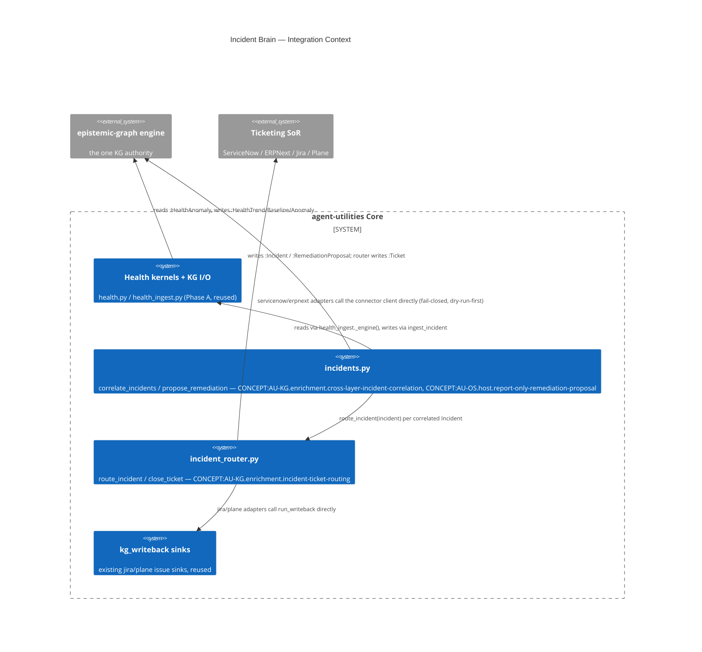

# Design Document: Incident Brain — cross-layer correlation, ticket routing, report-only remediation

> Every feature begins with a design document. This gates creation through
> the Knowledge Graph to enforce the **Extend-Before-Invent** principle.

## KG Analysis (Required)

### Nearest Existing Concepts

| Concept ID | Name | Similarity | Pillar |
|---|---|---|---|
| AU-KG.ingest.enterprise-source-extractor | shared health kernels I/O (`observability/health_ingest.py`) | high — same module family, extended in place | KG |
| AU-OS.host.remediation-playbooks | fleet-event-triage remediation playbooks (`knowledge_graph/adaptation/remediation_playbooks.py`) | medium — same "observe → propose/actuate" shape, different trigger (FleetEvent, not a correlated multi-layer Incident) and always report-only here | OS |
| AU-KG.enrichment.ticket-status-comment-writeback | ticket status/comment writeback sinks (`knowledge_graph/enrichment/writeback/sinks/issue_tracker.py`) | medium — reused directly (jira/plane adapters call `run_writeback`) rather than re-implemented | KG |

### Extension Analysis

- **Primary Extension Point**: CONCEPT:AU-KG.ingest.enterprise-source-extractor
  (`agent_utilities.observability.health_ingest.ingest_incident`, which its own
  docstring flagged as "a minimal shape — the correlation loop that populates
  this richly is a later phase").
- **Extension Strategy**: augment (the minimal `:Incident` writer gains
  optional richer fields) + compose (a new correlation/routing/remediation
  layer sits on top of the existing health kernels + `kg_writeback` sinks
  without duplicating either).
- **New Concept Required?**: Yes — three, one per new capability surface (see
  below); none of the existing pillars had a concept for "correlate anomalies
  into an incident", "route an incident to a ticketing SoR", or "propose a
  report-only remediation for a correlated incident" specifically.

### New Concept Proposal

- **Proposed ID**: CONCEPT:AU-KG.enrichment.cross-layer-incident-correlation
  - **Augments Pillar**: KG
  - **15-Phase Pipeline Integration**: enrichment/derivation (a periodic
    CronJob / `graph_loops` tick reads `:HealthAnomaly`, writes `:Incident`)
  - **Justification**: no existing concept covers joining anomalies across the
    unified infra-intelligence layers (hardware/os/orchestration/service/
    network) on a shared asset within a time window into one incident —
    `AU-KG.enrichment.ticket-status-comment-writeback`-family concepts are
    writeback, not derivation/correlation.
- **Proposed ID**: CONCEPT:AU-KG.enrichment.incident-ticket-routing
  - **Augments Pillar**: KG
  - **15-Phase Pipeline Integration**: enrichment/writeback (fail-closed,
    dry-run-first, mirrors the existing `kg_writeback` sink gating)
  - **Justification**: the existing `servicenow`/`erpnext` writeback sinks
    manage CMDB CIs / Items·Assets, not incident tickets (a different SoR
    table); this is a distinct pluggable-adapter surface keyed on
    `INCIDENT_TICKET_BACKEND`, reusing `run_writeback` where a sink already
    fits (jira/plane) rather than duplicating it.
- **Proposed ID**: CONCEPT:AU-OS.host.report-only-remediation-proposal
  - **Augments Pillar**: OS
  - **15-Phase Pipeline Integration**: adaptation (report-only proposal only —
    explicitly NOT the actuation phase `AU-OS.host.remediation-playbooks`
    already owns for FleetEvent-triggered subjects)
  - **Justification**: `remediation_playbooks.py` observes/confirms/actuates
    through the `ActionPolicy` gate for FleetEvent subjects; this concept is
    narrower and deliberately non-actuating — it only maps a correlated
    Incident's root-cause layer to a proposed action and writes a
    `:RemediationProposal` node for a human/later dispatcher to pick up via
    the same alert-bridge → `graph_loops` seam, never executing itself.

## C4 Context Diagram

## Data Flow

1. **ORCH**: a CronJob (`apptier/incident-correlation.yaml`, every 15m) or a
   `graph_loops` tick runs `python -m agent_utilities.observability.incidents`
   → `run_incident_correlation()`.
2. **KG**: reads all `:HealthAnomaly` nodes (any layer/producer) via the
   engine read client, groups by shared host/node asset within a time window,
   writes one `:Incident` per cluster (dedupe on a stable signature), then
   `:Ticket` (via `incident_router.route_incident`) and `:RemediationProposal`
   (via `incidents.propose_remediation`) — both linked back to the incident.
3. **AHE**: not yet participating in self-improvement cycles; a future wave
   could learn better root-cause-layer weighting from ticket resolution
   outcomes.
4. **ECO**: not exposed as a new MCP tool/A2A capability in this wave (no live
   caller beyond the CronJob entry point) — `graph_search`/`graph_query`
   already reach the written `:Incident`/`:Ticket`/`:RemediationProposal`
   nodes generically; a dedicated `graph_*` action is a natural follow-up once
   an operator wants to browse/approve incidents interactively.
5. **OS**: routing/remediation are fail-closed + dry-run-first by default
   (`INCIDENT_TICKET_ENABLE`, `INCIDENT_TICKET_BACKEND=none`); dispatching a
   `:RemediationProposal` into real actuation is a deliberate future step
   through the existing `remediation_playbooks.py` / `graph_loops` seam, not
   built here.
