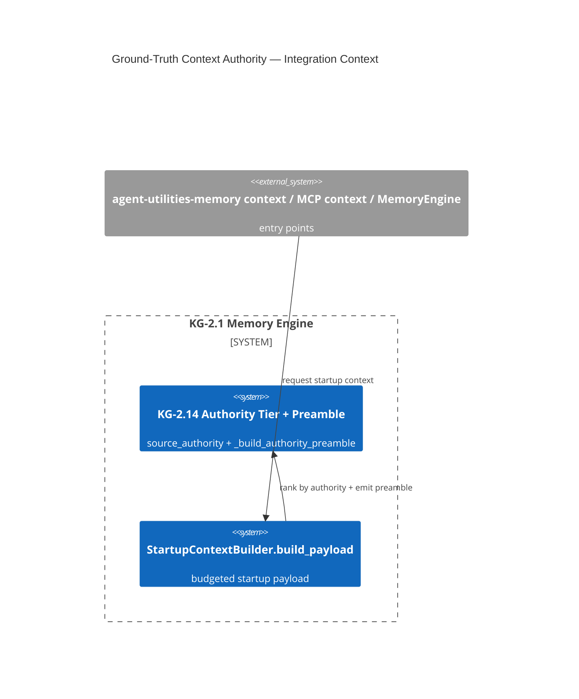

# Design Document: Ground-Truth Context Authority (KG-2.14)

> Assimilates memory-os Layer 7 "Ground Truth Hierarchy" (`ClaudioDrews/memory-os@a4ca094`,
> `layers/07-ground-truth.md`) — but as **structural, graph-grounded chunk authority + a budgeted
> startup preamble**, not an unverifiable prompt assertion. Shipped; this is the as-built design.

## Research Provenance

| Source | Location | Claim | Verification |
|---|---|---|---|
| memory-os Layer 7 | `layers/07-ground-truth.md`, `icarus/hooks.py` | Injected memory declared authoritative → stops "memory-zero" re-fetching | verified — tokens `memory-zero`/`Ground Truth`/`injected memory` present in source |

## KG Analysis (Required)

### Nearest Existing Concepts

| Concept ID | Name | Similarity | Pillar |
|---|---|---|---|
| KG-2.1 | Tiered Memory & Context | 0.86 (offline matcher 0.61, review band) | KG-2 |
| KG-2.6 | Memory Stability | 0.43 | KG-2 |

### Extension Analysis

- **Primary Extension Point**: `KG-2.1` (Tiered Memory & Context) — the startup-context builder.
- **Extension Strategy**: `augment` — add an authority tier to `StartupChunk` + an authority preamble
  in `build_payload`; no parallel module.
- **New Concept Required?**: Yes — `KG-2.14` (minted), justified as the orthogonal *authority* axis on
  injected memory (KG-2.1 covers recency/tiering; this covers "is it authoritative").

## C4 Context Diagram

## Data Flow

1. **ORCH**: agent startup requests the startup payload via CLI / MCP `graph` context / `MemoryEngine.build_startup_context`.
2. **KG**: `_authority_for(source, heading)` classifies each `StartupChunk` (advisory/standard/authoritative);
   `_chunk_priority` applies `AUTHORITY_BOOST`; `_build_authority_preamble` emits the Ground-Truth block.
   Authority composes with KG-2.11 bi-temporal validity + KG-2.6 trust.
3. **AHE**: n/a (read path).
4. **ECO**: surfaced through the existing memory CLI / MCP context action — no new tool.
5. **OS**: preamble is budget-reserved so it never crowds out content.

## Success Metric

Reduction in redundant re-fetch tool calls per session (the agent stops re-searching context already
injected) vs a no-preamble baseline.

## Risk Assessment

- **Blast Radius**: `knowledge_graph/memory/memory_engine.py` (additive `StartupChunk.source_authority`,
  `_authority_for`, `AUTHORITY_BOOST`, `_build_authority_preamble`, `build_payload` preamble insert).
- **Backward Compatible**: Yes — `source_authority` defaults to `standard`; preamble only appears when
  authoritative sources are present; budget reserved.
- **Breaking Changes**: None.

## Wiring (Wire-First, ≤3 hops — verified)

`agent-utilities-memory context` (cmd_context) / MCP `graph` context action / `MemoryEngine.build_startup_context`
→ `build_payload` → `_build_authority_preamble` = **2 hops** (`check_wiring.py`: reachable).

## As-built

Implemented in `knowledge_graph/memory/memory_engine.py`; tests in
`tests/unit/knowledge_graph/test_kg_2_14_ground_truth_authority.py`; deep-dive doc at
`docs/pillars/2_epistemic_knowledge_graph/KG-2.14-Ground_Truth_Authority.md`.
