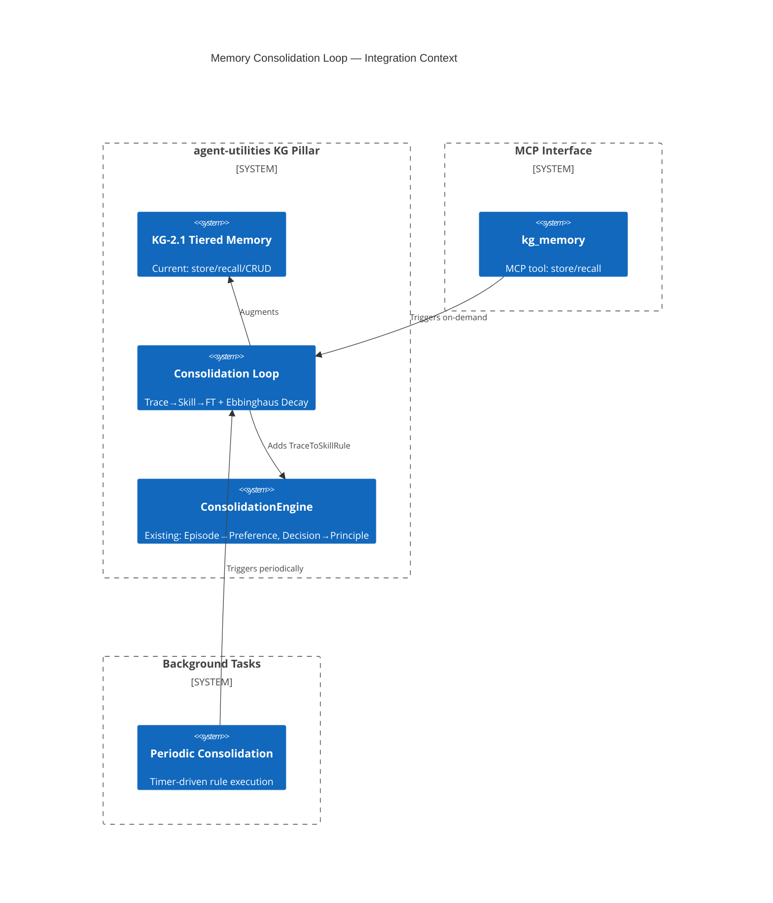

# Design Document: Memory Consolidation Loop (CONCEPT:KG-2.1)

> Every feature begins with a design document. This gates creation through
> the Knowledge Graph to enforce the **Extend-Before-Invent** principle.

## Research Provenance

| Paper | Source Path | Score | Key Finding |
|-------|-----------|-------|-------------|
| MEMO Survey | `2504.01990v2.pdf` | 0.641 | Memory lifecycle as latent optimization; Ebbinghaus decay; CLS theory |
| ParamMem | `2604.27707v1.pdf` | 0.601 | Retrieval-only agents hit generalization ceiling (Theorem 1) |
| MemReranker | `2605.06132v1.pdf` | 0.544 | MemOS memory-as-resource; reasoning-aware reranking |

## KG Analysis (Required)

### Nearest Existing Concepts

| Concept ID | Name | Similarity | Pillar |
|---|---|---|---|
| `KG-2.1` | Tiered Memory & Context | 0.95 | KG |
| `KG-2.2` | Ontology & Epistemics | 0.65 | KG |
| `AHE-3.5` | Heavy Thinking & Background Intelligence | 0.55 | AHE |
| `ORCH-1.2` | Specialist Routing & Discovery | 0.40 | ORCH |

### Extension Analysis

- **Primary Extension Point**: `CONCEPT:KG-2.1` — Tiered Memory & Context
- **Extension Strategy**: `augment` — adds consolidation loop + decay scoring to existing memory system
- **New Concept Required?**: No — extends KG-2.1 with three new consolidation rules

### Research-Backed Feature Set

1. **Ebbinghaus Decay Scoring** (MEMO Survey §3.2)
   - Add time-decay function to `kg_memory recall` scoring
   - Half-lives: Working=5min, Episodic=4hr, Semantic=30-day
   - Formula: `relevance = base_score × exp(-λt)` where λ = ln(2)/half_life

2. **Trace→Skill Distillation** (ParamMem §4, MEMO §5.1)
   - New `TraceToSkillRule` in `ConsolidationEngine`
   - Detects patterns: N ≥ 3 ChatTurn/ExecutionTrace nodes with positive outcomes
   - Proposes `SkillNode` entries capturing reusable strategies
   - Background timer + on-demand MCP trigger (both)

3. **Memory Poisoning Defense** (ParamMem §6.2)
   - Add `trust_score` field to MemoryNode
   - Provenance-tracked memories inherit trust from source agent
   - Untrusted memories quarantined until explicit approval

4. **Instruction-Aware Reranking** (MemReranker)
   - Post-retrieval reranker that considers task context
   - Lightweight: no LLM call, uses dot-product similarity against task embedding

## C4 Context Diagram

## Data Flow

1. **ORCH**: Orchestrator can trigger consolidation via `kg_memory(action='consolidate')`
2. **KG**: Reads ChatTurn, ExecutionTrace nodes; writes SkillNode proposals; updates trust scores
3. **AHE**: Consolidation proposals feed into self-improvement evaluation pipeline
4. **ECO**: Exposed as `kg_memory(action='consolidate')` MCP tool
5. **OS**: Trust scoring governed by security guardrails (OS-5.1)

## Risk Assessment

- **Blast Radius**: `engine_memory.py`, `consolidation.py`, `kg_server.py` (kg_memory tool)
- **Backward Compatible**: Yes — all new fields are optional with defaults
- **Breaking Changes**: None — existing store/recall API unchanged
