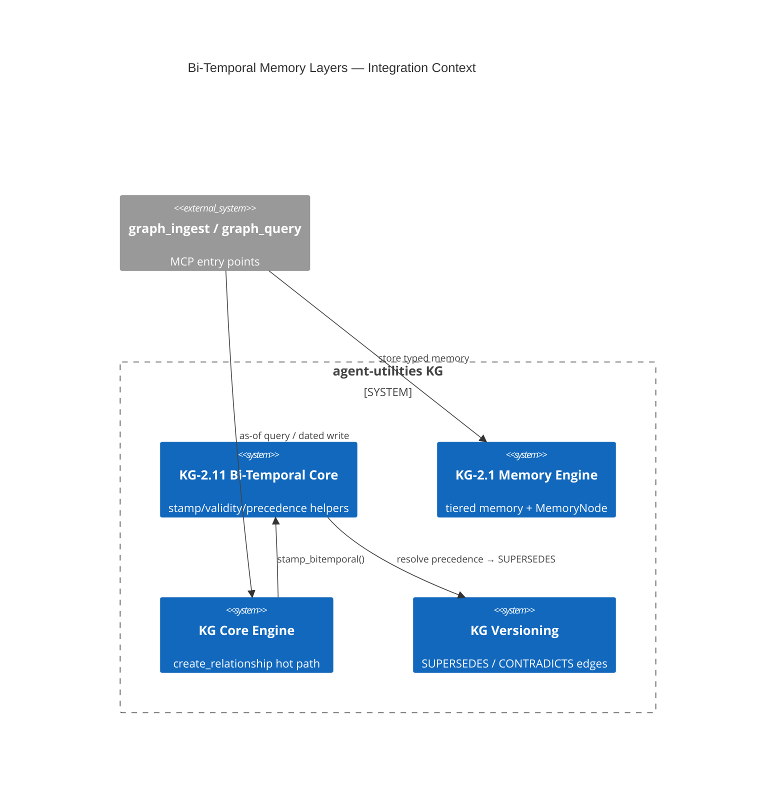

# Design Document: Bi-Temporal Memory Layers (KG-2.11)

> Assimilates Quarq Agent's **three memory layers** (semantic / episodic / procedural) and its
> **Temporal Truth Protocol** into agent-utilities — but as **structural graph properties** (a
> procedural memory-node type + first-class bi-temporal stamping + as-of resolution + edge-based
> contradiction precedence) instead of Quarq's flat `memory_type` string and prompt-only date
> discipline. This is the highest-leverage correctness lift for LongMemEval temporal questions.

## Research Provenance

| Source | Location | Behavior assimilated | Our structural upgrade |
|---|---|---|---|
| Quarq three layers | `agent-oss/agent.py:1058-1466, 3587` | `memory_type` ∈ {Semantic, Episodic}; Procedural rules JSON w/ `target_entity` + `tags` | Procedural becomes a first-class node type w/ `APPLIES_TO` edges (1-hop selective injection) |
| Temporal Truth Protocol | `agent-oss/agent.py:2370-2477, 3114-3161` | Prompt rules separating storage/event/narrative/relative dates | First-class `event_time` vs `storage_time` + `valid_from`/`valid_to`; as-of queries |
| Conflict resolution | `agent-oss/agent.py:2462-2468` | Prompt "conflict table; newer supersedes older" | Structural: later `event_time` wins → `SUPERSEDES` edge + loser `valid_to` set (never deleted) |

**Superiority delta:** Quarq cannot answer "what was true as of date T" — its flat files only know
storage order. agent-utilities resolves it with a bi-temporal `valid_from <= T < valid_to` filter
and resolves contradictions by event-time precedence over existing `CONTRADICTS`/`SUPERSEDES` edges.

## KG Analysis (Required)

### Nearest Existing Concepts

| Concept ID | Name | Similarity | Pillar |
|---|---|---|---|
| KG-2.1 | Tiered Memory & Context | 0.86 | EG-KG.compute.backend |
| KG-2.3 | Unified Retrieval & Graph Integrity | 0.74 | EG-KG.compute.backend |
| KG-2.16 | (temporal/time-series facet) | 0.69 | EG-KG.compute.backend |
| ECO-4.0 | Memory tier ingestion | 0.66 | AU-ECO.connector.plane-provisioning-auth |
| KG-2.5 | Topological Partitioning | 0.40 | EG-KG.compute.backend |

### Extension Analysis

- **Primary Extension Point**: `KG-2.1` (Tiered Memory & Context) — similarity 0.86 ≥ 0.70, MUST extend.
- **Secondary**: `KG-2.3` (Graph Integrity) for the temporal-contradiction facet.
- **Extension Strategy**: `augment` — additive `MemoryNode` fields + additive edge props + pure helper module wired into the existing relationship-creation hot path.
- **New Concept Required?**: Yes — `KG-2.11` as an explicit sub-concept of KG-2.1 (per user decision), justified as the bi-temporal + procedural-layer augmentation distinct from the decay-based tiering KG-2.1 already covers.

### New Concept Proposal

- **Proposed ID**: `CONCEPT:AU-KG.temporal.bi-temporal-memory-layers`
- **Augments Pillar**: KG
- **15-Phase Pipeline Integration**: Phase 4 (Epistemic — sync/extraction) for stamping; query-time for as-of resolution.
- **Justification**: KG-2.1 models *recency decay* across working/episodic/semantic tiers. KG-2.11 adds the orthogonal *valid-time* axis (event vs storage time) and the missing *procedural* layer — neither is expressible as decay.

## C4 Context Diagram

## Data Flow

1. **ORCH**: Retrieval can scope procedural rules to resolved entities via `APPLIES_TO` (consumed by KG-2.12).
2. **KG**: Writes `event_time`, `storage_time`, `valid_from`, `valid_to` on edges; `memory_type` + `target_entity` on `MemoryNode`; writes `SUPERSEDES` on contradiction.
3. **AHE**: The background learner (KG-2.13) stamps event_time at learn-time (relative→absolute resolution).
4. **ECO**: Exposed through existing `graph_ingest` (typed/dated writes) and `graph_query` (as-of) MCP tools — no new tool.
5. **OS**: Never hard-deletes — sets `valid_to`, preserving audit trail (governance-friendly).

## Risk Assessment

- **Blast Radius**: `models/knowledge_graph.py` (additive `MemoryNode` fields), `core/engine.py:415` (additive edge props), new `core/bitemporal.py` (pure, isolated), `core/kg_versioning.py` (precedence helper). All additive/backward-compatible.
- **Backward Compatible**: Yes — new fields default (`memory_type="semantic"`, `target_entity=""`); edge props default (`valid_to=None` = open interval); existing queries ignore unknown props.
- **Breaking Changes**: None. `valid_to` is set only on explicit SUPERSEDES; nothing is deleted.

## Wiring (Wire-First, ≤3 hops)

- `graph_ingest` (store_memory) → engine memory CRUD → `MemoryNode(memory_type=...)` = **2 hops**.
- `graph_write`/`graph_ingest` → `engine.create_relationship` → `stamp_bitemporal` = **2 hops**.
- `graph_query` → `query_cypher(as_of=...)` → `is_valid_as_of` filter = **2 hops**.
