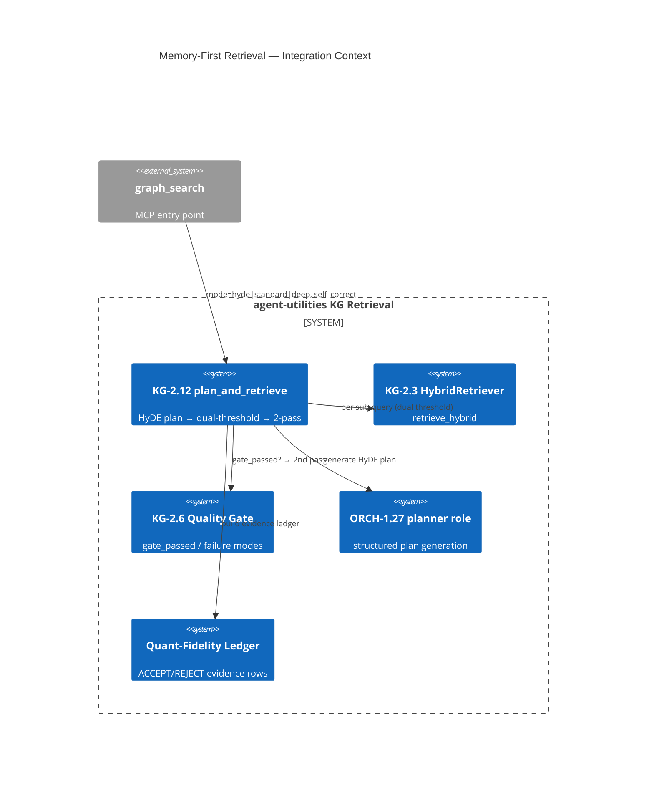

# Design Document: Memory-First Retrieval (KG-2.12)

> Assimilates Quarq Agent's retrieval stack — **HyDE query expansion**, **dual-threshold hybrid
> search**, **self-correcting two-pass retrieval**, and **quantitative-fidelity evidence ledger** —
> onto agent-utilities' graph-native hybrid retriever. With KG-2.11 (bi-temporal), this is the
> pair that closes most of the gap to 98.2% on LongMemEval-S.

## Research Provenance

| Source | Location | Behavior | Our upgrade |
|---|---|---|---|
| HyDE planner | `agent-oss/agent.py:1817-2020` | 4 vector queries (baseline/entity/action/literal) + keywords + search_mode | Planner runs as the ORCH-1.27 `planner` role; each sub-query runs the graph-native `retrieve_hybrid` (backlink boost + positional encodings enrich every hit) |
| Dual threshold | `agent-oss/agent.py:1336-2052` | 0.38 standard / 0.28 deep | Same constants, mapped to the existing `relevance_threshold` param |
| Two-pass self-correction | `agent-oss/agent.py:2676-2825` | `REQUIRED_DATA` flag → re-search at 0.28 → regenerate | Trigger is **evidence-based** (`RetrievalQualityGate.gate_passed`) not pure model self-report |
| Quantitative fidelity | `agent-oss/agent.py:2435,3211` | actor/action/event/exactness ACCEPT/REJECT ledger | Ledger consumes existing `ContextProvenanceRecord` scores; persisted for the learner to audit |

**Superiority delta:** Quarq's second pass fires only when the model *admits* missing data;
ours also fires when the quality gate *measures* a failure mode (low-relevance/drift/staleness),
catching confident-but-wrong first passes Quarq cannot.

## KG Analysis (Required)

### Nearest Existing Concepts

| Concept ID | Name | Similarity | Pillar |
|---|---|---|---|
| KG-2.3 | Unified Retrieval & Graph Integrity | 0.88 | KG-2 |
| AHE-3.4 | Query Decomposition (`retrieve_decomposed`) | 0.79 | AHE-3 |
| KG-2.6 | Retrieval Quality Gate | 0.76 | KG-2 |
| KG-2.11 | Bi-Temporal Memory (recency) | 0.62 | KG-2 |
| ORCH-1.27 | Role-Specialized Routing (planner) | 0.55 | ORCH-1 |

### Extension Analysis

- **Primary Extension Point**: `KG-2.3` (Unified Retrieval) — similarity 0.88 ≥ 0.70, MUST extend.
- **Reuses**: `AHE-3.4` decomposition pattern (`retrieve_decomposed`/`_decompose_query`), `KG-2.6` quality gate (`RetrievalQualityReport.gate_passed`), `ORCH-1.27` planner role.
- **Extension Strategy**: `augment` — `plan_and_retrieve()` is a new **method on `HybridRetriever`** (keeps the 3-hop ceiling) plus pure helpers in a new `hyde_planner.py`.
- **New Concept Required?**: Yes — `KG-2.12` sub-concept of KG-2.3 (per user decision), distinct as the *memory-first orchestration* of retrieval (plan → multi-query → gate → second pass → ledger).

### New Concept Proposal

- **Proposed ID**: `CONCEPT:KG-2.12`
- **Augments Pillar**: KG
- **15-Phase Pipeline Integration**: Phase 3 (Topology/embeddings) for retrieval; query-time orchestration.
- **Justification**: KG-2.3 covers the hybrid retriever mechanics; KG-2.12 is the multi-stage memory-recall *policy* (HyDE plan + dual threshold + gated two-pass + fidelity ledger) layered atop it.

## C4 Context Diagram

## Data Flow

1. **ORCH**: `graph_search(mode="hyde", self_correct=true)` → `search_hybrid` → `plan_and_retrieve`.
2. **KG**: Reads embeddings/edges via `retrieve_hybrid`; the ledger reads `ContextProvenanceRecord` scores.
3. **AHE**: Reuses AHE-3.4 decomposition; the gate failure signal feeds the second pass.
4. **ECO**: Exposed via the existing `graph_search` MCP tool (new `mode`/`self_correct` params) — no new tool.
5. **OS**: Second pass gated strictly on `gate_passed=False` to bound latency (no always-on fan-out).

## Risk Assessment

- **Blast Radius**: `retrieval/hybrid_retriever.py` (+`plan_and_retrieve`), new `retrieval/hyde_planner.py` (pure), `orchestration/engine_query.py:279` (`search_hybrid` gains `mode`/`self_correct`), `mcp/kg_server.py` (`graph_search` params). Additive.
- **Backward Compatible**: Yes — defaults (`mode="standard"`, `self_correct=False`) preserve current `search_hybrid` behavior; planner failure degrades to a single-query plan.
- **Breaking Changes**: None.

## Wiring (Wire-First, ≤3 hops)

- `graph_search` → `search_hybrid` → `plan_and_retrieve` → `retrieve_hybrid` = **3 hops** (at the ceiling; `plan_and_retrieve` stays a method, not a service).
