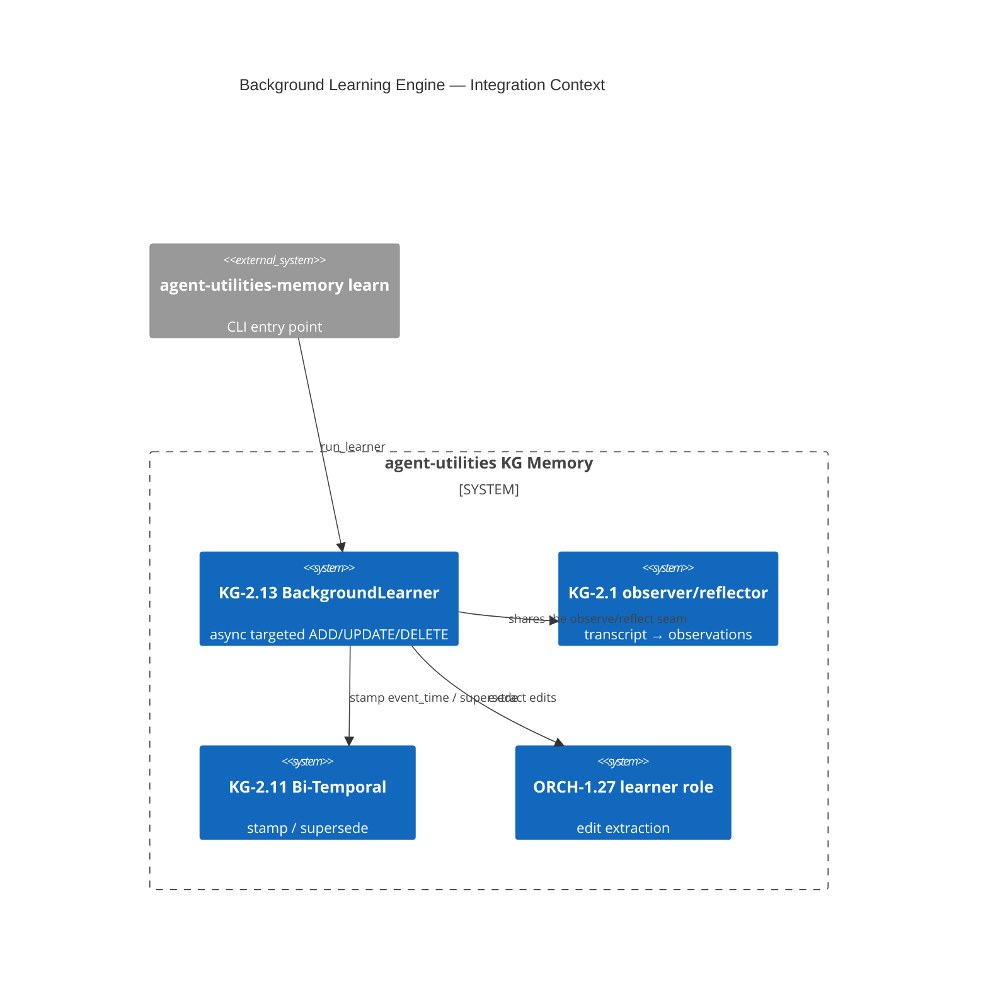

# Design Document: Background Learning Engine (KG-2.13)

> Assimilates Quarq Agent's asynchronous **targeted-edit learner** (semaphore-bounded, backoff,
> sync-barriered; ADD/UPDATE/DELETE fact edits, not raw dumps) into agent-utilities — wired into
> the existing observer/reflector seam and writing **bi-temporal graph mutations** (KG-2.11) via
> the **learner role** (ORCH-1.27), so an UPDATE supersedes rather than overwrites.

## Research Provenance

| Source | Location | Behavior | Our upgrade |
|---|---|---|---|
| Async learner | `agent-oss/agent.py:99-160, 2951-3007` | `Semaphore(4)`, exponential backoff (2→60s), sync barriers, fire-and-forget tasks | Same controls (backoff **bounded** to satisfy the ≤60s test gate, not Quarq's infinite loop) |
| Targeted edits | `agent-oss/agent.py:3303, 3646, 1277` | learner emits ADD/UPDATE/DELETE ops | UPDATE writes a `SUPERSEDES` edge + closes `valid_to` (KG-2.11); DELETE is **soft** (status=REMOVED + valid_to), never destroying history |
| Relative-date resolution | `agent-oss/agent.py:3114-3161` | "yesterday"/"last week" → absolute at learn time | `resolve_relative_dates` stamps the resolved `event_time` |

**Superiority delta:** Quarq rewrites a JSON line on UPDATE (history lost) and hard-deletes on
DELETE. Ours mutates the graph with bi-temporal stamping so prior beliefs remain queryable as-of.

## KG Analysis (Required)

### Nearest Existing Concepts

| Concept ID | Name | Similarity | Pillar |
|---|---|---|---|
| KG-2.1 | Tiered Memory & Context (consolidation) | 0.84 | EG-KG.compute.backend |
| AHE-3.2 | Agentic Evolution / reflection | 0.73 | AHE-3 |
| KG-2.11 | Bi-Temporal Memory | 0.71 | EG-KG.compute.backend |
| ORCH-1.27 | Role-Specialized Routing (learner) | 0.58 | ORCH-1 |
| ECO-4.0 | Memory tier ingestion | 0.55 | AU-ECO.connector.plane-provisioning-auth |

### Extension Analysis

- **Primary Extension Point**: `KG-2.1` (Tiered Memory & Context) — similarity 0.84 ≥ 0.70, MUST extend.
- **Reuses**: the `observer.observe_transcript` / `optimization_engine.run_reflector` seam, the KG-2.11 bi-temporal write path, the ORCH-1.27 `learner` role.
- **Extension Strategy**: `augment` — a new `memory/learning_engine.py` beside `observer.py`, plus a `learn` CLI subcommand.
- **New Concept Required?**: Yes — `KG-2.13`, sub-concept of KG-2.1, distinct as the *continuous targeted-edit consolidation* loop (vs. KG-2.1's decay-based tiering / KG-2.11's temporal model).

### New Concept Proposal

- **Proposed ID**: `CONCEPT:AU-KG.memory.background-learning-engine`
- **Augments Pillar**: KG (+AHE-3 self-improvement)
- **15-Phase Pipeline Integration**: Phase 4 (Epistemic — extraction) and Phase 5 (Governance — async evolution).
- **Justification**: KG-2.1 consolidates by recency decay; KG-2.13 adds an LLM-driven targeted ADD/UPDATE/DELETE editor with concurrency/backoff controls and bi-temporal supersession.

## C4 Context Diagram

## Data Flow

1. **ORCH**: The `learner` role (ORCH-1.27) extracts edits from a transcript.
2. **KG**: Writes/updates/soft-deletes `MemoryNode`s with bi-temporal stamps; UPDATE writes `SUPERSEDES`.
3. **AHE**: Runs as the async consolidation arm of the self-improvement loop.
4. **ECO**: Exposed via the `agent-utilities-memory learn` CLI subcommand (and reuses `observe`/`reflect` endpoints).
5. **OS**: `Semaphore(4)` + bounded exponential backoff + a `await_pending` sync barrier bound resource use and guarantee no indefinite hang (≤60s test gate).

## Risk Assessment

- **Blast Radius**: new `memory/learning_engine.py` (isolated), `memory/cli.py` (+`learn` subcommand). Additive.
- **Backward Compatible**: Yes — purely additive; no existing API changes.
- **Breaking Changes**: None. DELETE is soft (preserves history), diverging *safely* from Quarq's hard delete.

## Wiring (Wire-First, ≤3 hops)

- `agent-utilities-memory learn` CLI → `run_learner` → `engine.add/update/delete_memory_node` = **3 hops**.
