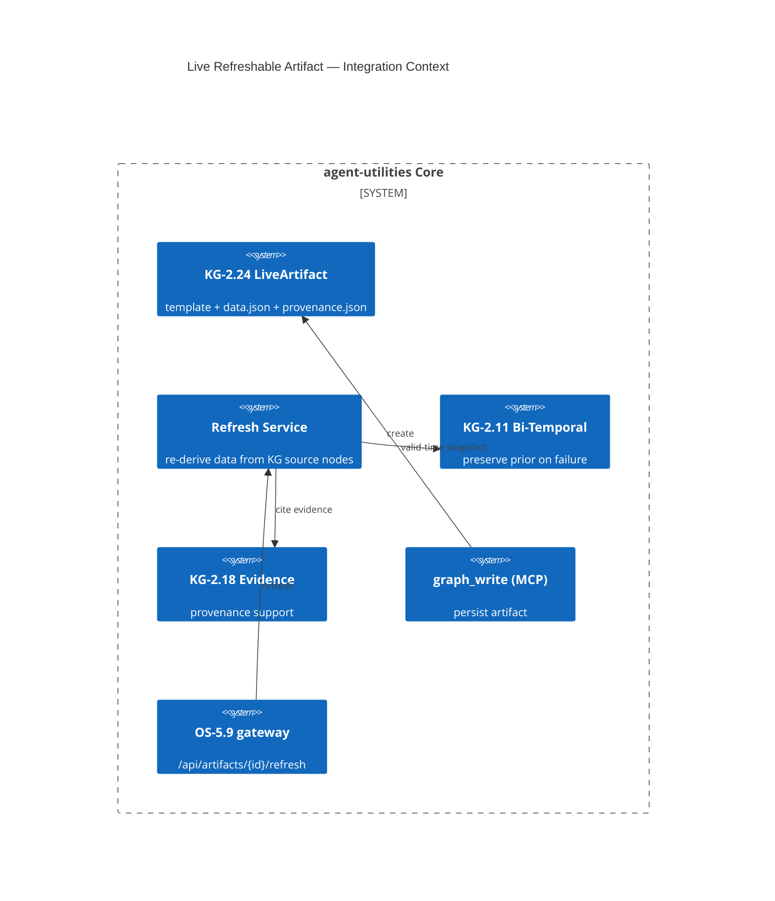

# Design Document: Live Refreshable Artifact (KG-2.24)

> Assimilates open-design's Live Artifact: an output split into **template + data + provenance** that
> **re-derives its data from a source on refresh**, preserving the prior render on failure. agent-utilities
> makes the source the **epistemic KG itself**, so artifacts become living, provenance-traced data products
> over a bi-temporal, evidence-weighted, self-curating graph. **This is the lighthouse synergy epic** (E4).

## Research Provenance

| Source | Location | Behavior assimilated |
|---|---|---|
| open-design Live Artifact spec | `specs/2026-04-29-live-artifacts/spec.md` | template.html + data.json → index.html; schema-versioned; Mustache `{{data.path}}` + `data-od-repeat`; bounded JSON; refresh re-executes source; failed refresh preserves prior; provenance per generation; `refreshes.jsonl` |
| open-design examples | `specs/.../examples/{artifact,data,provenance}.json` | concrete manifest/data/provenance triad |
| open-design SSRF-safe render | `apps/web/src/components/file-viewer-render-mode.ts` | srcDoc inject + postMessage bridge (contract adapted; renderer deferred) |

**Superiority delta:** open-design refreshes from a *generic* connector/tool. agent-utilities refreshes
from the **KG**: "failed refresh preserves prior" is literally **bi-temporal valid-time** (KG-2.11);
provenance cites **evidence-weighted** support (KG-2.18); refresh participates in the **self-curating
wiki** cycle (KG-2.19) so artifacts update when their source nodes change. No open-design clone can
produce a traceable, self-evolving data product — only one with an epistemic graph can.

## KG Analysis (Required)

### Nearest Existing Concepts
<!-- kg_search("refreshable artifact template data provenance re-derive from source preserve prior", top_k=5) -->

| Concept ID | Name | Similarity | Pillar |
|---|---|---|---|
| KG-2.19 | Self-Curating Wiki | 0.63 | KG-2 |
| KG-2.11 | Bi-Temporal Memory Layers | 0.58 | KG-2 |
| KG-2.18 | Evidence-Weighted Memory | 0.52 | KG-2 |
| OS-5.9 | Gateway Service Dashboard | 0.45 | OS-5 |
| KG-2.1 | Tiered Memory & Context | 0.39 | KG-2 |

> Highest 0.63 < 0.70 → **new concept justified**. KG-2.19 auto-curates *graph content*; KG-2.24 produces
> a *rendered, refreshable artifact* (template+data+provenance) over that content with a public refresh API.

### Extension Analysis
- **Primary Extension Point**: `KG-2.11` (bi-temporal), `KG-2.18` (evidence), `KG-2.19` (self-curation); `OS-5.9` (gateway) for the refresh surface.
- **Extension Strategy**: `compose` — a Live Artifact node type + refresh service over existing KG facets.
- **New Concept Required?**: Yes (the artifact triad + refresh contract).

### New Concept Proposal
- **Proposed ID**: `CONCEPT:KG-2.24`
- **Augments Pillar**: KG (with OS-5.9 gateway surface, OS-5.3 SSRF-safe contract)
- **15-Phase Pipeline Integration**: Phase 5 (Synthesize/emit) + a refresh path off the gateway.
- **Justification**: A refreshable, render-bound, provenance-tracked artifact over KG source nodes has no existing concept.

## C4 Context Diagram

## Data Flow
1. **ORCH**: an agent step emits a Live Artifact (template + bound KG query) instead of a static blob.
2. **KG**: `graph_write` persists the artifact node + `source_nodes` edges; refresh re-runs the bound query; bi-temporal valid-time keeps the prior datum if the new derivation fails validation.
3. **AHE**: refresh success/staleness metrics feed eval; stale artifacts can trigger a re-derive job.
4. **ECO**: write via `graph_write` MCP tool; refresh via new `/api/artifacts/{id}/refresh` gateway route; SSRF-safe contract emitted for any frontend.
5. **OS**: bounded JSON limits enforced (8 levels/100 keys/500 items/16KiB/256KiB); injection-safe interpolation only (no raw HTML/expressions); OS-5.3 contract.

## Risk Assessment
- **Blast Radius**: new `knowledge_graph/live_artifacts/` package, `mcp/kg_server.py` (artifact write helper), `gateway/api.py` (refresh route), `server/routers/agent_ui.py` (progress SSE). Additive.
- **Backward Compatible**: Yes — new node type + new route; existing writes unaffected.
- **Breaking Changes**: None.

## Wiring (Wire-First, ≤3 hops)
- `graph_write` (MCP) → `LiveArtifactStore.create` = **1 hop**.
- `/api/artifacts/{id}/refresh` → `RefreshService.refresh` → KG query = **2 hops**.
