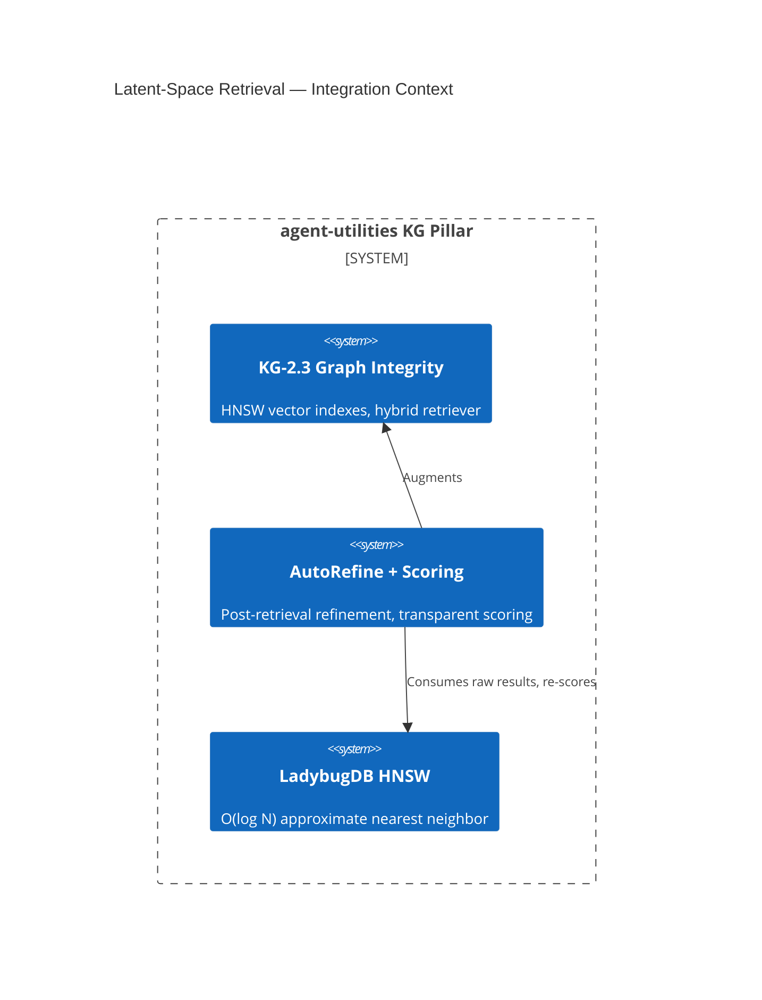

# Design Document: Latent-Space Retrieval Optimization (CONCEPT:AU-KG.memory.auto-similarity-memory-graph)

> Every feature begins with a design document. This gates creation through
> the Knowledge Graph to enforce the **Extend-Before-Invent** principle.

## Research Provenance

| Paper | Source Path | Score | Key Finding |
|-------|-----------|-------|-------------|
| LatentRAG | `2605.06285v1.pdf` | 0.508 | Latent-space reasoning+retrieval; 90% latency reduction |
| MINER | `2605.06460v1.pdf` | 0.519 | Internal representation mining; multi-layer probing |
| SIRA | `2605.06647v1.pdf` | 0.556 | Expected-response sketch retrieval; single-query corpus discrimination |

## KG Analysis (Required)

### Nearest Existing Concepts

| Concept ID | Name | Similarity | Pillar |
|---|---|---|---|
| `KG-2.3` | Graph Integrity & Retrieval | 0.92 | KG |
| `KG-2.0` | Active Knowledge Graph | 0.70 | KG |
| `KG-2.4` | Inductive Knowledge & Hypergraphs | 0.45 | KG |

### Extension Analysis

- **Primary Extension Point**: `CONCEPT:AU-KG.memory.auto-similarity-memory-graph` — Graph Integrity & Retrieval
- **Extension Strategy**: `augment` — adds AutoRefine post-retrieval stage and scoring transparency
- **New Concept Required?**: No

### Research-Backed Feature Set

1. **AutoRefine Post-Retrieval Stage** (LatentRAG §3.2)
   - After HNSW retrieval, run a lightweight re-scoring pass
   - Score each result against the query context (not just raw cosine)
   - Filter low-quality results before returning to caller

2. **Multi-Layer Embedding Probing** (MINER §2.1)
   - Future: extract retrieval signals from intermediate transformer layers
   - Immediate: add diagnostic method to identify which embedding layer carries most signal
   - 4.5% nDCG@5 improvement without increasing index size

3. **Scoring Transparency** (SIRA §4)
   - Always include `score` field in search results
   - Add `scoring_method` metadata to API responses
   - Expose `expected_response_sketch` for corpus-discriminative queries

## C4 Context Diagram

## Data Flow

1. **ORCH**: No direct integration — orchestrator uses search via KG
2. **KG**: Modifies `discover_innovations()` and `search_hybrid()` return format
3. **AHE**: AutoRefine quality metrics feed evaluation engine
4. **ECO**: `kg_search` MCP tool returns enhanced scoring metadata
5. **OS**: No guardrail changes needed

## Risk Assessment

- **Blast Radius**: `engine_query.py` (discover_innovations, search_hybrid), `kg_server.py` (kg_search)
- **Backward Compatible**: Yes — scoring metadata is additive
- **Breaking Changes**: None
