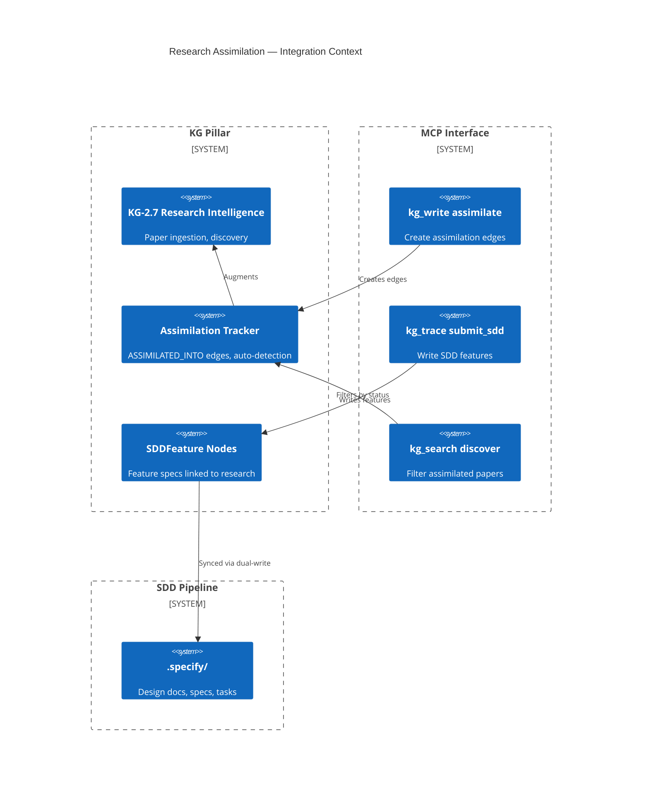

# Design Document: Research Assimilation Tracking (CONCEPT:AU-KG.research.research-pipeline-runner)

> Every feature begins with a design document. This gates creation through
> the Knowledge Graph to enforce the **Extend-Before-Invent** principle.

## Research Provenance

This feature is meta — it tracks the provenance of all other research-derived features.

## KG Analysis (Required)

### Nearest Existing Concepts

| Concept ID | Name | Similarity | Pillar |
|---|---|---|---|
| `KG-2.7` | Research Intelligence | 0.90 | KG |
| `KG-2.0` | Active Knowledge Graph | 0.60 | KG |
| `AU-ORCH.planning.legal-automation-roadmap` | DSTDD Pipeline | 0.55 | ORCH |

### Extension Analysis

- **Primary Extension Point**: `CONCEPT:AU-KG.research.research-pipeline-runner` — Research Intelligence
- **Extension Strategy**: `augment` — adds assimilation lifecycle tracking to existing research intelligence
- **New Concept Required?**: No

### Feature Set

1. **ASSIMILATED_INTO Edge Type**
   - Links Article nodes to codebase Code nodes
   - Properties: `concept_ids[]`, `sdd_feature_ids[]`, `codebase`, `status`, `assimilation_date`
   - Status enum: `reviewed` → `assimilated` → `implemented`
   - Generalized: works across ANY ingested codebase, not just agent-utilities

2. **DERIVED_FROM_RESEARCH Edge Type**
   - Links SDDFeature nodes back to source Article nodes
   - Created when SDD specs reference research papers
   - Enables traceability: feature → paper → innovation claim

3. **Auto-Detection of Assimilation**
   - When SDDFeature nodes transition to `status='COMPLETED'`:
     - All linked Article nodes (via DERIVED_FROM_RESEARCH) get `ASSIMILATED_INTO` edges auto-created
     - Status set to `implemented`
   - Triggered by: `kg_trace(action='submit_sdd')` with `status='COMPLETED'`

4. **Comparative Analysis Filtering**
   - `discover_innovations()` gains `exclude_assimilated` parameter
   - When True, filters out Article chunks that have `ASSIMILATED_INTO` edges with `status='implemented'`
   - Future comparative analyses automatically skip already-implemented papers

5. **SDDFeature Node Type**
   - Properties: `id`, `name`, `concept_ids[]`, `research_sources[]`, `status`, `sdd_path`, `codebase`
   - Written via `kg_trace(action='submit_sdd')`
   - Links: `DERIVED_FROM_RESEARCH` → Article, `IMPLEMENTS_FINDING` → Code

## C4 Context Diagram

## Data Flow

1. **ORCH**: DSTDD pipeline triggers SDD creation via `kg_trace(action='submit_sdd')`
2. **KG**: Creates SDDFeature nodes, ASSIMILATED_INTO edges, DERIVED_FROM_RESEARCH edges
3. **AHE**: Auto-detection runs as post-hook when SDD status changes to COMPLETED
4. **ECO**: `kg_write(action='assimilate')` exposed as MCP tool
5. **OS**: No guardrail changes needed

## Risk Assessment

- **Blast Radius**: `kg_server.py` (kg_write, kg_trace, kg_search), `engine_query.py` (discover_innovations)
- **Backward Compatible**: Yes — new node/edge types are additive
- **Breaking Changes**: None
