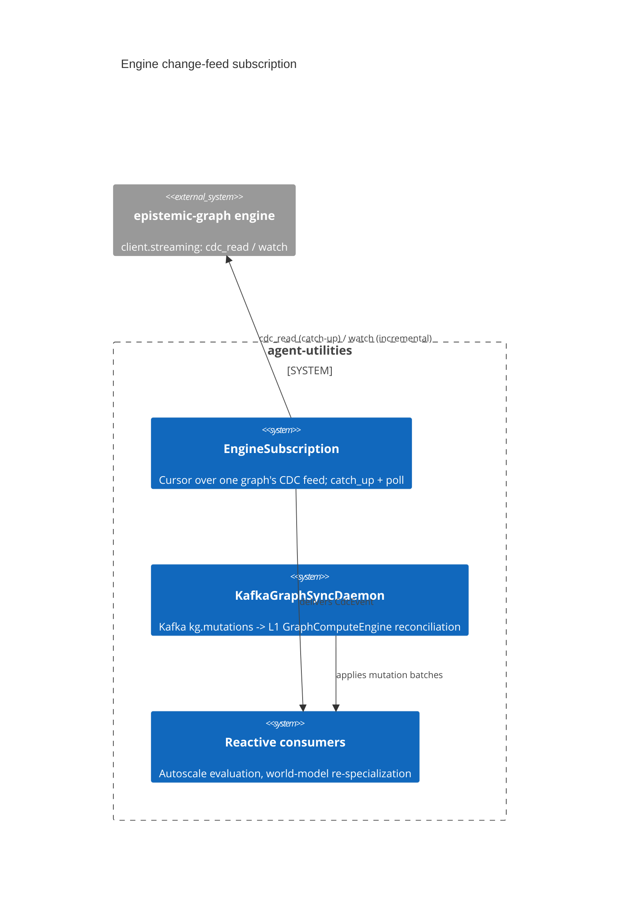

# Design Document: Engine change-feed subscription (poll→push reactivity)

> Backfilled under the concept-lineage rule (CONCEPT:AU-OS.governance.concept-lineage-parent-doc)
> for a concept that has carried live markers for multiple releases without a
> design document. `AU-KG.compute.event-driven-sync` is an earlier, narrower
> instance of the same poll→push idea and points at this document rather than
> restating it.

CONCEPT:AU-KG.compute.change-feed-subscription · CONCEPT:AU-KG.compute.event-driven-sync

## KG Analysis (Required)

### Nearest Existing Concepts

| Concept ID | Name | Similarity | Pillar |
|---|---|---|---|
| `AU-KG.compute.event-driven-sync` | Kafka-backed L1/L3 reconciliation daemon | 0.70 | KG |
| `KG-2.229/230` | engine `client.streaming` (`cdc_read` / `watch`) primitives this wraps | 0.80 | KG (engine) |

### Extension Analysis

- **Primary Extension Point**: `epistemic_graph.client.streaming` (`cdc_read` /
  `watch`), already shipped by the Rust engine.
- **Extension Strategy**: augment — this is the missing consumer-side wrapper
  around an existing engine primitive, not a new transport.
- **New Concept Required?**: No. This document names the decision the marker
  already carries.

## Decision — one reusable subscription primitive, not N ad-hoc poll loops

`CONCEPT:AU-KG.compute.change-feed-subscription` —
`agent_utilities/graph/reactive/engine_subscription.py`.

**The problem**: agent-utilities fans writes INTO the engine (the in-process
`graph.reactive` event-sourcing layer) but historically never consumed the
engine's own committed-change feed back out. Every daemon that needed to react
to graph mutations (autoscale evaluation, world-model re-specialization) had to
run its own full-rescan poll loop on a timer — O(whole-graph) work per tick
regardless of how much actually changed.

**The rejected alternative** was letting each daemon keep its own poll loop
against `backend.execute` queries. It works, and it is what `event-driven-sync`
(below) still does at the Kafka layer, but it does O(graph size) work on every
tick and each caller reinvents cursor bookkeping independently.

**The design chosen**: `EngineSubscription` wraps the engine's own
change-data-capture cursor (`streaming.cdc_read` / `streaming.watch`, engine
concepts KG-2.229/230) as ONE primitive with two delivery surfaces built on the
SAME cursor:

1. **Cold-start catch-up** (`catch_up`) — bounded tail read via `cdc_read` (up
   to `catch_up_limit` events, default 4096) so a freshly started daemon
   converges without re-scanning graph history.
2. **Incremental push** (`poll`) — one `watch` long-poll from the current
   cursor, filtered by `label`; `block_ms=0` (daemon-tick default) returns
   immediately with whatever is pending (O(new-changes) work per tick, not
   O(history)); `block_ms>0` blocks for a dedicated reactive thread.

Both surfaces deliver each change to a registered `handler(event)` — a
`CdcEvent` dict (`seq`/`kind`/`node_id`/`label`/`before`/`after`). The
subscription owns ONLY cursor management + delivery; the handler decides what
to do. `resolve_streaming` (`engine_subscription.py:53`) degrades to `None` —
and every `EngineSubscription` method becomes a safe no-op — on a backend
without the engine `streaming` feature (a non-engine mirror, or an engine build
without it), so a caller wires the subscription unconditionally and keeps its
periodic reconcile as the safety net rather than branching on backend type.

**What breaks if this is violated**: a new reactive consumer that opens its own
`cdc_read`/`watch` call directly, instead of going through
`EngineSubscription`, duplicates cursor-lifecycle bugs this module already
solved once (catch-up limit, `_caught_up` state, degrade-to-no-op on a
non-streaming backend) — the exact three-ad-hoc-loops problem this primitive
was built to retire.

### event-driven-sync — the earlier, Kafka-layer instance of the same idea

`CONCEPT:AU-KG.compute.event-driven-sync` —
`agent_utilities/knowledge_graph/core/kafka_graph_sync.py`.

`KafkaGraphSyncDaemon` is the predecessor pattern: it consumes `kg.mutations`
events off the `EventBackend` (Kafka) and applies them to the in-process
`GraphComputeEngine` (L1) to keep it consistent with the persistent backend
(L3), batching flushes for 100ms, reconciling every 5 minutes, and
circuit-breaking to a full reload past 10K events of lag. It solves the same
poll→push problem one layer up the stack (event-bus-fed L1/L3 consistency
rather than engine-native CDC), predates `EngineSubscription`, and is kept as
its own module because it consumes a different feed (Kafka topic, not the
engine's native CDC cursor) with its own batching/circuit-breaker concerns.
It is recorded here rather than given a second document because it is the same
architectural decision — collapse a poll loop into an event-driven consumer —
applied to the layer that predates the engine's own streaming feature.

## C4 Context Diagram

## Data Flow

1. **ORCH**: reactive daemons wire `EngineSubscription` unconditionally and
   keep their periodic reconcile as the fallback when streaming is unavailable.
2. **KG**: the engine's own durable CDC log is the source of truth; no
   side-channel socket.
3. **AHE**: world-model re-specialization is a downstream handler.
4. **ECO**: not directly exposed as an MCP tool; an internal wiring primitive.
5. **OS**: none — read-only consumption of already-committed mutations.

## Risk Assessment

- **Blast Radius**: `graph/reactive/engine_subscription.py`,
  `orchestration/fleet_autoscaler.py`, `harness/world_model_task.py`,
  `knowledge_graph/core/kafka_graph_sync.py`.
- **Backward Compatible**: Yes — `available=False` degrades every method to a
  no-op; existing periodic-reconcile callers are unaffected.
- **Breaking Changes**: None.
- **Known weak point**: on an engine build without the `streaming` feature, a
  caller that assumes `poll()` delivers events (rather than checking
  `available`) silently gets zero events and must rely on its own reconcile.
