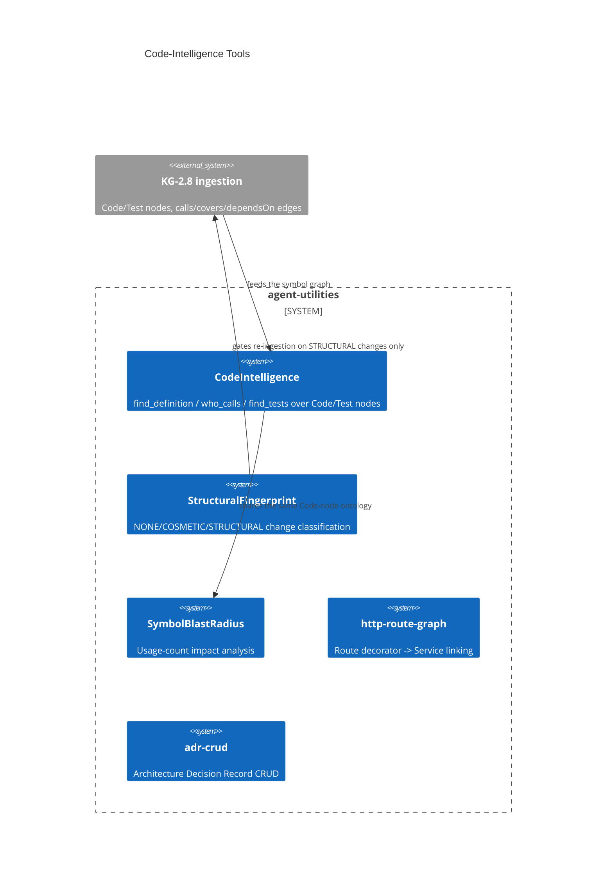

# Design Document: Code-Intelligence Tools — the SWE agent's grounding surface

> Backfilled under the concept-lineage rule (CONCEPT:AU-OS.governance.concept-lineage-parent-doc).
> Five sibling markers (`adr-crud`, `built-ast-extended`, `http-route-graph`,
> `structural-fingerprint`, `symbol-blast-radius`) are per-capability
> realisations of the one decision below and point at this document instead of
> each restating it.

CONCEPT:AU-KG.compute.code-intelligence-tools · CONCEPT:AU-KG.compute.adr-crud ·
CONCEPT:AU-KG.compute.built-ast-extended · CONCEPT:AU-KG.compute.http-route-graph ·
CONCEPT:AU-KG.compute.structural-fingerprint · CONCEPT:AU-KG.compute.symbol-blast-radius

## KG Analysis (Required)

### Nearest Existing Concepts

| Concept ID | Name | Similarity | Pillar |
|---|---|---|---|
| `KG-2.8` | code ingestion emitting `Code`/`Test` nodes with `calls`/`covers`/`dependsOn` edges | 0.75 | KG |
| `KG-2.65` | the symbol-graph query layer `CodeIntelligence` is built on | 0.85 | KG |

### Extension Analysis

- **Primary Extension Point**: the live code ontology (`Code`/`Test` nodes,
  `CALLS`/`covers`/`dependsOn` edges) already ingested by KG-2.8.
- **Extension Strategy**: augment — every capability below is a query or a
  metadata layer over that ontology, not a new ingestion path.
- **New Concept Required?**: No.

## Decision — ground the SWE agent in graph queries, not context-window reads

`CONCEPT:AU-KG.compute.code-intelligence-tools` —
`agent_utilities/tools/code_intelligence_tools.py`.

**The rejected alternative, named explicitly in the module docstring**: OpenHands
grounds its `CodeActAgent` by stuffing file contents into the context window and
compressing with a summarizing condenser — a context-window gamble that degrades
on a large, unread repo. agent-utilities does the opposite: because KG-2.8
ingestion already emits `Code`/`Test` nodes with `calls`/`covers`/`dependsOn`
edges, "where is this defined?", "who calls this?" and "which tests cover
this?" become graph queries (`find_definition`, `who_calls`, `find_tests`,
`code_intelligence_tools.py:58-70`) instead of prompt-stuffing. This is what
lets the agent reason about a repository it has never read in full.

`CodeIntelligence` (`code_intelligence_tools.py:34`) is a pure, synchronous
core over `engine.backend.execute` — so it unit-tests against a fake backend —
with `@tool` wrappers adapting it to the Pydantic-AI `RunContext[AgentDeps]`
surface. Symbol matching is exact-name/id OR an id-suffix match (a qualified
tail like `pkg/mod.py::foo`), and edge-label matching is case-tolerant
(`CALLS`/`calls`) because backends normalize labels differently — a real,
observed backend-portability constraint, not defensive filler.

**What breaks if violated**: a caller that queries `Code` nodes directly with
its own Cypher, instead of through `CodeIntelligence`, re-introduces the exact
label-casing and suffix-matching bugs this module centralizes, and loses the
fake-backend unit-testability the pure-core/`@tool`-wrapper split exists for.

### The five pointers — instances, not separate decisions

**`adr-crud`** (`mcp/tools/analysis_tools.py:2054`, `mcp/kg_server.py:1779`) —
Architecture Decision Record CRUD (`query`=title creates, empty query lists,
`target`=status, `node_id`=decision text) exposed through the SAME
`graph_analyze(action="adr")` grounding surface as the rest of code
intelligence: an ADR is a queryable node type on this layer, not a separate
subsystem.

**`built-ast-extended`** (`enrichment/pipeline.py:98`,
`core/gitlab_indexer.py:57`) — the extended-language file-extension tier
(`.rb`/`.php`/`.sh`/`.scala`/`.lua`/…) that the AST-ingestion engine covers
beyond its core language set. It is a data declaration (which extensions feed
the same KG-2.8 ingestion pipeline that grounds `code_intelligence_tools`),
not an independent design.

**`http-route-graph`** (`knowledge_graph/enrichment/routes.py`,
`mcp/kg_server.py:1701`) — HTTP route extraction + code↔service linking: route
decorators on `Code` symbols become `:Route` nodes joined to the resolved
ecosystem `:Service` node via `serves`/`route` edges
(`core/owl_bridge.py:78,392`). It is the code-intelligence ontology's answer to
"which HTTP endpoint does this handler serve?" — the same graph-query
grounding pattern applied to routes instead of calls.

**`structural-fingerprint`** (`knowledge_graph/core/fingerprint.py`) — the
`StructuralFingerprint` engine classifying a file edit as NONE (identical
SHA-256) / COSMETIC (structure unchanged — whitespace, comments, formatting) /
STRUCTURAL (signature-level — params, methods, imports/exports) so the
code-intelligence ontology only re-ingests on a STRUCTURAL change, not on every
cosmetic edit. Inspired by Understand-Anything's `fingerprint.ts`/`staleness.ts`.

**`symbol-blast-radius`** (`knowledge_graph/core/blast_radius.py`) — traces how
widely a Python symbol is used across the codebase (regex-based usage
tracking with definition-line exclusion), surfacing low-usage symbols as
dead-code candidates. Adapted from contextplus's `blast-radius.ts`, scored
into a `BlastRadiusNode`. It answers "what breaks if I change/remove this
symbol?" — the impact-analysis counterpart to `who_calls`.

## C4 Context Diagram

## Data Flow

1. **ORCH**: the SWE agent's grounding tools (`@tool` wrappers) are bound into
   the specialist's toolset for code-reasoning tasks.
2. **KG**: reads/writes `Code`/`Test`/`Route`/ADR nodes and their typed edges.
3. **AHE**: `structural-fingerprint` gates incremental re-ingestion, keeping
   the KG cheap to keep current as the codebase changes.
4. **ECO**: `adr-crud` and `http-route-graph` are also exposed via
   `graph_analyze`/REST twins.
5. **OS**: none directly — read/query surface over already-ingested data.

## Risk Assessment

- **Blast Radius**: `tools/code_intelligence_tools.py`,
  `knowledge_graph/core/fingerprint.py`, `knowledge_graph/core/blast_radius.py`,
  `knowledge_graph/enrichment/routes.py`, `mcp/tools/analysis_tools.py`,
  `knowledge_graph/enrichment/pipeline.py`, `knowledge_graph/core/gitlab_indexer.py`.
- **Backward Compatible**: Yes — all five are additive query/classification
  layers over the existing ontology.
- **Breaking Changes**: None.
- **Known weak point**: edge-label case-tolerance (`CALLS`/`calls`) is a
  symptom of backend label-normalization drift, not a permanent fix — a new
  backend with a third casing convention needs its own tolerance added by hand.
