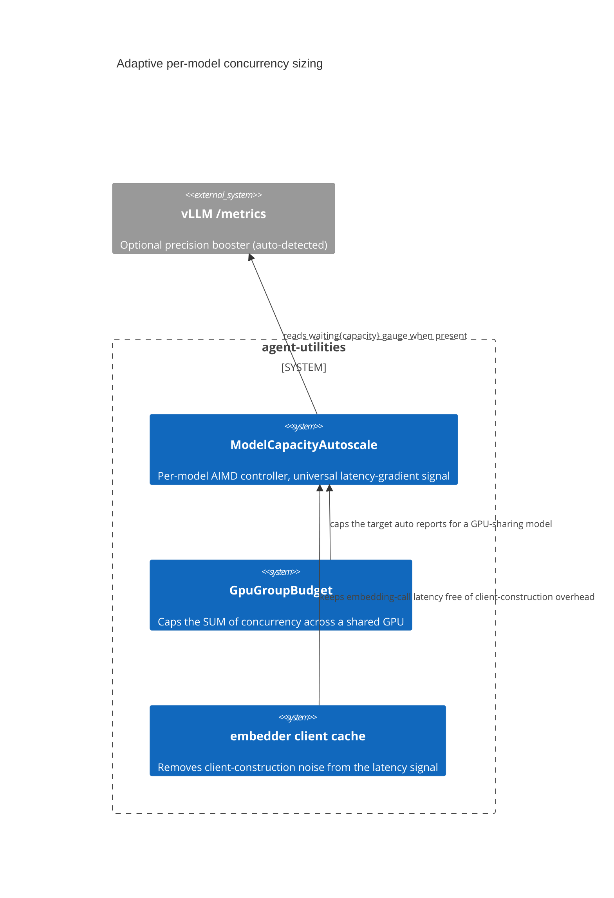

# Design Document: Adaptive per-model concurrency sizing

> Backfilled under the concept-lineage rule (CONCEPT:AU-OS.governance.concept-lineage-parent-doc).
> Three sibling markers (`config-keyed-embedder-client`,
> `pure-config-enumeration-fail`, `surfaces-universal-latency-signal`) are
> layers of the SAME concurrency-sizing decision and point at this document.

CONCEPT:AU-KG.compute.concurrency-controller-sizing ·
CONCEPT:AU-KG.compute.config-keyed-embedder-client ·
CONCEPT:AU-KG.compute.pure-config-enumeration-fail ·
CONCEPT:AU-KG.compute.surfaces-universal-latency-signal

## KG Analysis (Required)

### Nearest Existing Concepts

| Concept ID | Name | Similarity | Pillar |
|---|---|---|---|
| `AU-KG.retrieval.embedding-fast-fail` | bounding the OpenAI SDK's own retry loop (adjacent, in the same module) | 0.45 | KG |
| `Config.model_capacity` | the static floor this controller ramps above | 0.60 | KG |

### Extension Analysis

- **Primary Extension Point**: `Config.model_capacity`
  (`parallel_instances × max_parallel_calls`, `core/model_concurrency.py`).
- **Extension Strategy**: augment — the static config value becomes a *floor*,
  never a ceiling; the controller layered on top ramps toward observed real
  capacity.
- **New Concept Required?**: No.

## Decision — a model's usable concurrency is discovered, not just declared

`CONCEPT:AU-KG.compute.concurrency-controller-sizing` —
`core/config.py:1234` (`resolve a model's total parallel-call capacity`),
consumed by `knowledge_graph/enrichment/semantic.py`,
`knowledge_graph/pipeline/phases/embedding.py`.

**The problem**: the static per-model capacity declared in config is a floor —
what we KNOW the backend can take — not a ceiling. It cannot know how much
headroom a beefier GPU or an extra serving instance actually gives, nor when
the serving tier is already saturated. Treating the static value as a hard
ceiling either wastes available capacity (under-provisions on strong hardware)
or overwhelms weak hardware (over-provisions on the declared floor alone).

**The rejected alternative**: statically configure the "right" concurrency per
deployment by hand. It requires re-tuning on every hardware change and gives
no signal when the endpoint is already congested.

### surfaces-universal-latency-signal — the controller doing the sizing

`CONCEPT:AU-KG.compute.surfaces-universal-latency-signal` —
`core/model_capacity_autoscale.py`.

An AIMD (additive-increase/multiplicative-decrease) controller, one per model,
cached. The **primary signal is client-observed latency, not a server metric**
— it works against ANY OpenAI-compatible endpoint (vLLM, LM Studio,
llama.cpp, OpenAI) because it needs nothing from the server, only the latency
and status of calls the caller already makes. This is the Netflix
adaptive-concurrency-limits / TCP-Vegas approach: a low-load baseline RTT is
tracked as the EWMA of the *smallest* observed latencies (only moves down
toward fast samples, so a transient spike never poisons it);
`gradient = baseline / max(avg_recent_latency, baseline)` near 1 means no
queueing (additive increase), well below the configured threshold (default
0.9) means queueing (multiplicative decrease); any 429/503 is an immediate
multiplicative decrease regardless of gradient. `floor` = the static
configured capacity (never regresses below it); `ceiling` = `MODEL_MAX_CONCURRENCY`
(default 512). vLLM's `/metrics` gauges are an OPTIONAL precision booster,
auto-detected — `waiting{capacity} > 0` forces a hard back-off when present,
but the controller never requires it.

**What breaks if violated**: bypassing the controller and hardcoding
concurrency again reintroduces the choice this decision explicitly rejected —
either stranded headroom on strong hardware or silent overload on weak
hardware, with no adaptive signal either way.

### pure-config-enumeration-fail — the shared-GPU budget layered on top

`CONCEPT:AU-KG.compute.pure-config-enumeration-fail` — `core/gpu_group_budget.py`.

Several model endpoints can share ONE physical accelerator. Each per-model
controller above tunes in isolation toward ITS OWN real capacity — left alone,
two independently-ramping models sharing a GPU would jointly oversubscribe it
(bulk embedding starving interactive chat of GPU time). `GpuGroupBudget` caps
the SUM of concurrency targets across a GPU group, with a reserved floor for
latency-sensitive roles (`chat`/`generator`/`default`/`lite`/`super`) —
`allowed(m) = budget − Σ floor(priority peers) − Σ target(best-effort peers)`,
floored at `floor(m)`. Priority members are **seeded proactively from config**
(`_register_gpu_group_peers`), not only when first called, so an idle chat
model still reserves its floor off every other member's allowance from
process start — the hard guarantee that a best-effort peer can never
transiently exceed `budget − Σ priority floors` even while chat has never yet
run. No configured budget ⇒ `group_allowed` returns `None` ⇒ zero regression
against the single-model controller above.

### config-keyed-embedder-client — why the concurrency signal is trustworthy at all

`CONCEPT:AU-KG.compute.config-keyed-embedder-client` — `core/embedding_utilities.py:42`.

Before this cache, `create_embedding_model` rebuilt a fresh LlamaIndex
embedding client on EVERY call — per-window, per-document, per-fact on the
ingest hot path — logging a fresh `Creating OpenAIEmbedding` (new httpx
client, TLS context, tokenizer) on top of every actual network POST. That
construction overhead is itself latency noise that would have corrupted the
AIMD controller's baseline-RTT signal above. The client is stateless w.r.t.
content — only the resolved provider/model/endpoint/key/TLS/timeout matter —
so a process-scoped cache keyed by those resolved inputs
(`_EMBED_MODEL_CACHE`, thread-safe under a double-checked lock,
`embedding_utilities.py:58-59`) is safe to reuse for the whole run. It is
recorded here, not as a separate decision, because it exists so the
concurrency signal measures real network/serving latency, not
client-construction overhead.

## C4 Context Diagram

## Data Flow

1. **ORCH**: fan-out call sites (`map_concurrent_sync`, bulk-embed) query the
   controller's current target before dispatching concurrent calls.
2. **KG**: no direct graph writes — pure in-process arithmetic/state.
3. **AHE**: none directly; this stabilizes the substrate other AHE loops run on.
4. **ECO**: not exposed as an MCP tool.
5. **OS**: none — a performance/stability guardrail, not a policy gate.

## Risk Assessment

- **Blast Radius**: `core/model_capacity_autoscale.py`,
  `core/gpu_group_budget.py`, `core/embedding_utilities.py`, `core/config.py`,
  `knowledge_graph/enrichment/semantic.py`,
  `knowledge_graph/pipeline/phases/embedding.py`.
- **Backward Compatible**: Yes — floor never regresses below the static
  configured capacity; no GPU budget configured is a no-op.
- **Breaking Changes**: None.
- **Known weak point**: the AIMD baseline is per-process; a multi-process
  deployment runs independent controllers per process with no shared view of
  true aggregate load on the endpoint.
