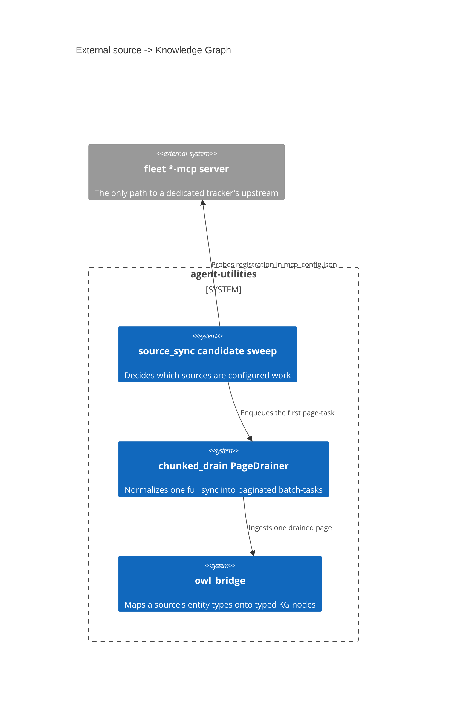

# Design Document: How an external source reaches the graph

> One decision authored across `knowledge_graph/core/source_sync.py`,
> `knowledge_graph/core/chunked_drain.py`, `knowledge_graph/core/owl_bridge.py`
> and `protocols/source_connectors/connectors/mcp_tool.py`. Backfilled from the
> code and its introducing commits under the concept-lineage rule
> (CONCEPT:AU-OS.governance.concept-lineage-parent-doc): **sixteen** of
> `AU-KG.compute`'s markers are per-source realisations of what is written here,
> and they point at this document rather than restating it sixteen times.

CONCEPT:AU-KG.compute.mcp-backed-dedicated-trackers ·
CONCEPT:AU-KG.compute.connector-declared-page-drainer

## KG Analysis (Required)

### Nearest Existing Concepts

| Concept ID | Name | Similarity | Pillar |
|---|---|---|---|
| `AU-KG.ontology.single-source-full-drain` | the chunked-drain wave normalization; same module header, the *ontology* half of the same change | 0.65 | KG |
| `AU-ORCH.execution.two-level-fair-rotation` | the `connectors` lane the page-tasks ride; scheduling, not source modelling | 0.40 | ORCH |
| `AU-KG.ingest.ambient-connector-provenance` | provenance stamped on what a connector ingests, downstream of this | 0.35 | KG |

### Extension Analysis

- **Primary Extension Point**: `source_sync._DELTA_HANDLERS` and the
  `PageDrainer` registry in `chunked_drain.py`.
- **Extension Strategy**: augment — adding a source is data (a handler entry and
  an entity-type mapping), not a new ingestion path.
- **New Concept Required?**: No new ones here. This document names the two
  decisions that already had markers and gives the other sixteen a home.

## Decision 1 — a dedicated tracker reaches its upstream ONLY through its MCP server

`CONCEPT:AU-KG.compute.mcp-backed-dedicated-trackers`

Jira, Confluence, Plane, DockerHub, Langfuse, Technitium, tunnel-manager,
Uptime-Kuma, Home Assistant, Twenty, Audiobookshelf, Firefly-III, Gramps,
Paperless-ngx and GitLab are all reached through their fleet `*-mcp` server —
never a direct vendor client with its own env token.

**The rejected alternative was a direct vendor client per source.** It is the
obvious design and it loses on three counts the code names explicitly:

1. **"Configured" stops being answerable.** A direct client's configured signal
   is "an env token is set". An MCP-backed one's is *"the server is registered in
   `mcp_config.json`"* — which the sweep can actually check. Before that gate
   existed, trackers were enqueued unconditionally, so a tracker whose `*-mcp`
   server was absent under the expected key still spawned a `connector_sync`
   task that the connector then aborted with "not found in `mcp_config`" — zero
   nodes, and never surfacing as configured work. The candidate sweep now drops
   a tracker whose server is absent, so it neither wastes a task nor misreports
   a reachable tracker as missing.
2. **Credentials stay in one place.** The fleet server already holds them
   (OpenBao-backed); a direct client would duplicate the secret into
   agent-utilities' own config surface.
3. **One remote-routing story.** The operator runs atlassian/plane remote-routed;
   a direct client would need its own transport, retry and auth handling.

The cost, accepted deliberately: a source is unreachable when its MCP server is
down, and `_MCP_TRACKER_SERVERS` must be kept in sync with each
`_resolve_tracker_instances` `default_server`. That coupling is a comment
obligation, not a mechanical one, and is the known weak point of this decision.

**Three configuration regimes, not one.** The sweep distinguishes MCP-backed
trackers (server-registered), capability-registry sources (env-token configured)
and always-local feed/fleet handlers. Collapsing them into one "is it
configured?" predicate is what produced the phantom-work bug above.

### What the pointers to this decision are

Sixteen markers point here, and the list of them lives in
`agent_utilities/governance/concept_lineage.yaml` rather than being copied into
this paragraph — a bare enumeration of sixteen ids is exactly the filler the
lineage relation exists to avoid, and the registry is the queryable form of it.

They are of three shapes. **Twelve are per-source entity-type declarations**:
one per connector, each saying "this source yields these typed nodes"
(repositories, monitors, people/companies, documents/correspondents,
accounts/transactions, zones/records, …). None is a choice between alternatives;
each is an instance of the rule above. **Three are the trackers this decision is
literally about** — the Jira, Confluence and Plane delta handlers named in
`_MCP_TRACKER_SERVERS`. **One is the hydration-layer seam** through which the
three configuration regimes are expressed.

## Decision 2 — pagination is declared by the connector, not built into the driver

`CONCEPT:AU-KG.compute.connector-declared-page-drainer`

One `source_sync(source=X, mode="full")` on a large corpus (FreshRSS's ~11k
article backlog) must not run synchronously to completion. **The rejected
alternatives were both real and both tried:** run it to completion (the request
times out) or make a human/agent hand-repeat delta waves (the operator does the
scheduler's job).

Instead the single call is normalized into a stream of paginated,
capacity-guarded batch tasks: `start_chunked_drain` enqueues the first
`connector_drain` task and returns a handle immediately; each task drains one
bounded page through the connector's own resumable `poll` cursor and
**self-continues** by enqueuing the next page with the advanced
`ConnectorCheckpoint`.

The design choice that earns its own concept is **where the pagination knowledge
lives**. A source opts in by registering a `PageDrainer` — how to build its
connector and how to ingest one drained page — and the generic driver walks *any*
such cursor to exhaustion. The mechanism is therefore not FreshRSS-specific,
which is exactly what the first implementation was. `homelab-rss-reader-as` (the
FreshRSS drainer) is the flagship instance of this, not a second decision.

Guardrails that are decisions in their own right, recorded here rather than
separately: a hard `_DEFAULT_MAX_PAGES = 5000` backstop against a connector that
reports `has_more` forever, and idempotent re-drain via the write-layer
content-hash delta.

## C4 Context Diagram

## Data Flow

1. **ORCH**: page-tasks ride the `connectors` lane under the
   `BACKGROUND_INGESTION` priority edict and the server-capacity guard.
2. **KG**: `owl_bridge` maps each source's declared entity types onto typed
   nodes; the write layer's content-hash delta makes re-drain cheap.
3. **AHE**: none directly.
4. **ECO**: every dedicated tracker is reached through an MCP server, so the
   fleet *is* the integration surface.
5. **OS**: credentials stay in the fleet server's OpenBao-backed config.

## Risk Assessment

- **Blast Radius**: `source_sync.py`, `chunked_drain.py`, `owl_bridge.py`,
  `protocols/source_connectors/connectors/mcp_tool.py`, `core/config.py`.
- **Backward Compatible**: Yes — adding a source is data.
- **Breaking Changes**: None.
- **Known weak point**: `_MCP_TRACKER_SERVERS` is kept in sync with each
  handler's `default_server` by convention. Nothing mechanically enforces it, so
  a renamed server key degrades silently into "unconfigured".
