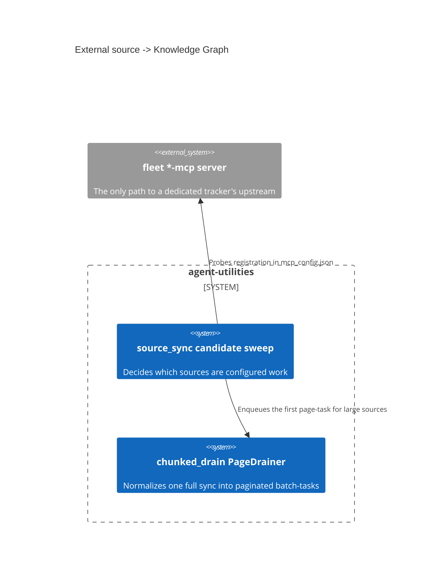

# Design Document: How an external source reaches the graph

> Backfilled under the concept-lineage rule (CONCEPT:AU-OS.governance.concept-lineage-parent-doc).
> Both markers are per-source-plane realisations of one connector-reachability
> and one pagination decision, authored across `source_sync.py` and
> `chunked_drain.py`.

CONCEPT:AU-KG.compute.mcp-backed-dedicated-trackers ·
CONCEPT:AU-KG.compute.connector-declared-page-drainer

## KG Analysis (Required)

### Nearest Existing Concepts

| Concept ID | Name | Similarity | Pillar |
|---|---|---|---|
| `AU-KG.ontology.single-source-full-drain` | the chunked-drain "controlled waves" ontology-side declaration; same module header | 0.65 | KG |
| `AU-ORCH.execution.two-level-fair-rotation` | the `connectors` lane page-tasks ride under | 0.40 | ORCH |

### Extension Analysis

- **Primary Extension Point**: `source_sync._DELTA_HANDLERS` and the
  `PageDrainer` registry in `chunked_drain.py`.
- **Extension Strategy**: augment — adding a source is a data declaration (a
  handler entry, an entity-type mapping, optionally a `PageDrainer`), not a
  new ingestion path.
- **New Concept Required?**: No.

## Decision 1 — a dedicated tracker reaches its upstream ONLY through its MCP server

`CONCEPT:AU-KG.compute.mcp-backed-dedicated-trackers` — `source_sync.py:3938-3958,4656`.

Jira, Confluence, Plane, DockerHub, Langfuse, Technitium, tunnel-manager,
Uptime-Kuma, Home Assistant and Twenty are all reached through their fleet
`*-mcp` server — never a direct vendor client holding its own env token.
`_MCP_TRACKER_SERVERS` (`source_sync.py:3945`) maps each delta source to the
candidate server keys the sweep probes.

**The rejected alternative**: a direct vendor client per source. It is the
obvious design and loses on the reasons the code states directly:
"configured" stops being answerable with a direct client (its signal is
just "an env token is set", which said nothing about whether the connector
could actually reach anything), credentials would duplicate into
agent-utilities' own config surface instead of staying in the fleet server's
OpenBao-backed store, and the operator would need a second transport/auth
story alongside the MCP-routed one already in use for remote sessions.

The design instead makes "configured" mean "the `*-mcp` server this source
needs is registered in `mcp_config.json`" — a signal the sweep can actually
verify — and the sweep drops (never mis-reports as failed) a candidate whose
server is absent. The accepted cost is an explicit coupling comment
obligation: `_MCP_TRACKER_SERVERS` must be kept in sync with each
`_resolve_tracker_instances` call's `default_server`.

**What breaks if violated**: adding a new tracker with a direct vendor client
instead of an `*-mcp` entry reintroduces a duplicate credential surface and
makes "is this source configured?" unanswerable by the sweep's server-registration
check — the sweep would either silently skip a genuinely reachable source or
enqueue work for one that can never succeed.

## Decision 2 — pagination is declared by the connector, not built into the driver

`CONCEPT:AU-KG.compute.connector-declared-page-drainer` — `chunked_drain.py:1-28`.

A single `source_sync(source=X, mode="full")` on a large corpus (FreshRSS's
~11k-article backlog) must not run synchronously to completion — that blocks
the MCP/REST request until timeout, or forces a human/agent to hand-repeat
delta waves. Instead the call is normalized into a stream of paginated,
capacity-guarded batch-tasks: `start_chunked_drain` enqueues the first
`connector_drain` task and returns a handle immediately; each task drains one
bounded page (`KG_DRAIN_PAGE_SIZE` items) through the connector's own
resumable `PollConnector.poll` cursor and, while `has_more`,
**self-continues** by enqueuing the next page-task carrying the advanced
`ConnectorCheckpoint`.

The design choice that earns its own concept is WHERE the pagination
knowledge lives: a source opts in by registering a `PageDrainer` — how to
build its connector and how to ingest one drained page — and the generic
driver walks ANY such cursor to exhaustion. The mechanism is therefore not
FreshRSS-specific, though FreshRSS was its first and flagship instance. The
page-tasks ride the `connectors` lane under the `BACKGROUND_INGESTION`
priority edict and the server-capacity guard, so a large drain can neither
time out the request nor OOM the host; re-draining is cheap via the
write-layer content-hash delta, and each page-task is idempotent and
resumable from its carried checkpoint.

**What breaks if violated**: a source-specific pagination loop written
outside the `PageDrainer` registry bypasses the lane/capacity guard the
generic driver enforces — exactly the failure this decision retired (a
synchronous full-corpus drain blocking a request until timeout).

## C4 Context Diagram

## Data Flow

1. **ORCH**: page-tasks ride the `connectors` lane under
   `BACKGROUND_INGESTION` priority and the server-capacity guard.
2. **KG**: the write-layer content-hash delta makes re-drain cheap.
3. **AHE**: none directly.
4. **ECO**: every dedicated tracker is reached through an MCP server, so the
   fleet IS the integration surface for these sources.
5. **OS**: credentials stay in the fleet server's OpenBao-backed config.

## Risk Assessment

- **Blast Radius**: `knowledge_graph/core/source_sync.py`,
  `knowledge_graph/core/chunked_drain.py`.
- **Backward Compatible**: Yes — adding a source is a data declaration.
- **Breaking Changes**: None.
- **Known weak point**: `_MCP_TRACKER_SERVERS` is kept in sync with each
  handler's `default_server` by convention, not mechanically — a renamed
  server key degrades silently into "unconfigured" rather than erroring.
