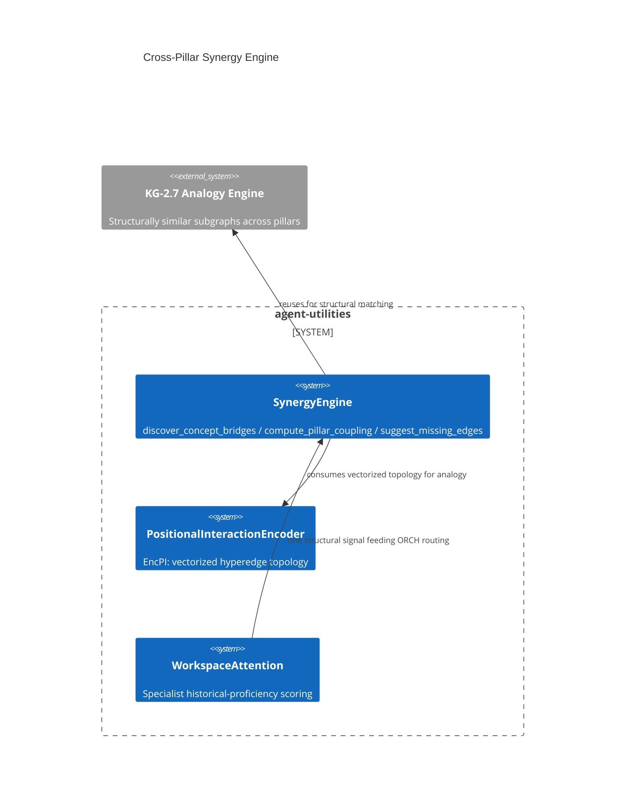

# Design Document: Cross-Pillar Synergy Engine

> Backfilled under the concept-lineage rule (CONCEPT:AU-OS.governance.concept-lineage-parent-doc).
> Three sibling markers (`inductive-knowledge-hypergraphs`,
> `positional-interaction-encoding`, `workspace-attention-scoring`) are
> consumers/instances of this decision and point at this document.

CONCEPT:AU-KG.compute.cross-pillar-synergy ·
CONCEPT:AU-KG.compute.inductive-knowledge-hypergraphs ·
CONCEPT:AU-KG.compute.positional-interaction-encoding ·
CONCEPT:AU-KG.compute.workspace-attention-scoring

## KG Analysis (Required)

### Nearest Existing Concepts

| Concept ID | Name | Similarity | Pillar |
|---|---|---|---|
| `KG-2.7` | Analogy Engine — structurally similar subgraphs across pillars, reused here | 0.70 | KG |
| `AU-KG.compute.topological-analogy` | the analogy-matching primitive `SynergyEngine` calls into | 0.55 | KG |

### Extension Analysis

- **Primary Extension Point**: the existing SKOS `broader`/`narrower` taxonomy
  and OWL transitive properties (`dependsOn`, `partOf`, `propagatesRiskTo`)
  already in the ontology, plus the KG-2.7 Analogy Engine.
- **Extension Strategy**: augment — synergy discovery is a read-only analysis
  layer over structure that already exists; it invents no new edge semantics.
- **New Concept Required?**: No.

## Decision — discover cross-pillar synergies structurally, not by manual audit

`CONCEPT:AU-KG.compute.cross-pillar-synergy` —
`knowledge_graph/core/synergy_engine.py`.

**The problem**: the ecosystem is deliberately organized into 5 pillars
(ORCH-1.x orchestration, KG-2.x knowledge/retrieval, AHE-3.x harness
engineering, ECO-4.x ecosystem/integration, OS-5.x infrastructure). Pillar
boundaries are useful for ownership and scoping, but a capability built in one
pillar frequently has a non-obvious functional synergy with a capability in
another (e.g. an AHE evaluation loop that could reuse a KG retrieval
primitive) that nobody wrote down and nobody will find by reading five
pillars' worth of docs.

**The rejected alternative**: a manually curated cross-reference doc, kept
current by hand. It rots the moment either pillar changes, and it can only
list synergies someone already thought to look for.

**The design chosen**: `SynergyEngine` (`discover_concept_bridges`,
`compute_pillar_coupling`, `suggest_missing_edges`,
`generate_synergy_report`) discovers synergies STRUCTURALLY, by composing
three pieces of infrastructure that already exist rather than inventing
detection logic from scratch: the KG-2.7 Analogy Engine (structurally similar
subgraphs across different pillars), the SKOS taxonomy's `broader`/`narrower`
relations (cross-pillar concept hierarchies), and OWL transitive-property
closures (`dependsOn`/`partOf`/`propagatesRiskTo`) for automatic relationship
discovery. A discovered synergy is persisted as a first-class
`SynergyInsightNode` (`models/knowledge_graph.py:2162`) — `source_concept`,
`target_concept`, `relationship_type`, `confidence`, `rationale`, `pillar_a`,
`pillar_b` — so a synergy is a queryable KG fact, not a report that goes
stale in a doc.

**What breaks if violated**: writing a new pillar-crossing insight only into
prose docs (rather than as a `SynergyInsightNode`) makes it invisible to
anything that queries the graph for synergies — exactly the manual-audit
failure mode this engine replaced.

### The three pointers — consumers of the same structural-synergy machinery

**`inductive-knowledge-hypergraphs`** (`knowledge_graph/core/hypergraph.py`) —
the `PositionalInteractionEncoder` (EncPI) implementing the HYPER paper's
zero-shot inductive generalization across novel hyperedge intersections. It is
the vectorized-topology substrate `SynergyEngine`'s structural-similarity
matching draws on for cross-domain analogy (`models/imodel.py:23`: "vectorized
model topology for cross-domain analogy matching").

**`positional-interaction-encoding`** (`graph/verification.py:1041,1107`) —
the concrete use of EncPI: mapping a derived tactic's condition/action pair to
a hyperedge position so a distilled `ExperienceNode` generalizes structurally
across novel topologies, rather than only matching the exact trajectory it was
learned from. It is the applied instance of the hypergraph encoding above,
inside the parallel-trajectory-distillation path.

**`workspace-attention-scoring`** (`graph/executor.py:990`) — `WorkspaceAttention`
scores a specialist's historical proficiency (`get_attention_score`) as one
input to routing priority when dispatching a task to a specialist agent
(`graph/executor.py:295`, "soft dependency"). It is a cross-pillar synergy in
the same structural sense — a KG-derived signal (retrieval/memory) feeding an
ORCH routing decision — scored via the same MemoryRetriever machinery the
synergy engine's coupling analysis draws structural signal from, and it fails
soft (`attention_score` stays `None`, dispatch proceeds unaffected) on lookup
failure.

## C4 Context Diagram

## Data Flow

1. **ORCH**: `workspace-attention-scoring` feeds specialist-dispatch priority.
2. **KG**: `SynergyInsightNode` persists discovered bridges; EncPI vectorizes
   hyperedge topology for analogy matching.
3. **AHE**: `positional-interaction-encoding` generalizes distilled tactics
   across novel structural topologies during parallel trajectory distillation.
4. **ECO**: not directly exposed as an MCP tool.
5. **OS**: none.

## Risk Assessment

- **Blast Radius**: `knowledge_graph/core/synergy_engine.py`,
  `knowledge_graph/core/hypergraph.py`, `graph/verification.py`,
  `graph/executor.py`, `models/knowledge_graph.py`, `models/imodel.py`.
- **Backward Compatible**: Yes — all three are additive analysis/scoring
  layers that degrade to no signal (not an error) on failure.
- **Breaking Changes**: None.
- **Known weak point**: synergy confidence is self-reported by the discovery
  heuristics with no independent verification step — a `SynergyInsightNode`
  can assert a low-quality bridge that nothing currently prunes.
