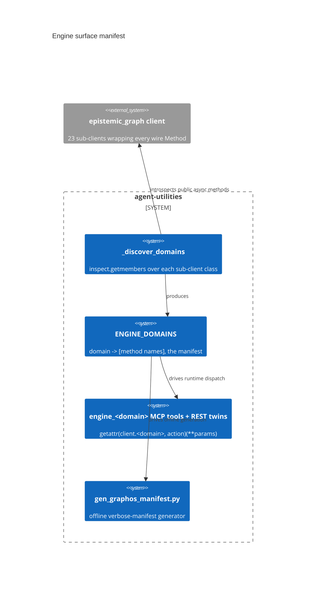

# Design Document: Engine surface manifest (client-introspection source of truth)

> Backfilled under the concept-lineage rule (CONCEPT:AU-OS.governance.concept-lineage-parent-doc).

CONCEPT:AU-KG.compute.engine-surface-manifest

## KG Analysis (Required)

### Nearest Existing Concepts

| Concept ID | Name | Similarity | Pillar |
|---|---|---|---|
| `AU-ECO.mcp.full-api-mcp-surface` | Full engine API + MCP surface (REST + MCP in lockstep) — this manifest's sibling concept in the same module | 0.65 | ECO |

### Extension Analysis

- **Primary Extension Point**: the pure-Python `epistemic_graph` client's
  sub-clients (`.nodes`, `.edges`, `.graph`, `.analytics`, …) — the wire
  protocol's own source of truth.
- **Extension Strategy**: augment — the manifest is derived FROM the client
  by introspection, never hand-authored in parallel with it.
- **New Concept Required?**: No.

## Decision — discover the engine action surface, never hand-maintain it

`CONCEPT:AU-KG.compute.engine-surface-manifest` — `mcp/tools/engine_tools.py:24,177,290`.

**The problem**: the engine speaks length-prefixed MessagePack over UDS/TCP;
the pure-Python `epistemic_graph` client wraps every wire `Method`
(`crates/eg-types/src/protocol.rs`) as a method on one of 23 sub-clients
(`.nodes`, `.edges`, `.graph`, `.analytics`, `.lifecycle`, `.reasoning`,
`.ledger`, `.channels`, `.tenants`, `.resharding`, `.consensus`, `.finance`,
`.datascience`, `.query`, `.txn`, `.timeseries`, `.rdf`, `.streaming`,
`.blob`, `.broker`, `.rbac`, `.admin`, `.graphlearn`). Whatever exposes those
methods as `engine_<domain>` MCP tools + REST routes needs to know, for each
domain, exactly which methods exist.

**The rejected alternative**: a hand-maintained list of methods per domain,
updated by hand every time the Rust engine adds/renames a method. It rots the
moment the two sides of the FFI boundary drift, which is exactly the failure
mode named in the module docstring ("no hand-maintained method list to rot").

**The design chosen**: `_discover_domains` (`engine_tools.py:161-173`)
introspects each sub-client class via `inspect.getmembers(cls,
inspect.iscoroutinefunction)`, keeping every public (non-`_`-prefixed) async
method. The result, `ENGINE_DOMAINS` (`engine_tools.py:178`), IS the manifest
— the source of truth for both the runtime tool surface (one action-routed
`engine_<domain>` MCP tool per domain, dispatching via
`getattr(client.<domain>, action)(**params)`) and the offline verbose-manifest
generator (`scripts/gen_graphos_manifest.py:343`, which explicitly must
"never silently emit a shrunken manifest"). Every tool registers its REST twin
into `ACTION_TOOL_ROUTES` in the same call, so the MCP/REST surface-parity
gate stays green by construction rather than by a separate audit.

**What breaks if violated**: a hand-added or hand-removed entry in
`ENGINE_DOMAINS` (bypassing `_discover_domains`) desyncs the tool surface from
the actual client capability — either exposing a method the client doesn't
have (a runtime `AttributeError` on first call) or silently hiding a real
engine capability from every consumer of the generated manifest, which is
precisely the shrunken-manifest failure `gen_graphos_manifest.py` guards
against.

## C4 Context Diagram

## Data Flow

1. **ORCH**: not directly — this is infrastructure other tool-exposure layers
   depend on.
2. **KG**: the manifest IS the engine's action surface as seen by agent-utilities.
3. **AHE**: none directly.
4. **ECO**: every `engine_<domain>` MCP tool and its REST twin is driven by
   this manifest; the surface-parity gate depends on it staying accurate.
5. **OS**: per-action scope/policy classification (ADMIN vs normal domains)
   is layered on top of the discovered manifest, not a separate list.

## Risk Assessment

- **Blast Radius**: `mcp/tools/engine_tools.py`, `mcp/tools/engine_surface_tools.py`,
  `scripts/gen_graphos_manifest.py`.
- **Backward Compatible**: Yes — discovery-based, so it tracks the client
  automatically; no manual sync step to forget.
- **Breaking Changes**: None.
- **Known weak point**: a method that becomes public (loses its `_` prefix)
  without being ready for external exposure is auto-surfaced as a tool with no
  separate opt-in gate — the naming convention IS the exposure gate.
