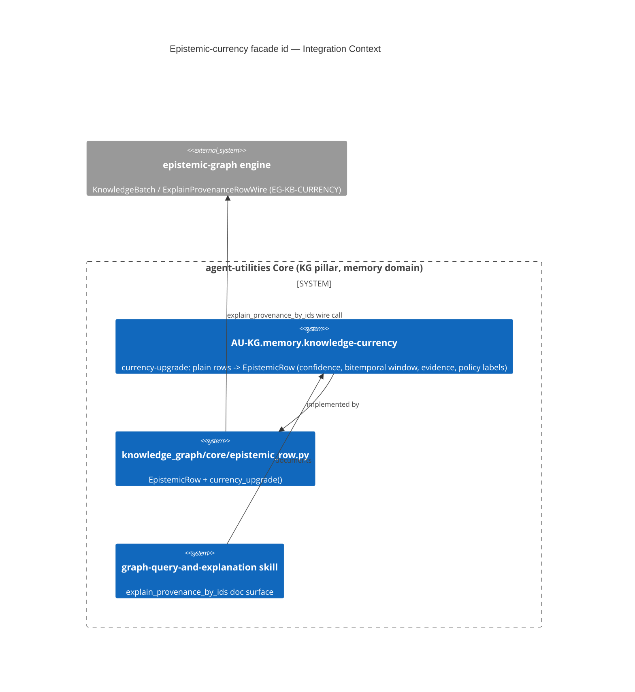

# Design Document: Epistemic-currency facade concept id (AU-KG.memory.knowledge-currency)

> Retroactive governance id for an already-shipped capability. The facade-side half of
> "Seam 1" (epistemic-columns currency — see `docs/architecture/epistemic-columns-currency.md`)
> has always been cited in code/docs as `CONCEPT:AU-KB-CURRENCY`, a **legacy flat id that
> predates the `<SLUG>-<PILLAR>.<domain>.<concept>` OKF-CIS grammar and the closed pillar
> vocabulary** (`agent_utilities/governance/domain_vocab.yaml`). `KB` was never a registered
> pillar, so the flat id was invisible to `check_concepts.py` / `check_concept_governance.py` /
> `check_domain_vocab.py` (their marker regex requires the dotted form) and was never curated
> during the historical flat→dotted migration (`scripts/migrate_concepts_hierarchy.py`). This
> doc mints the correct dotted id and is the design-doc anchor `check_concept_governance.py`
> requires for its first live marker occurrence. Shipped; this is as-built documentation, not
> a forward design.

## KG Analysis (Required)

### Nearest Existing Concepts

| Concept ID | Name | Similarity | Pillar |
|---|---|---|---|
| EG-KB-CURRENCY | Epistemic-columns currency (engine side) | sibling concept, same seam | EG-KG (engine-side counterpart, also a legacy flat id) |
| AU-KG.memory.mementified-context | Rust-native finance / mementified context | related (same `memory` domain) | AU-KG |

### Extension Analysis

- **Primary Extension Point**: none — `AU-KB-CURRENCY` has no dotted counterpart to extend;
  this is a grammar correction of an existing, already-shipped concept, not new capability.
- **Extension Strategy**: `specialize` — assign the flat id's facade-side half a conformant
  dotted id under the `KG` pillar's registered `memory` domain (`domain_vocab.yaml` lists `kb`
  as one of `memory`'s own signal keywords, confirming the fit).
- **New Concept Required?**: Yes — `AU-KG.memory.knowledge-currency` (reserved via
  `agent-utilities concept reserve --id AU-KG.memory.knowledge-currency`), justified because
  `AU-KB-CURRENCY` cannot be expressed in the current grammar at all (no valid pillar).

## C4 Context Diagram

## Data Flow

1. **ORCH**: unchanged — reached via the existing `engine_query(action="explain_provenance_by_ids")`
   / `include_epistemic=true` on `graph_query`/`graph_ask` (Cypher dialect), documented in the
   `graph-query-and-explanation` skill's "Epistemic answers" section.
2. **KG**: no new nodes/edges; this is an id/documentation correction over the existing
   `EpistemicRow` currency-upgrade path (`agent_utilities/knowledge_graph/core/epistemic_row.py`,
   `facade.py`, `orchestration/engine_query.py`).
3. **AHE**: n/a (read path, no training/eval participation).
4. **ECO**: already exposed — `graph_epistemic` MCP tool, `include_epistemic` on `graph_query`/
   `graph_ask`, and the A2A epistemic-metadata projection (`protocols/a2a.py`).
5. **OS**: none — no new guardrail; this only makes the existing marker OKF-CIS-conformant and
   registry-visible.

## Risk Assessment

- **Blast Radius**: the `graph-query-and-explanation` skill doc only (this change). The wider
  facade implementation (`epistemic_row.py`, `facade.py`, `graph_compute.py`, `engine_query.py`,
  the backends, `a2a.py`, MCP tools, tests, `docs/architecture/epistemic-columns-currency.md`)
  still cites the legacy flat `CONCEPT:AU-KB-CURRENCY` in ~49 other files — a full mechanical
  rename across all of them is a separate, larger follow-up (flagged, not done here; it also
  touches a generated file, `agent_utilities/knowledge_graph/retrieval/capabilities-power.json`,
  whose regeneration is out of scope for this fix).
- **Backward Compatible**: Yes — pure documentation/id correction, no behavior change.
- **Breaking Changes**: None.

## As-built

Marker restored in `agent_utilities/skills/graph-query-and-explanation/SKILL.md`'s "Epistemic
answers" section (dropped during the 73-skill collapse into 13 domain skills,
commit `80334a8a`, from its prior home in the now-folded `kg-epistemic-answer` skill). Full
capability doc: `docs/architecture/epistemic-columns-currency.md`. Implementation:
`agent_utilities/knowledge_graph/core/epistemic_row.py`.
