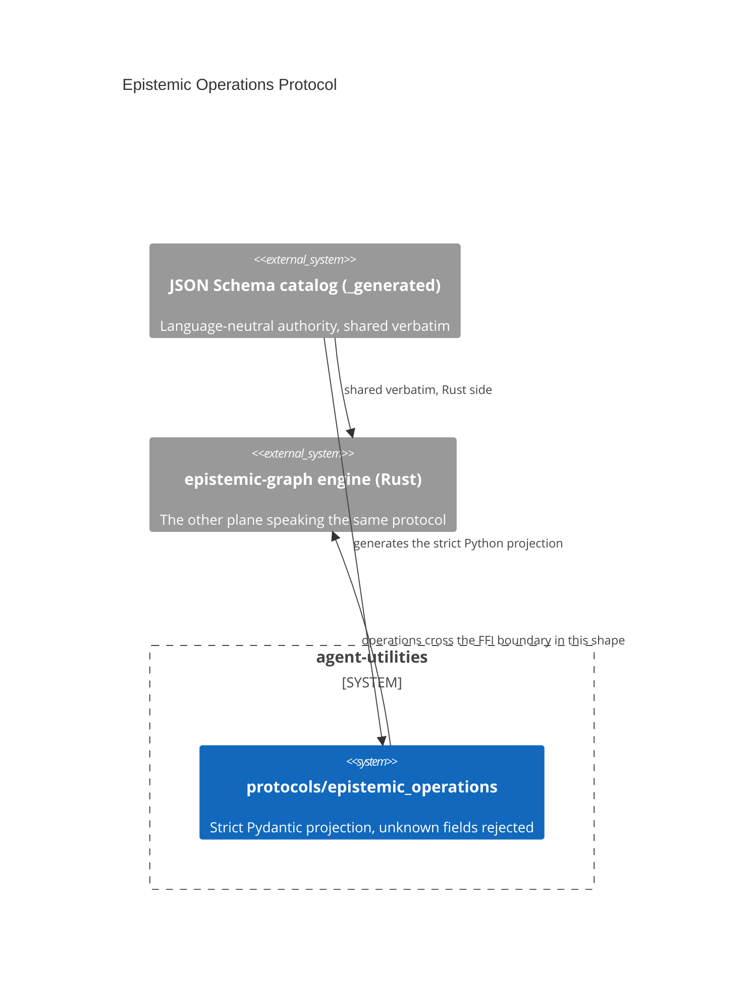

# Design Document: Epistemic Operations Protocol — one current-only contract

> Backfilled under the concept-lineage rule (CONCEPT:AU-OS.governance.concept-lineage-parent-doc).

CONCEPT:AU-KG.compute.epistemic-operations-protocol

## KG Analysis (Required)

### Nearest Existing Concepts

| Concept ID | Name | Similarity | Pillar |
|---|---|---|---|
| `AU-KG.compute.engine-surface-manifest` | the engine's low-level method surface — this protocol is the strict-typed contract layered above it | 0.40 | KG |

### Extension Analysis

- **Primary Extension Point**: the JSON Schema catalog shared between
  `agent-utilities` and `epistemic-graph` (`_generated`).
- **Extension Strategy**: augment — Pydantic models are a strict PROJECTION of
  the language-neutral schema, not a second, independently-evolving contract.
- **New Concept Required?**: No.

## Decision — the JSON Schema catalog is the authority; Pydantic is its strict projection

`CONCEPT:AU-KG.compute.epistemic-operations-protocol` —
`protocols/epistemic_operations/__init__.py:7`.

**The problem**: the agent plane (Python, agent-utilities) and the engine
plane (Rust, `epistemic-graph`) must agree on the shape of every operation
that crosses the boundary — work-item claims, mutation batches, evidence
bundles, placement routes, analytics jobs, artifacts — without either side
drifting from the other, and without silently accepting a message shaped for
a protocol version neither side is actually running.

**The rejected alternative**: hand-write Pydantic models independently on the
Python side and trust them to stay in sync with whatever the Rust engine
emits. Two independently-maintained schemas for the same contract is exactly
the drift risk `engine-surface-manifest` (the sibling decision above it in the
KG-2.x concurrency work) was built to eliminate for the low-level method
surface; this concept applies the same "one source of truth, one generated
projection" rule to the operation *payloads* those methods carry.

**The design chosen**: the JSON Schema catalog (`CATALOG_SHA256`,
`SCHEMA_SHA256`, `SCHEMA_VERSION`, `PROTOCOL_VERSION` — all re-exported from
`_generated`) is the language-neutral authority, shared verbatim with the Rust
engine. The Pydantic models in this module
(`ClaimWorkItemRequest`/`Result`, `MutationBatch`/`Operation`,
`EvidenceBundle`/`Claim`/`TimeRange`, `PlacementRoute`/`Request`,
`AnalyticsJob`/`Error`, `Artifact`/`Locus`, `ChangeEnvelope`,
`OperationResult`/`Error`/`Redirect`, `KnowledgeBatch`/`Field`, `WorkItem`,
`RequestContext`, `SourceAccess`, `TraceOutcome`) are a STRICT projection of
that catalog — unknown fields are rejected (no silent pass-through of a field
one side added and the other doesn't know about yet) and identifiers stay
opaque (no Python-side semantic assumptions baked into an id's shape).
"Current-only" means there is exactly ONE live protocol version at a time —
no dual-version compatibility shims accreting inside this module; a protocol
version bump is a coordinated cutover of both planes, not a gradual migration
window.

**What breaks if violated**: a hand-added Pydantic field not present in the
generated JSON Schema catalog either silently drops on the wire (the Rust
side never sees it) or, worse, is accepted locally and never validated
against what the engine actually enforces — the exact two-schemas-drifting
failure this protocol exists to prevent. Accepting unknown fields (relaxing
the strict-rejection contract) would let a client silently talk a stale or
divergent protocol version without either side ever finding out.

## C4 Context Diagram

## Data Flow

1. **ORCH**: `WorkItem`/`ClaimWorkItemRequest`/`Result` are the typed contract
   for work claimed across the orchestration boundary.
2. **KG**: `MutationBatch`/`ChangeEnvelope`/`KnowledgeBatch` are the typed
   contract for graph mutations crossing into the engine.
3. **AHE**: `EvidenceBundle`/`EvidenceClaim`/`TraceOutcome` carry evaluation
   evidence in the shared shape.
4. **ECO**: `PlacementRoute`/`AnalyticsJob`/`Artifact` are the typed contract
   for cross-plane operational routing and analytics.
5. **OS**: `SourceAccess`/`RequestContext` carry the identity/ACL context of a
   cross-plane operation.

## Risk Assessment

- **Blast Radius**: `protocols/epistemic_operations/__init__.py` and every
  Python call site constructing or consuming a protocol model.
- **Backward Compatible**: Current-only by design — NOT backward compatible
  across a protocol version bump; that is the explicit trade-off this
  decision makes (simplicity over compatibility shims).
- **Breaking Changes**: A `PROTOCOL_VERSION`/`SCHEMA_VERSION` bump is
  inherently breaking for any client still on the old version; both planes
  must cut over together.
- **Known weak point**: "current-only" means there is no compatibility window
  — a rolling deployment where agent-utilities and epistemic-graph briefly run
  different protocol versions will reject each other's messages rather than
  degrade gracefully.
