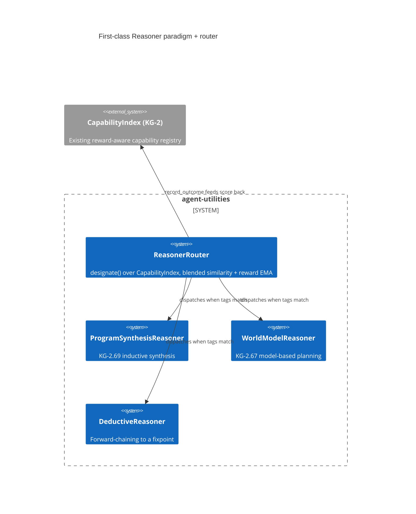

# Design Document: First-class Reasoner paradigm + outcome-learning router

> Backfilled under the concept-lineage rule (CONCEPT:AU-OS.governance.concept-lineage-parent-doc).

CONCEPT:AU-KG.compute.first-class-reasoner-paradigm

## KG Analysis (Required)

### Nearest Existing Concepts

| Concept ID | Name | Similarity | Pillar |
|---|---|---|---|
| `AU-KG.compute.first-class-action-conditioned` | the world-model paradigm this router dispatches to (`WorldModelReasoner`) | 0.55 | KG |
| `ORCH-1.27` | role-specialized routing — the sibling "any provider backs any role" model-agnosticism this extends to paradigms | 0.50 | ORCH |

### Extension Analysis

- **Primary Extension Point**: `CapabilityIndex` (KG-2) — the existing
  reward-aware capability registry and its `designate()` routing call.
- **Extension Strategy**: augment — a reasoning paradigm registers as a
  capability entity in the SAME index other capabilities already use, rather
  than a parallel routing mechanism.
- **New Concept Required?**: No.

## Decision — thinking itself is pluggable, and the router learns which paradigm wins

`CONCEPT:AU-KG.compute.first-class-reasoner-paradigm` — `knowledge_graph/core/reasoner.py:6`.

**The problem**: agent-utilities is model-agnostic (any provider backs any
role, ORCH-1.27) and symbolic-backend-pluggable (KG-2.23), but there was no
seam at which an alternative way of *thinking* — not which model, but which
reasoning strategy — slots in behind the orchestrator. Every task reasoned
about the same way regardless of whether it was better suited to inductive
program synthesis, model-based planning, or deductive forward-chaining.

**The rejected alternative**: an if/else switch hand-picking a paradigm per
task type. It requires a human to correctly anticipate every task-shape/
paradigm pairing up front and never improves — the module docstring is
explicit that this is "not an if/else switch" for exactly that reason.

**The design chosen**: `Reasoner` (`reasoner.py:61-66`) is a
`runtime_checkable` `Protocol` — `name`, `capability_tags`, and
`reason(task) -> ReasoningResult` that self-reports a `score` in `[0, 1]`.
`ReasonerRouter` registers each paradigm as a capability entity in the
EXISTING reward-aware `CapabilityIndex` (KG-2) and routes a task through the
SAME `designate()` call the execution plane already trusts for other
capability routing — candidates are gated by required capability tags, then
ranked by similarity BLENDED WITH a learned reward EMA. After a paradigm runs,
the router feeds its self-reported score back via `record_outcome`, so
**the router learns which paradigm works for which task class** — the
recursive-improvement pathway (AHE) applied to the act of reasoning itself,
not just to task execution.

Three built-in paradigms wire the seam end to end:
`ProgramSynthesisReasoner` (inductive, KG-2.69, `capability_tags=
("induction", "examples", "symbolic")`), `WorldModelReasoner` (model-based,
rolls a policy forward over the KG-2.67 world model,
`capability_tags=("planning", "dynamics")`), and `DeductiveReasoner`
(forward-chains rules to a fixpoint over a fact set,
`capability_tags=("symbolic", "logic", "deduction")`). A generative paradigm
slots in behind an injected completion function. **New paradigms register
without touching any caller** — the router discovers them through the
capability index, not through a hardcoded dispatch table.

**What breaks if violated**: adding a new reasoning strategy as a direct call
site (bypassing `Reasoner`/`ReasonerRouter`) means it never enters the
outcome-learning loop — the router can neither route to it based on task fit
nor learn whether it actually performs well, silently reverting to the
if/else-switch failure mode this abstraction exists to replace.

## C4 Context Diagram

## Data Flow

1. **ORCH**: `designate()` is the same routing call the execution plane
   already trusts for capability dispatch generally.
2. **KG**: paradigms register as capability entities in `CapabilityIndex`;
   `WorldModelReasoner` rolls forward the KG-2.67 world model.
3. **AHE**: `record_outcome` closes the loop — the router's paradigm choice
   improves from observed `ReasoningResult.score`, the recursive-improvement
   pattern applied to reasoning strategy selection.
4. **ECO**: not directly exposed as an MCP tool; an internal routing seam.
5. **OS**: none.

## Risk Assessment

- **Blast Radius**: `knowledge_graph/core/reasoner.py` and any caller that
  invokes `ReasonerRouter` instead of a paradigm directly.
- **Backward Compatible**: Yes — additive; existing direct paradigm use is
  unaffected, the router is an opt-in dispatch layer.
- **Breaking Changes**: None.
- **Known weak point**: a paradigm's `score` is self-reported with no
  independent verification — a paradigm that over-reports its own confidence
  skews the reward EMA and can win routing it doesn't deserve.
