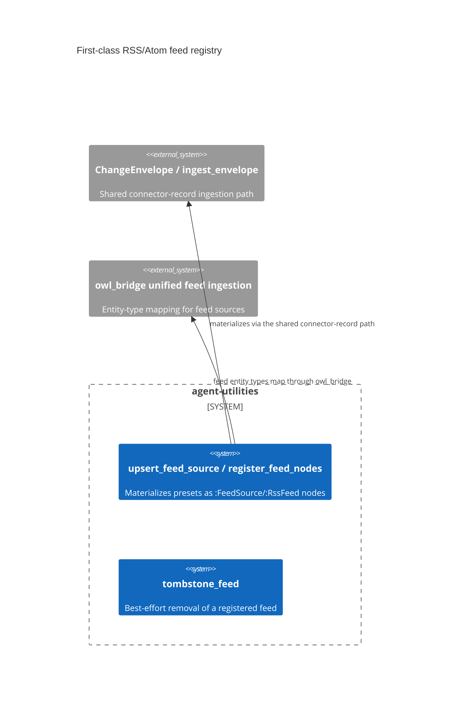

# Design Document: A feed is a first-class KG citizen, not declarative config

> Backfilled under the concept-lineage rule (CONCEPT:AU-OS.governance.concept-lineage-parent-doc).

CONCEPT:AU-KG.compute.first-class-rss-atom

## KG Analysis (Required)

### Nearest Existing Concepts

| Concept ID | Name | Similarity | Pillar |
|---|---|---|---|
| `AU-KG.compute.mcp-backed-dedicated-trackers` | the broader "a source is a typed KG entity, not config" rule this specializes for feeds | 0.55 | KG |

### Extension Analysis

- **Primary Extension Point**: `core/owl_bridge.py` unified feed ingestion —
  the entity-mapping layer that already turns other sources into typed nodes.
- **Extension Strategy**: augment — a feed becomes another typed node kind
  materialized through the existing ingestion/envelope machinery, not a new
  ingestion path.
- **New Concept Required?**: No.

## Decision — presets → KG: a feed is a durable node, not just a config entry

`CONCEPT:AU-KG.compute.first-class-rss-atom` — `automation/feed_sources.py:207-300`.

**The problem**, named directly in the code as "the long-missing 'presets→KG'
wiring": RSS/Atom feed sources (native feeds, ScholarX categories, and other
presets) existed only as declarative configuration — a feed URL in a config
file is not queryable, not linkable to other KG entities, and cannot be
enabled/disabled or tombstoned as a durable, addressable fact.

**The rejected alternative**: keep feeds as pure config and resolve them at
ingest time by re-reading the config file. It works for "what feeds are
configured right now" but gives the graph no memory of a feed as an entity —
nothing to attach provenance to, nothing another node can reference, and no
record of a feed that was disabled or removed.

**The design chosen**: `upsert_feed_source` (`feed_sources.py:213-257`)
materializes a configured feed as a durable `:FeedSource`/`:RssFeed` node.
`_feed_node_id` derives a stable id from `sha256(source_system + key)[:32]` so
re-registering the same feed is idempotent. The node carries `name`,
`feed_url`, `enabled`, and `kind` (`"RssFeed"`/`"FeedSource"` — one flat LPG
label with the OWL refinement `:RssFeed rdfs:subClassOf :FeedSource`) plus
source provenance (`stamp_source`). It goes through the SAME
`ChangeEnvelope`/`ingest_envelope` path other connectors use
(`ChangeEnvelope.from_connector_record` with a content-hash `updatedAt`,
`envelope_ingest.ingest_envelope`) — not a bespoke feed-specific write path —
and raises on any non-`success`/`skipped` status rather than swallowing a
failed materialization. Removal is a first-class operation too:
`tombstone_feed` (`feed_sources.py:300`) marks a feed gone by its url/key,
best-effort, rather than silently deleting a node other entities may still
reference.

**What breaks if violated**: a feed added only to config (bypassing
`upsert_feed_source`) is invisible to anything that queries the graph for
configured sources, cannot be linked to the articles it produced, and has no
durable enable/disable state — exactly the "declarative config, not a KG
citizen" gap this decision closes.

## C4 Context Diagram

## Data Flow

1. **ORCH**: none directly — a data-materialization step invoked from feed
   registration, not an orchestrated task.
2. **KG**: writes `:FeedSource`/`:RssFeed` nodes via the shared
   `ChangeEnvelope` ingestion path used by other connectors.
3. **AHE**: none directly.
4. **ECO**: feed presets originate from native config and ScholarX category
   registration, both consolidated through this one registry.
5. **OS**: none.

## Risk Assessment

- **Blast Radius**: `automation/feed_sources.py`,
  `knowledge_graph/core/owl_bridge.py:143`.
- **Backward Compatible**: Yes — additive; a feed not yet materialized simply
  has no `:FeedSource` node until first registered.
- **Breaking Changes**: None.
- **Known weak point**: `tombstone_feed` is explicitly best-effort — a failed
  tombstone leaves a feed marked live in the graph even after its config entry
  is removed, until the next successful tombstone call.
