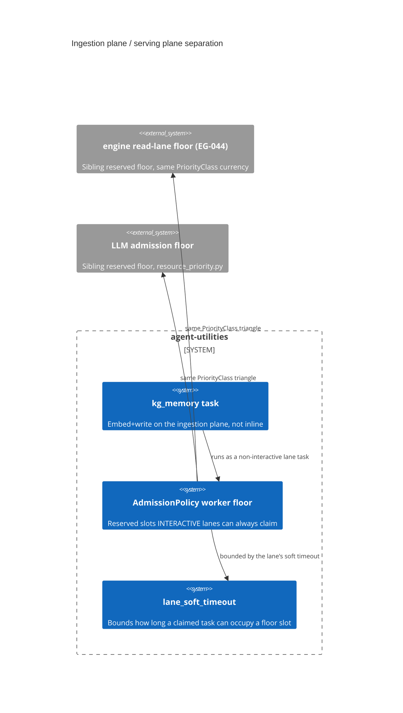

# Design Document: The ingestion plane is separate from the serving plane

> Backfilled under the concept-lineage rule (CONCEPT:AU-OS.governance.concept-lineage-parent-doc).
> Two decisions authored across `engine_tasks.py`, `task_lanes.py`,
> `worker_scheduler.py` and `core/resource_priority.py`.

CONCEPT:AU-KG.compute.offloaded-memory-write · CONCEPT:AU-KG.compute.interactive-lane-floor

## KG Analysis (Required)

### Nearest Existing Concepts

| Concept ID | Name | Similarity | Pillar |
|---|---|---|---|
| `AU-ORCH.execution.two-level-fair-rotation` | the lane partition + fair round-robin claim these decisions sit on top of | 0.70 | ORCH |
| `AU-ORCH.scheduling.resource-priority-edict` | the `PriorityClass` vocabulary the floor keys off; mechanism documented in `docs/architecture/resource-priority-edict.md` | 0.65 | ORCH |

### Extension Analysis

- **Primary Extension Point**: `engine_tasks.py` task dispatch and
  `worker_scheduler.py` admission control.
- **Extension Strategy**: augment.
- **New Concept Required?**: No.

## Decision 1 — a memory write is offloaded from the serving process

`CONCEPT:AU-KG.compute.offloaded-memory-write` — `knowledge_graph/core/engine_tasks.py:4393-4402`,
`mcp/tools/write_ingest_tools.py:1693`.

**The rejected alternative**: write inline on whatever path called
`store_memory` — simpler, and what an MCP write tool would naturally do.
It loses because embedding is the expensive, GPU-contended step in the
system: doing it inline on a serving/read path puts a live query behind a
model call whose latency is set by whatever background ingestion happens to
be loading the same GPU at that moment.

**The design chosen**: a `store_memory` call arriving on a serving path does
not embed and write inline. It is enqueued as a `kg_memory` task
(`write_ingest_tools.py:1693`); the host worker performs the embed + write on
the ingestion plane (`engine_tasks.py:4393`, `_local=True` so it never
re-enqueues itself), isolating heavy ingestion from the serving/read plane.

The cost is accepted explicitly: a memory write is **not** durable-visible
the instant the enqueuing call returns. A caller that needs read-your-write
must use the returned task handle rather than assume synchrony.

## Decision 2 — interactive work gets a reserved worker floor

`CONCEPT:AU-KG.compute.interactive-lane-floor` — `knowledge_graph/core/task_lanes.py:139-145`,
`core/resource_priority.py:25`.

Lanes partition the task queue by functional domain and are claimed
round-robin, so no lane starves another outright. **That alone is not
enough**: fair rotation still lets background ingestion occupy every worker
at the exact moment an interactive request arrives.

**The rejected alternative** was strict priority — the scheme the queue
actually used before lanes existed, where one ordering covered all task types
and a backed-up type head-of-line-blocked the rest. Strict priority also has
the opposite failure mode: taken far enough, it starves background work to
zero.

**The design chosen**: `INTERACTIVE_LANES = frozenset({"queries"})`
(`task_lanes.py:139`) — latency-sensitive work that must ALWAYS have a free
host worker, even when ingestion saturates the pool. The scheduler's
`AdmissionPolicy` reserves a worker floor that non-interactive lanes
(codebase/document/connector/maint) can never claim. The floor is
deliberately a FLOOR, not a monopoly — background work uses spare capacity
whenever nothing higher contends. `resource_priority.py:25-35` names this as
one of THREE reserved floors keyed off the same `PriorityClass` currency
end to end: the host-worker floor (this module), the engine's reserved read
lane (EG-044, keeping a read slot for interactive reads under a saturating
ingest write-storm), and the LLM's reserved generator-capacity admission
(`core/resource_priority.py` itself). All three fire together so one
interactive request gets a worker slot AND an engine read AND an LLM slot
ahead of background ingestion.

**What breaks if violated**: removing the reserved floor (reverting to pure
fair rotation) reproduces the exact failure the floor exists to prevent — an
interactive `queries` request can wait behind a full pool of ingestion
workers with no bound on how long. Reintroducing strict priority instead
would fix that but starve background ingestion to zero under sustained
interactive load — the opposite failure this design also explicitly avoids.

### lane-soft-timeout — why a reserved floor slot can't be held forever

`CONCEPT:AU-KG.compute.lane-soft-timeout` — `task_lanes.py:149-180`.

A per-lane soft execution-timeout bound: a claimed task exceeding its lane's
bound is cancelled and routed through the KG-2.113 retry→backoff→dead_letter
machinery, freeing its worker fast instead of pinning it until the reaper's
absolute 2h cap. Bounds are auto-sized per lane from observed tail latency
(e.g. `connectors` p50=16ms but one hung 456s → 180s bound gives ~10000x p50
headroom). It exists because a reserved floor slot occupied by a hung task
defeats the floor's whole purpose — the floor guarantees a slot exists, the
soft timeout guarantees that slot doesn't stay wedged.

## C4 Context Diagram

## Data Flow

1. **ORCH**: lanes are claimed round-robin; the floor is enforced at
   admission; `resource_priority.py` mirrors the same class at the LLM layer.
2. **KG**: offloaded writes embed and persist on the ingestion plane.
3. **AHE**: none directly.
4. **ECO**: MCP write tools (`write_ingest_tools.py`) enqueue rather than
   write inline.
5. **OS**: `PriorityClass` propagates through the observability correlation
   context (`priority-class-propagation`) so the floor edict does not stop at
   a process boundary.

## Risk Assessment

- **Blast Radius**: `knowledge_graph/core/engine_tasks.py`,
  `knowledge_graph/core/task_lanes.py`, `knowledge_graph/core/worker_scheduler.py`,
  `core/resource_priority.py`, `observability/correlation.py`,
  `mcp/tools/write_ingest_tools.py`.
- **Backward Compatible**: Yes at the API level; **not** at the timing level —
  a caller that assumed a synchronous memory write now sees an enqueue.
- **Breaking Changes**: None in signature; the read-your-write assumption is
  the one behavioral change, called out explicitly above.
- **Known weak point**: a caller that ignores the returned task handle and
  immediately re-reads the memory it just wrote can observe a stale/missing
  result — the API does not force handle-checking.
