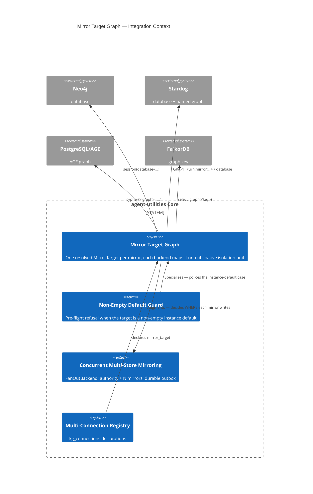

# Design Document: Configurable Mirror Target Graph

> Operator request: *"For our stardog, pg-age, neo4j, falkordb mirroring ability, can
> you make it so we can either write to the default graph (db) or we can dedicate a
> graph for the mirroring. That way if there is already data in the instance, we do
> not override by default, a user can specify to mirror to a separate graph please?"*

## KG Analysis (Required)

### Nearest Existing Concepts

| Concept ID | Name | Similarity | Pillar |
|---|---|---|---|
| `AU-KG.backend.mirror-health-repair` | Concurrent Multi-Store Mirroring (fan-out, outbox, reconcile) | high — the mirroring machinery this configures | AU-KG |
| `AU-KG.backend.multi-connection-registry` | Named multi-connection graph registry (`kg_connections`) | high — the declaration surface a target rides on | AU-KG |
| `AU-KG.ingest.default-graph-leak-guard` | Guarded SPARQL default-graph routing + strict refusal | medium — the same "don't land in the default graph silently" instinct, but for *source partitioning within our own store*, not for co-tenancy in someone else's instance | AU-KG |
| `AU-KG.backend.age-postgresql-tier` | AGE graph tier (`ag_catalog.create_graph`) | medium — supplies the idempotent create path reused here | AU-KG |
| `AU-KG.backend.connection-registry` | Role-aware registry, `role="mirror"` | medium — where a mirror is declared | AU-KG |

### Extension Analysis

- **Primary Extension Point**: `CONCEPT:AU-KG.backend.mirror-health-repair`
- **Extension Strategy**: augment
- **New Concept Required?**: Yes — two, for the two distinct things being added.

`mirror-health-repair` answers *whether* a write reaches a mirror (outbox, replay,
drift repair). It has no notion of *where inside that store* the write lands — each
backend answered that privately and differently. `default-graph-leak-guard` is the
closest safety analogue but is about our own source partitioning inside a store we
own; it says nothing about a store that already belongs to someone else. Neither can
be stretched to carry a cross-backend target concept plus a pre-flight refusal
without changing what they mean.

### New Concept Proposal

- **Proposed ID**: `CONCEPT:AU-KG.backend.mirror-target-graph`
  - **Augments Pillar**: KG
  - **Pipeline integration**: backend construction (`create_backend`) → the fan-out
    mirror set → every mirror write.
  - **Justification**: one *target* concept — resolved once, mapped by each backend
    onto its native isolation unit (Neo4j database, Stardog database *and* named
    graph, AGE graph, FalkorDB graph key). The four selectors already existed and
    had already drifted; this is the single place they cannot drift from.

- **Proposed ID**: `CONCEPT:AU-KG.backend.mirror-nonempty-default-guard`
  - **Augments Pillar**: KG
  - **Pipeline integration**: pre-flight, between mirror construction and mirror
    attachment in `_build_mirror_set`.
  - **Justification**: the safety property is separable from the target concept and
    is the operator's actual ask — *never* write the KG into an instance default
    that already holds data, whichever way the default falls. It is a refusal, so it
    needs its own exception type, its own health signal (`refused: true`), and its
    own name.

## C4 Context Diagram

## Data Flow

1. **ORCH**: nothing new to invoke — a mirror target is declarative configuration,
   resolved during backend construction on the existing startup path.
2. **KG**: no new nodes/edges. It changes the *destination* of every mirrored
   node/edge/embedding write, and on Stardog the named graph those triples carry.
   The `source_system` property is still written when a dedicated graph is used, so
   source partitioning stays queryable inside the mirror graph.
3. **AHE**: no participation in self-improvement cycles.
4. **ECO**: surfaced through the existing `graph_configure(action="mirror_status")`
   MCP tool and its REST twin — a refused mirror appears with `ok: false` and
   `refused: true`, distinguishing an operator misconfiguration from an outage.
5. **OS**: the guard is the policy. It fails **closed** (an unprovable target is
   treated as occupied) and it never silently redirects a write. A refused mirror is
   isolated exactly like any other failed mirror: the epistemic-graph authority and
   every other mirror keep running.

## Decisions worth recording

- **Stardog has two levels; the named graph is the default for a dedicated target.**
  It needs no admin rights, it is the same mechanism the backend already uses to
  partition by source, and "dedicate a graph" is literally what a named graph is. A
  whole database is available via `{"mode":"dedicated","level":"database"}`.
- **A dedicated Stardog graph overrides source partitioning** rather than merely
  replacing the default-graph fallback. Partial isolation would still let our
  `urn:source:leanix` collide with a co-tenant's, which would not deliver the safety
  property the operator asked for.
- **`dedicated` supersedes a named selector on a single-level store.** AGE and
  FalkorDB connection profiles *require* a graph name, so treating the combination
  as a conflict would make dedicating inexpressible. It is logged at INFO.
- **`default` next to a named selector is a hard error**, not a silent winner.

## Risk Assessment

- **Blast Radius**: `knowledge_graph/backends/` (`__init__`, `mirror_target` (new),
  `age_backend`, `postgresql_backend`, `contrib/neo4j_backend`,
  `contrib/falkordb_backend`, `sparql/stardog_backend`, `owl/stardog_backend`),
  `knowledge_graph/core/connection_registry`, and the `kg_connections` config field.
- **Backward Compatible**: for any deployment that names its database/graph
  explicitly — yes, byte-identical. For a deployment relying on an *implicit*
  default — no, deliberately.
- **Breaking Changes**: exactly one. A mirror whose target resolves to the instance
  default (a Neo4j mirror with no `database`; a Stardog mirror with no
  `STARDOG_DATABASE`, including `continuous_stardog_mirror`) is **refused** at
  startup when that default already holds data. It is a loud refusal with an
  actionable message — never a silent redirect and never a silent overwrite. The
  documented fixes are `"mirror_target":"dedicated"` (recommended) or
  `"mirror_target":"default-overwrite"` to keep the prior behaviour.
