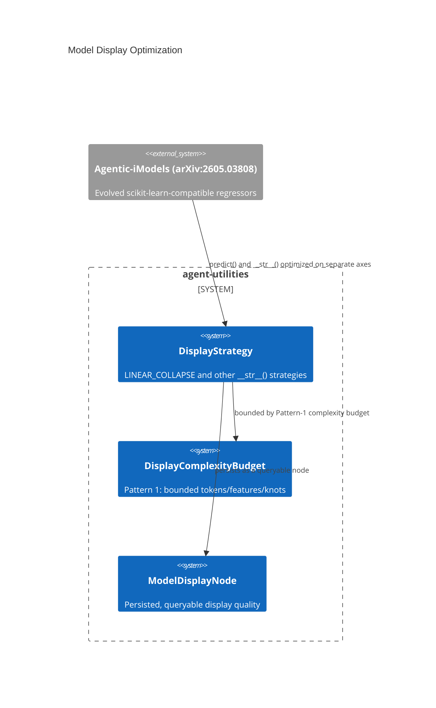

# Design Document: Model Display Optimization (display-predict decoupling)

> Backfilled under the concept-lineage rule (CONCEPT:AU-OS.governance.concept-lineage-parent-doc).

CONCEPT:AU-KG.compute.model-display-optimization

## KG Analysis (Required)

### Nearest Existing Concepts

| Concept ID | Name | Similarity | Pillar |
|---|---|---|---|
| `AU-AHE.evaluation.interpretability-tests` | LLM-graded interpretability tests scoring the SAME evolved models this display strategy renders | 0.60 | AHE |
| `AU-KG.compute.cross-pillar-synergy` | AnalogyEngine finding similar model displays — a downstream consumer | 0.35 | KG |

### Extension Analysis

- **Primary Extension Point**: the Agentic-iModels node models
  (`models/imodel.py`) persisting evolved scikit-learn-compatible regressors
  as first-class KG nodes.
- **Extension Strategy**: augment — display optimization is a second,
  independent objective axis layered onto model persistence, not a new model
  representation.
- **New Concept Required?**: No.

## Decision — optimize what the model SAYS independently of what it PREDICTS

`CONCEPT:AU-KG.compute.model-display-optimization` — `knowledge_graph/core/model_display.py:4`,
`models/imodel.py:8,39,46`.

**The problem**, drawn from Microsoft Research's Agentic-iModels paper
(arXiv:2605.03808): coding agents iteratively evolve scikit-learn-compatible
regressors optimized for BOTH predictive accuracy and LLM readability via
their `__str__()` output. Left coupled, optimizing a model's internal
structure for accuracy tends to produce a `__str__()` representation that is
either too verbose for an LLM to reason over cheaply, or so compressed it
loses the structure an LLM would need to reason about it at all.

**The rejected alternative**: let display fall out of whatever internal
representation the model's `predict()` logic ends up with — the common case
in ordinary ML tooling, where `__str__()` is an afterthought. It couples two
objectives (accuracy and human/LLM readability) that should be tuned
independently.

**The design chosen**: `DisplayStrategy` (`models/imodel.py:43-55`) is a
`StrEnum` of optimization strategies applied to `__str__()` INDEPENDENTLY of
`predict()` — e.g. `LINEAR_COLLAPSE` reduces all features to
`y = ax₀ + bx₁ + c` form regardless of the model's actual internal
representation. Three patterns from the paper are implemented as named
guardrails, not folklore: **Pattern 1 — bounded display complexity**
(`DisplayComplexityBudget`, a hard cap on tokens/features/knots so a display
never grows unbounded with model complexity); **Pattern 2 — display-predict
decoupling** (the core decision — two separate optimization axes, this
document's subject); **Pattern 3 — reward-hacking resistance** (`SmartAdditive`
adaptive display, guarding against a model that games the display metric by
producing a technically-compact but semantically-misleading `__str__()`).
Optimized displays persist as `ModelDisplayNode`s in the KG, so a display
strategy's quality is itself queryable and comparable across model variants,
not regenerated ad hoc.

**What breaks if violated**: coupling display optimization back into
`predict()` tuning (rather than treating `DisplayStrategy` as an independent
axis) reintroduces the exact trade-off the paper's Pattern 2 exists to avoid
— a model tuned purely for accuracy degrades LLM readability, or vice versa,
with no way to improve one without regressing the other.

## C4 Context Diagram

## Data Flow

1. **ORCH**: none directly.
2. **KG**: `ModelDisplayNode`s persist optimized display representations;
   `ContextCompactor` (`AU-KG.memory.tiered-memory-caching`) uses display
   budgets when composing prompts.
3. **AHE**: `evolutionary-aggregation` (VariantPool) tournament-selects model
   variants; `interpretability-tests` LLM-grades the resulting `__str__()`
   output — the objective this display optimization is tuned against.
4. **ECO**: none directly.
5. **OS**: none.

## Risk Assessment

- **Blast Radius**: `knowledge_graph/core/model_display.py`, `models/imodel.py`.
- **Backward Compatible**: Yes — additive display layer over existing
  Agentic-iModels persistence; a model without an optimized display falls back
  to its raw `__str__()`.
- **Breaking Changes**: None.
- **Known weak point**: Pattern-3 reward-hacking resistance is a mitigation,
  not a proof — a sufficiently adversarial evolution loop could still find a
  `__str__()` that scores well on the interpretability test while being
  substantively misleading about the model's actual behavior.
