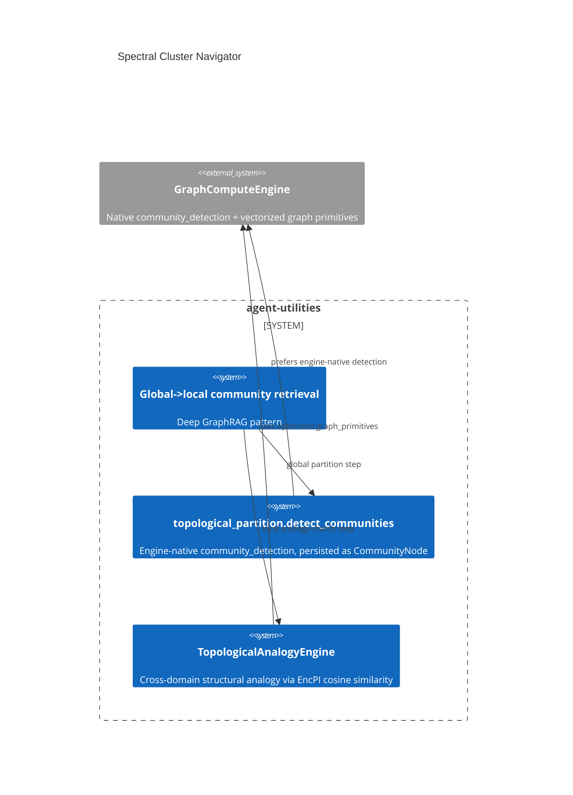

# Design Document: Spectral Cluster Navigator (topological analysis over the engine)

> Backfilled under the concept-lineage rule (CONCEPT:AU-OS.governance.concept-lineage-parent-doc).
> Two sibling markers (`topological-analogy`, `topological-mincut-partitioning`)
> are the two concrete engines this concept names and point at this document.

CONCEPT:AU-KG.compute.spectral-cluster-navigator ·
CONCEPT:AU-KG.compute.topological-analogy ·
CONCEPT:AU-KG.compute.topological-mincut-partitioning

## KG Analysis (Required)

### Nearest Existing Concepts

| Concept ID | Name | Similarity | Pillar |
|---|---|---|---|
| `AU-KG.compute.graph-compute-engine` | the Rust GraphComputeEngine both sub-engines run their algorithms on | 0.60 | KG |
| `AU-KG.compute.cross-pillar-synergy` | AnalogyEngine reused there for finding similar model displays | 0.40 | KG |

### Extension Analysis

- **Primary Extension Point**: `GraphComputeEngine`'s native
  `community_detection` and vectorized embedding primitives.
- **Extension Strategy**: augment — both sub-engines are algorithms layered
  on the existing compute engine, not a new graph substrate.
- **New Concept Required?**: No.

## Decision — global→local structural retrieval over the live engine, not a static index

`CONCEPT:AU-KG.compute.spectral-cluster-navigator` —
`knowledge_graph/core/topological_analysis_engine.py:97` ("Global→local
community retrieval, Deep GraphRAG"), `models/knowledge_graph.py:211,240,264,266`.

**The problem**: retrieval over a large, densely-connected graph needs a way
to narrow "where in the graph is the answer" (global structure — which
community/cluster) before "what within that region is relevant" (local
detail) — the Deep GraphRAG pattern. Doing this by re-running community
detection from scratch on every query, or maintaining a hand-built static
cluster index that drifts from the live graph, are both real costs.

**The rejected alternative**: a precomputed, periodically-rebuilt cluster
index maintained outside the graph engine. It goes stale between rebuilds and
duplicates state the engine's own community-detection primitives already
compute correctly.

**The design chosen**: `spectral-cluster-navigator` names the umbrella
capability — global→local structural retrieval — realized by TWO concrete
engines running directly against the live `GraphComputeEngine`, so retrieval
always reflects current graph state rather than a stale precomputed index:

### topological-mincut-partitioning — the global partition

`CONCEPT:AU-KG.compute.topological-mincut-partitioning` —
`knowledge_graph/core/topological_partition.py:3,24,152`.

`detect_communities` (`topological_partition.py:21`) tries the engine's
native `community_detection` FIRST (`hasattr(graph, "community_detection")`)
and groups the raw `(node_id, label)` output into community sets — preferring
the engine's own algorithm over a Python-side reimplementation so partitioning
stays consistent with whatever community-detection method the engine
natively supports. Stable communities are persisted back to the backend as
`CommunityNode`s, so the global partition is itself a queryable KG fact, not
a value recomputed and discarded on every call.

### topological-analogy — the local, cross-domain match within/across partitions

`CONCEPT:AU-KG.compute.topological-analogy` —
`knowledge_graph/core/analogy_engine.py:4`.

`TopologicalAnalogyEngine` finds analogous subgraphs across DIFFERENT domains
using topological similarity — cosine similarity over vectorized embeddings
(EncPI) plus the engine's optimized graph primitives (`graph_primitives as
rx`) — enabling cross-domain innovation extraction and structural pattern
matching. Persisted as `AnalogyMatchNode`s. This is the "local" half of the
global→local pattern: once mincut partitioning has narrowed the search space,
analogy matching finds the structurally similar region within or across
those partitions.

**What breaks if violated**: reimplementing community detection in Python
instead of calling the engine's native `community_detection` when available
produces a partition that can disagree with the engine's own view of graph
structure — two different "which community is this node in?" answers
depending on which code path asked. Caching a community partition without
persisting it as a `CommunityNode` (or an analogy match without an
`AnalogyMatchNode`) loses the "queryable KG fact, not a throwaway value"
property both sub-engines are built to provide.

## C4 Context Diagram

## Data Flow

1. **ORCH**: not directly — a retrieval-time structural narrowing step.
2. **KG**: `CommunityNode`s and `AnalogyMatchNode`s persist both sub-engines'
   output as queryable graph facts.
3. **AHE**: none directly.
4. **ECO**: none directly.
5. **OS**: none.

## Risk Assessment

- **Blast Radius**: `knowledge_graph/core/topological_analysis_engine.py`,
  `knowledge_graph/core/topological_partition.py`,
  `knowledge_graph/core/analogy_engine.py`, `models/knowledge_graph.py`.
- **Backward Compatible**: Yes — `detect_communities` falls back gracefully
  when the engine lacks native `community_detection`.
- **Breaking Changes**: None.
- **Known weak point**: persisted `CommunityNode`/`AnalogyMatchNode` facts can
  go stale relative to a graph that has mutated since the last detection run —
  nothing here automatically re-triggers detection on graph change; a caller
  must re-run it.
