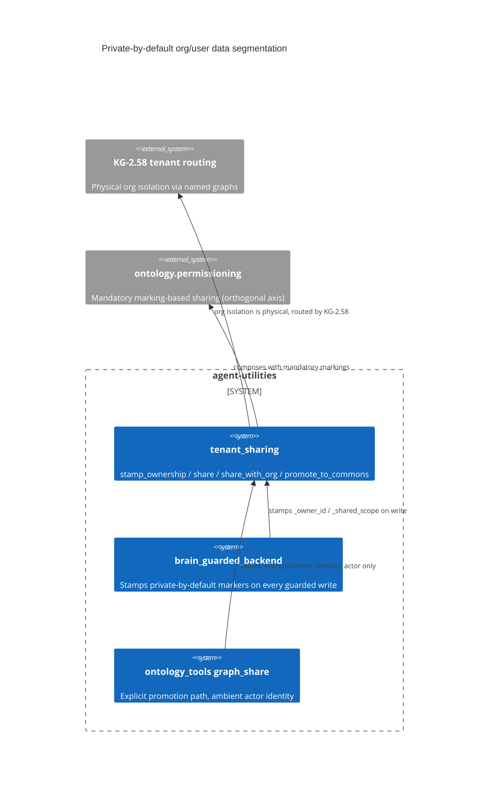

# Design Document: Private-by-default org/user data segmentation

> Backfilled under the concept-lineage rule (CONCEPT:AU-OS.governance.concept-lineage-parent-doc).
> The id `data-is-private-its` is a slugified prose fragment ("Data is
> private-to-its-owner by default") rather than a chosen name, but it marks a
> real, six-module design — it is deliberately kept and documented, not
> retired. A governed rename is tracked separately (D-CC-1) because the
> current mechanism supports document/parent/retire but not rename.

CONCEPT:AU-KG.compute.data-is-private-its

## KG Analysis (Required)

### Nearest Existing Concepts

| Concept ID | Name | Similarity | Pillar |
|---|---|---|---|
| `KG-2.58` | tenant → named-graph routing, the physical isolation layer this builds on | 0.70 | KG |

### Extension Analysis

- **Primary Extension Point**: KG-2.58 tenant→named-graph routing and the
  `ontology.permissioning` markings system.
- **Extension Strategy**: augment — this adds a LOGICAL layer (owner/scope
  markers) inside the physical isolation KG-2.58 already provides; it does not
  change how tenants are routed to graphs.
- **New Concept Required?**: No.

## Decision — org isolation is physical; user privacy within an org is logical, and private by default

`CONCEPT:AU-KG.compute.data-is-private-its` — `knowledge_graph/core/tenant_sharing.py:1-29`.

**The problem**: an org needs hard isolation from every other org, but WITHIN
one org, individual users still need privacy from each other by default,
while being able to cheaply share a node with their org, or promote it further
into a cross-org commons — without three different mechanisms for three
different sharing directions.

**The rejected alternative**, implicit in the "locked model" language: making
user-level privacy also a physical boundary (a graph per user) would multiply
KG-2.58's graph count by user count instead of org count, and would turn
"share with my org" into a data COPY between graphs instead of a cheap
in-place flag flip.

**The design chosen** — three deliberately distinct isolation mechanisms,
composed rather than unified into one:

1. **Org = the physical isolation boundary.** Each org routes to its own named
   graph `tenant__<slug>__<base>` (KG-2.58) — cross-org isolation is physical,
   not a filter that could be bypassed by a query bug.
2. **User privacy within an org = logical, private by default.** Every
   guarded write stamps `_owner_id` (the writing actor) and `_shared_scope`.
   A user sees their own nodes plus anything shared to the org. "Share with my
   org" (`share_with_org`) is a cheap in-place scope flip — never a data move.
3. **The default graph is the COMMONS**, readable across orgs.
   `promote_to_commons` is the ONE operation that copies data across graphs —
   "share by WHERE it is placed." Markings (`mark`, via the orthogonal,
   MANDATORY `ontology.permissioning` system) are "share by HOW it is
   placed" — a second, independent control axis, not a substitute for scope.

Visibility for a non-privileged verified actor composes with the existing
tenant `scope()` predicate as four cases (`tenant_sharing.py:18-24`): `own`
(`_owner_id == actor.actor_id`), `org` (`_shared_scope IN ('org','commons')`
inside the org graph), `unowned` (`_owner_id IS NULL` — legacy/system data,
never hidden), `commons` (anything in the commons graph, read-union). Only an
actor carrying the explicit `kg:admin` CAPABILITY (not a generic `admin`
application role) is unrestricted by owner/scope visibility — tenant and ACL
boundaries still apply even then.

The explicit promotion path (`mcp/tools/ontology_tools.py:1981`) makes the
actor/owner identity ambient (resolved from the authenticated session), never
caller-supplied — a request cannot claim to share a node on behalf of another
owner.

**What breaks if violated**: a write path that skips stamping `_owner_id`/
`_shared_scope` (bypassing `stamp_ownership`) produces a node with undefined
visibility — depending on the query path, it could default to invisible
(orphaned, unreachable even by its own creator) or, worse, visible org-wide
when it was meant to be private. Accepting a caller-supplied owner id instead
of the ambient actor identity would let one user promote or share data on
another user's behalf.

## C4 Context Diagram

## Data Flow

1. **ORCH**: none directly.
2. **KG**: every guarded write is stamped; every read composes the
   owner/scope predicate with the tenant `scope()` predicate.
3. **AHE**: none directly.
4. **ECO**: `graph_share`-style MCP tool exposes the explicit promotion path.
5. **OS**: `kg:admin` capability (not a generic role) is the only bypass of
   owner/scope visibility; tenant and ACL boundaries are never bypassed.

## Risk Assessment

- **Blast Radius**: `knowledge_graph/core/tenant_sharing.py`,
  `knowledge_graph/backends/brain_guarded_backend.py`,
  `knowledge_graph/orchestration/engine_query.py`,
  `knowledge_graph/core/graph_compute.py`, `mcp/tools/ontology_tools.py`.
- **Backward Compatible**: Yes — additive visibility layer over existing
  KG-2.58 tenant routing.
- **Breaking Changes**: None.
- **Known weak point**: the concept id itself is a slugified prose fragment
  rather than a chosen name (see D-CC-1) — it is discoverable in code search
  but not self-explanatory in a concept listing; a governed rename is tracked
  separately since the current concept-lifecycle mechanism has no `rename`
  disposition.
