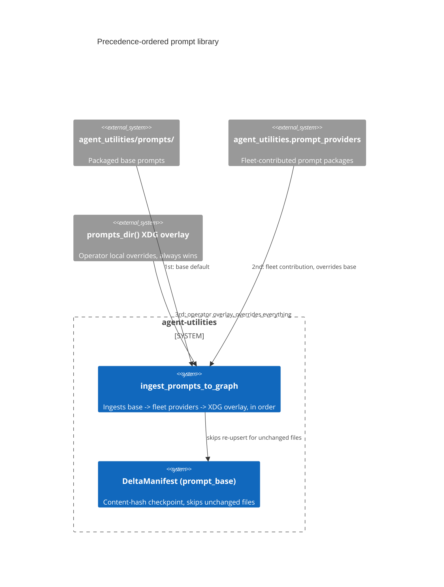

# Design Document: Precedence-ordered prompt library (base < fleet < operator overlay)

> Backfilled under the concept-lineage rule (CONCEPT:AU-OS.governance.concept-lineage-parent-doc).

CONCEPT:AU-KG.compute.user-override-prompt-library

## KG Analysis (Required)

### Nearest Existing Concepts

| Concept ID | Name | Similarity | Pillar |
|---|---|---|---|
| `EG-KG.storage.nonblocking-checkpoint` | the content-hash checkpoint gating re-ingest of unchanged prompt files | 0.55 | KG |

### Extension Analysis

- **Primary Extension Point**: `ingest_prompts_to_graph` — the KG-native
  prompt-discovery mechanism replacing the legacy static `NODE_AGENTS.md`
  registry.
- **Extension Strategy**: augment — override precedence is a resolution rule
  layered on top of KG-native prompt ingestion, not a new prompt format.
- **New Concept Required?**: No.

## Decision — later-registered sources override earlier ones of the same id, deterministically

`CONCEPT:AU-KG.compute.user-override-prompt-library` — `agent/registry_builder.py:288`.

**The problem**: prompts come from three tiers that must compose
predictably — the packaged base prompts shipped with agent-utilities
(`agent_utilities/prompts/`), prompts contributed by fleet packages via the
`agent_utilities.prompt_providers` entry-point mechanism, and an operator's
own XDG overlay (`prompts_dir()`) for local customization. When more than one
tier defines a prompt under the same namespaced id, which one wins must be a
rule, not an accident of ingestion order.

**The rejected alternative**: the legacy static `NODE_AGENTS.md` registry —
prompts hand-listed in a document, with no mechanism for a fleet package or an
operator to override a base prompt without editing that shared file directly.

**The design chosen**: `ingest_prompts_to_graph` (`registry_builder.py:284-302`)
ingests all three tiers **in precedence order** — packaged base prompts
first, then every fleet-contributed `agent_utilities.prompt_providers`
package, then the operator's XDG overlay last — and a later source
overrides an earlier one of the SAME namespaced id via `_upsert_node`. The
operator's local overlay therefore always has the final word over any prompt
id it defines, without needing to know or edit what the base package or a
fleet plugin shipped. Re-ingestion is made cheap by a durable content-hash
checkpoint (`EG-KG.storage.nonblocking-checkpoint`, `DeltaManifest` category
`"prompt_base"`): a file whose content hash is unchanged since last recorded
skips its `_upsert_node` call entirely; a new or changed file is re-upserted
and re-recorded. The checkpoint is explicitly best-effort — if it can't be
constructed, every file is treated as untracked and always upserted (the
prior, safe, full-re-upsert-every-run behavior) — so a checkpoint failure
degrades to correctness at the cost of redundant writes, never to a missed
override.

**What breaks if violated**: ingesting the three tiers out of order (or
letting an earlier tier's write silently win over a later one) means an
operator's XDG override — or a fleet package's contributed prompt — can be
silently shadowed by the packaged base default, with no error and no
indication the override never took effect.

## C4 Context Diagram

## Data Flow

1. **ORCH**: `AgentTemplate` nodes (`registry_builder.py:272`) reference a
   prompt via `USES_PROMPT`, so override precedence determines which prompt
   content a specialist actually runs with.
2. **KG**: `PromptNode`s are upserted in strict tier order; the checkpoint
   avoids redundant writes for unchanged files.
3. **AHE**: none directly.
4. **ECO**: fleet packages contribute prompts via the
   `agent_utilities.prompt_providers` entry-point mechanism, a cross-package
   extension seam.
5. **OS**: the operator's XDG overlay is the local-customization boundary —
   the one tier that always wins, by design.

## Risk Assessment

- **Blast Radius**: `agent/registry_builder.py`,
  `knowledge_graph/ingestion/manifest.py` (`DeltaManifest`).
- **Backward Compatible**: Yes — a deployment with no fleet providers or XDG
  overlay ingests only the base tier, identical to prior behavior.
- **Breaking Changes**: None.
- **Known weak point**: precedence is enforced purely by INGESTION ORDER
  (`_upsert_node` called later wins) — there is no explicit priority field on
  a `PromptNode`, so auditing "why did this prompt win" requires knowing the
  ingestion order convention rather than reading a stored priority value.
