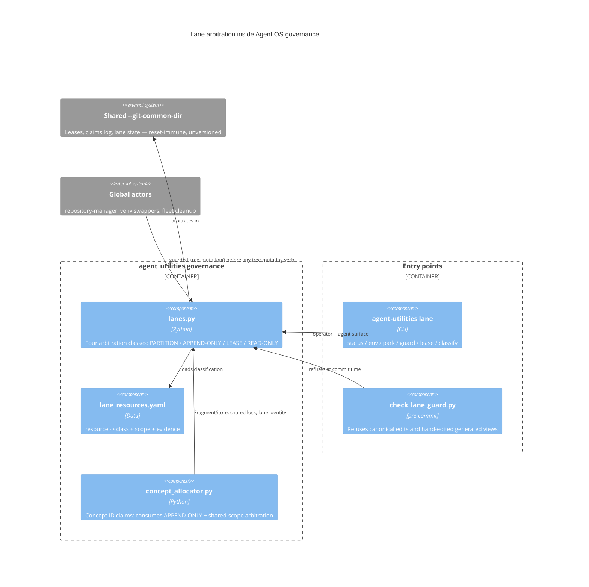

# Design Document: Lane concurrency — four arbitration classes

> Concurrent development by many agent sessions and many humans on one shared
> repository, without destroying each other's work. Implementation:
> `agent_utilities/governance/lanes.py`; user-facing doc:
> [`docs/architecture/lane-concurrency.md`](../../../docs/architecture/lane-concurrency.md).

## KG Analysis (Required)

### Nearest Existing Concepts

| Concept ID | Name | Similarity | Pillar |
|---|---|---|---|
| CONCEPT:AU-OS.governance.concept-id-allocation | Multi-session concept-ID allocation | ~55% | AU-OS |
| CONCEPT:AU-OS.governance.reserve-concepts-hook | Auto-reserve CONCEPT markers on write | ~40% | AU-OS |
| CONCEPT:AU-ORCH.scheduling.soft-timeout-lease-quarantine | Soft-timeout lease + quarantine | ~35% | AU-ORCH |
| CONCEPT:AU-OS.state.unified-durable-state-externalization | Advisory-lock daemon leadership | ~30% | AU-OS |

### Extension Analysis

- **Primary Extension Point**: `CONCEPT:AU-OS.governance.concept-id-allocation`
- **Extension Strategy**: generalize — the concept allocator already solved *one*
  instance of "many worktrees contend for one shared file", but solved it only for
  concept IDs and solved it incorrectly across worktrees (its lock was keyed by the
  worktree path, so two worktrees took two unrelated locks, and its ledger root came
  from `__file__`, so an editable install pointed every lane at the canonical tree).
  The fix generalizes its mechanism and then re-consumes it.
- **New Concept Required?**: Yes — the allocator concept covers concept IDs only;
  the contended resources here include the cargo target dir, `refs/stash`, the
  pytest basetemp, the shared venv/lock, `pre-commit --all-files`, reconciliation
  merges, and the canonical checkout itself. Those are not concept-ID allocation.

### New Concept Proposal

| Proposed ID | Class it implements | Why it cannot be an extension |
|---|---|---|
| `AU-OS.governance.lane-arbitration-classes` | the taxonomy + the data-driven registry | No existing concept classifies shared resources at all; this is the routing layer the other four hang off. |
| `AU-OS.governance.canonical-checkout-immutable` | READ-ONLY | The canonical checkout was governed only by prose in `AGENTS.md`, which was violated; nothing in the codebase expressed or enforced it. |
| `AU-OS.governance.shared-scope-lease` | LEASE | Advisory-lock leadership (`AU-OS.state...`) elects a *daemon* over a database; this arbitrates *developer* operations across worktrees and across the host, with defer-not-block semantics and dead-holder reclaim. |
| `AU-OS.governance.lane-partitioned-resources` | PARTITION | No existing concept covers deriving per-lane instances of build/test/stash state; the previous answer was an unenforced convention. |
| `AU-OS.governance.append-only-fragment-fold` | APPEND-ONLY | The allocator's ledger was a whole-file rewrite. The fragment/fold pattern is now the generic mechanism, consumed by both the reservation ledger and the deferred register. |

- **Augments Pillar**: OS (Agent OS — governance)
- **Pipeline integration**: developer/build-time governance. It is consumed by the
  `lane-guard` pre-commit gate, the `agent-utilities lane` CLI, and
  `concept_allocator`, which is itself consumed by `build_concepts_yaml` and the
  `concept_registry` MCP action.
- **Justification**: every collision in the evidence base is an instance of "a
  global actor mutated state a lane owned". Solving them one at a time is what
  produced the unenforced conventions that failed; the taxonomy is what makes each
  new shared resource route to an already-proven mechanism.

## C4 Context Diagram

## Evidence base

Ten documented rule violations in one day, each already forbidden in writing:
a canonical-checkout mutation that destroyed ~20 minutes of a lane's work
mid-pre-commit; six `refs/stash` collisions across 38 worktrees plus a seventh by
an actor with the never-stash rule in front of it; a shared `CARGO_TARGET_DIR`
that corrupts concurrent builds; a shared venv that rotted silently for 10 days
and hid 13 real defects; a whole-file-rewritten reservation ledger needing repair
by hand-verified line-union; a reconcile that could not see a worktree's own
markers; 26 commits stranded on a detached HEAD.

## Verification

`tests/unit/test_lanes.py` (30 tests) and `tests/unit/test_concept_allocator.py`
(11 tests). The guards are proved by behaviour, not existence: the canonical guard
refuses and names the remedy; two worktrees reserving concurrently both keep their
claim; the same id claimed from two worktrees has exactly one winner; a lease taken
in one worktree blocks another, defers rather than blocks, and is reclaimed from a
dead holder; `lane park` clears the tree with `refs/stash` demonstrably untouched;
reconcile sees a marker that landed on a feature branch.

## Residual gap (explicitly not closed)

A lease binds only actors that take it; an unwrapped external process still races.
This closes only by making the guarded wrapper the sole way the long operation is
run, paired with activity detection for actors that never take a lease. Tracked as
`D-CP-8` in `reports/PROGRAM.md`.
