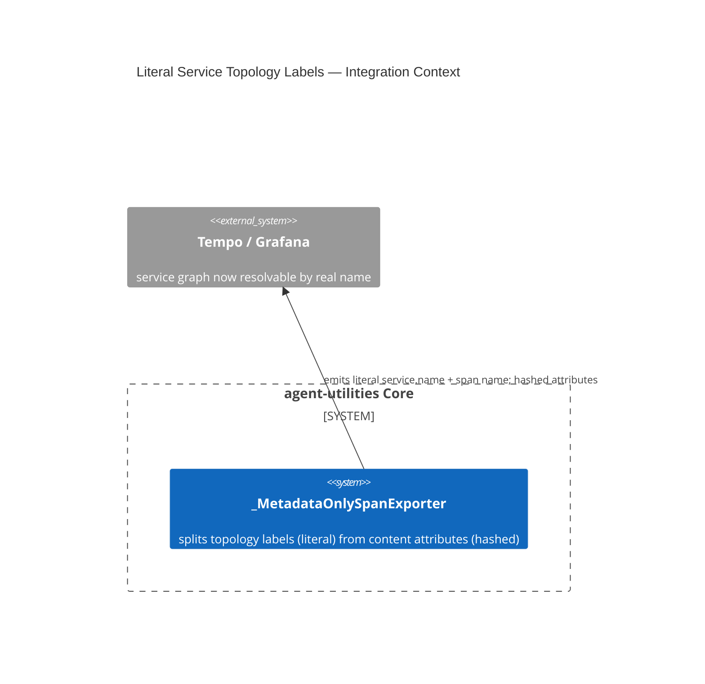

# Design Document: Literal Service/Operation Topology Labels in OTel Spans (D-OG-2)

> Real, substantive coverage already exists in
> [`docs/architecture/configuration.md`](../../../docs/architecture/configuration.md)
> (the "Content boundary" section) plus the fix's own before/after test —
> written alongside the code in `459e2a31`. This file is a **pointer**, not
> a rewrite.

CONCEPT:AU-OS.observability.literal-service-topology-labels

## KG Analysis (Required)

### Nearest Existing Concepts

| Concept ID | Name | Similarity | Pillar |
|---|---|---|---|
| `AU-OS.governance.truthful-state-invariant` | a different truthfulness concern (status re-derivation, not content-vs-topology redaction) | 0.20 | OS |
| `AU-OS.observability.otlp-trace-fanout` | sibling OTel exporter concept, same subsystem, different guarantee | 0.35 | OS |

### Extension Analysis

- **Primary Extension Point**:
  `agent_utilities/observability/custom_observability.py`
  (`_MetadataOnlySpanExporter`).
- **Extension Strategy**: augment — split what gets hashed from what stays
  literal, within the existing metadata-only exporter.
- **New Concept Required?**: Yes.

### New Concept Proposal

- **Proposed ID**: `CONCEPT:AU-OS.observability.literal-service-topology-labels`
- **Augments Pillar**: OS (domain `observability`)
- **15-Phase Pipeline Integration**: cross-cutting — every emitted span.
- **Justification**: `_MetadataOnlySpanExporter` hashed `service.name` and
  span/operation names **uniformly** with content attributes, making
  Tempo/Grafana service discovery and the service graph unusable — a real
  Tempo trace before the fix showed `service.name=pref_service_8ed48b44...`
  instead of `graph-os`. The alternative (keep hashing everything uniformly,
  for implementation simplicity) is rejected because it conflated
  **topology** (which service, which operation — fixed strings/enum-like
  identifiers) with **content** (request/response data, which must stay
  redacted). This is a privacy-policy line, not a code-simplicity one — the
  deferred item (D-OG-2) explicitly notes it required the
  `PersistencePrivacyGuard` owner's sign-off. Fix: service name and span
  name are now emitted literally (`graph-os`, `engine.GetNodeProperties`);
  every other span/resource **attribute** stays hashed exactly as before.

## C4 Context Diagram

## Data Flow

1. **ORCH**: none directly.
2. **KG**: none.
3. **AHE**: none.
4. **ECO**: none.
5. **OS**: this IS the OS-pillar privacy-boundary decision — the dividing
   line between "topology, safe to emit literally" and "content, must stay
   redacted."

## Risk Assessment

- **Blast Radius**: every emitted OTel span, across every traced service.
- **Backward Compatible**: Yes — pre-fix hashed labels are simply replaced
  with literal ones; no consumer depended on the hashed form (it was
  useless for its stated purpose).
- **Breaking Changes**: any dashboard/query built against the old hashed
  `service.name` values would need updating (unlikely, since those hashes
  were unusable for filtering by design).
- **What would make this wrong later**: the safety argument depends on
  service names and span names always being **fixed strings or enum-like
  identifiers**, never built from user- or model-controlled input. If a
  future span name is ever constructed from request content (e.g.
  interpolating a tool argument into a span name for readability), it would
  silently reintroduce a content leak through a field this fix just
  declared safe to emit literally.
