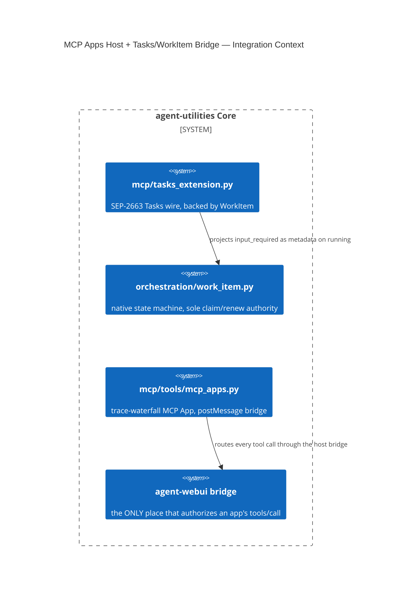

# Design Document: MCP Apps Host + Tasks/WorkItem Bridge

> Both concepts share commit `b80961a7` (`AU-ECO.mcp.tasks-workitem-bridge`
> lands there; `AU-ECO.ui.mcp-apps-host`, first introduced in `6f303784`
> "ship the trace-waterfall MCP App", D-25-1, is extended there). Documented
> together because `mcp/tools/mcp_apps.py` is the shared file both touch, but
> they are two distinct trust-boundary decisions — kept as separate concept
> ids, one shared doc.

CONCEPT:AU-ECO.mcp.tasks-workitem-bridge ·
CONCEPT:AU-ECO.ui.mcp-apps-host

## KG Analysis (Required)

### Nearest Existing Concepts

| Concept ID | Name | Similarity | Pillar |
|---|---|---|---|
| `AU-ORCH.dispatch.workitem-consent-gate` | adjacent WorkItem concept (consent, not the MCP Tasks wire mapping) | 0.40 | ORCH |
| `AU-ECO.mcp.webui-governed-mcp-delegation` | sibling trust-boundary decision (host-authorizes-the-call pattern) | 0.35 | ECO |

### Extension Analysis

- **Primary Extension Point**: `mcp/server_factory.py` / `mcp/
  tasks_extension.py` / `orchestration/work_item.py` for the Tasks bridge;
  `mcp/kg_server.py` / `mcp/tools/mcp_apps.py` for the Apps host.
- **Extension Strategy**: augment (Tasks bridge projects onto the existing
  `WorkItem` state machine); new, narrowly-scoped module (Apps host).
- **New Concept Required?**: Yes for both.

### New Concept Proposal

1. **`AU-ECO.mcp.tasks-workitem-bridge`** — deliberately does **not** mount
   `fastmcp_tasks.extension.TasksExtension` wholesale, because its engine is
   hard-wired to Docket/Redis, which `AU-P1-1` forbids duplicating as a
   second job system. Only the extension's *registration mechanism* is
   reused; the actual state is backed directly by the existing `WorkItem`
   state machine. The wire protocol's `input_required` status is modeled as
   `pending_input_request`/`pending_input_response` **metadata** on top of
   the existing `running` state — deliberately not a new `WORK_ITEM_STATES`
   value — so a worker can still heartbeat/checkpoint normally while
   waiting on input.
2. **`AU-ECO.ui.mcp-apps-host`** — apps (the trace-waterfall viewer, D-25-1)
   communicate with their host **only** via a `postMessage` JSON-RPC bridge
   (`mcpapp/ready → init → tool-call → tool-result|tool-error`). The module
   explicitly disclaims authority: it makes **no claim about what the host
   trusts**, deferring all actual `tools/call` authorization to
   `agent-webui`'s bridge. Registered outside `register_tool_surface`
   because it is a single-purpose tool+resource pair, not an
   action-routed dispatcher.

- **Augments Pillar**: ECO (domains `mcp` and `ui` respectively).
- **15-Phase Pipeline Integration**: Phase 3 (Execute) for the Tasks bridge
  (claim/renew/input-request path); presentation layer (no pipeline phase)
  for the Apps host.
- **Justification**: neither the SEP-2663 Tasks wire mapping onto a native
  work-item state machine, nor a sandboxed-app-to-host tool-call bridge with
  explicit authority disclaimed, existed as a concept before.

## C4 Context Diagram

## Data Flow

1. **ORCH**: Tasks bridge claim/renew calls the native `WorkItem` state
   machine directly, never a second job engine.
2. **KG**: none new — reuses existing `WorkItem` node fields.
3. **AHE**: none.
4. **ECO**: both are ECO-pillar surface concerns — one wire-protocol mapping,
   one UI-embedding trust boundary.
5. **OS**: authorization for app tool calls stays entirely with the host
   bridge (agent-webui), never the app HTML itself — fail-closed by
   construction.

## Risk Assessment

- **Blast Radius**: any MCP client using the Tasks extension against this
  server; any embedded MCP App (currently one: the trace waterfall).
- **Backward Compatible**: Yes — both are additive surfaces.
- **Breaking Changes**: None.
- **What would make this wrong later**: the Tasks bridge diverges
  deliberately from the isolated gateway's older pinned SEP-2663 revision —
  if that draft's field names change again, or if the gateway and native
  server adapters drift in their `input_required` semantics, the mapping
  needs re-deriving. The Apps host explicitly deferred 3 of 5 originally
  planned apps (workflow viewer, evaluation scorecard, ontology diff/approval
  form) — not a design flaw, but scope not yet built. It would go wrong if a
  future app author bypasses the `postMessage` bridge and embeds a direct
  tool-call path in HTML, or if the host bridge's own policy-verification
  gate is bypassed.
