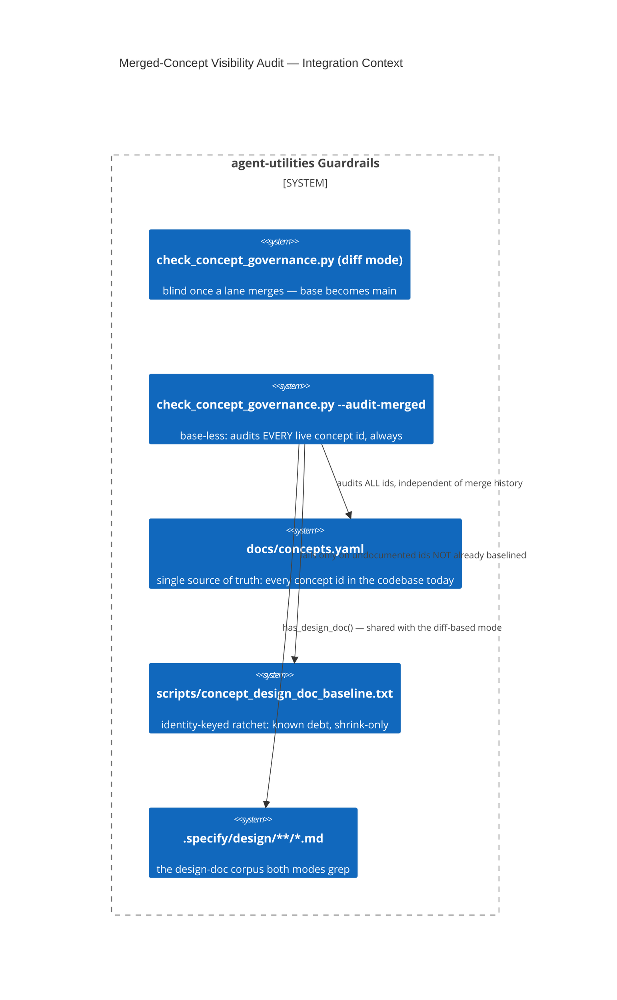

# Design Document: Merged-Concept Visibility Audit (D-RG2-3)

> This is the design doc for the gate change this whole lane exists to make:
> `scripts/check_concept_governance.py --audit-merged`. It closes D-RG2-3
> ("the gate cannot see debt once a lane is merged"), the mechanism behind
> D-RG2-2 (32→39 concepts merged this wave with no design doc, invisible to
> the pre-existing gate the moment they reached `main`).

CONCEPT:AU-OS.governance.merged-concept-visibility-audit

## KG Analysis (Required)

### Nearest Existing Concepts

| Concept ID | Name | Similarity | Pillar |
|---|---|---|---|
| `AU-AHE.evaluation.swallow-baseline-stable-key` | the closest analog: an existing gate hardened with an identity-stable ratchet baseline against the same class of "rots under concurrent lanes" hazard | 0.55 | AHE |
| `AU-OS.governance.truthful-state-invariant` | a sibling "a surface stops reporting the truth once state changes" bug — here, the surface is a governance gate itself, not a status field | 0.35 | OS |

`swallow-baseline-stable-key` is the nearest concept (a ratchet-baseline
design against gate rot) — deliberately **reused as the mechanism**, not
merely referenced: this concept's baseline is keyed by concept id, the
`swallow-baseline-stable-key` concept's core lesson (identity-keyed, not
count-keyed) is directly why a bare count ratchet was rejected here (see
Extension Analysis). Similarity is high but the domain differs enough
(concept-governance vs. exception-swallowing) that this is a new concept
applying that lesson, not an extension of it.

### Extension Analysis

- **Primary Extension Point**: `scripts/check_concept_governance.py`
  (existing diff-based gate).
- **Extension Strategy**: augment — a new mode (`--audit-merged`) on the
  existing script, sharing its `has_design_doc()`/design-corpus scan, not a
  second gate script.
- **New Concept Required?**: Yes.

### New Concept Proposal

- **Proposed ID**: `CONCEPT:AU-OS.governance.merged-concept-visibility-audit`
- **Augments Pillar**: OS (domain `governance`)
- **15-Phase Pipeline Integration**: pre-commit/CI guardrail phase, run
  independent of and in addition to the diff-based check.
- **Justification**: the pre-existing gate resolves its diff base as the
  merge-base against the nearest trunk (`origin/main`/`main`). Once a lane
  merges, `main` itself **becomes** that base, so the diff is empty and the
  gate reports "no new concepts" — permanently, for that concept, regardless
  of whether it ever gets a design doc. Reconciliation gate 2 found this
  empirically: 39 concepts landed across a 39-branch merge wave with no
  design doc, and the gate was GREEN on the resulting `main` the whole time.
  **Not fixed by tightening the diff-based mode** — that mode's entire
  contract is "what changed since the trunk," which is structurally the
  wrong question for "does merged code comply." The fix is a genuinely
  different, **base-less** mode: audit every concept id currently registered
  in `docs/concepts.yaml` (the single generated source of truth for "what
  concepts exist in this codebase today," independent of merge history)
  against the same design-doc corpus.
  - **Why a count ratchet was rejected** (the "suggested shape" in D-RG2-3
    said "ratchets on the count"): a bare integer ratchet cannot distinguish
    "a new gap appeared" from "an old gap was fixed and a different old gap
    appeared" — it can be satisfied by fixing an unrelated entry while a
    genuinely new regression hides behind the same total. This is exactly
    the failure mode `AU-AHE.evaluation.swallow-baseline-stable-key`
    documents for a sibling gate (there: line-number keys rotting under
    concurrent edits; here: a count that can't name *which* concept
    regressed). The baseline is therefore keyed by **concept id**, not a
    count — `scripts/concept_design_doc_baseline.txt`, one id per line.
  - **Adoption without instant redlining**: a bare first run against
    `docs/concepts.yaml` would fail on ~1000+ pre-existing undocumented
    concepts unrelated to this lane (measured: 1120 registered, 1017 without
    a doc before this lane's fixes). The baseline is populated once, via
    `--update-baseline`, immediately after this lane's fixes/retirements —
    freezing the **remaining** known debt as accepted, exactly the adoption
    pattern already used for `swallowed_error_baseline.txt` and
    `env_flag_baseline.txt` elsewhere in this codebase.

## C4 Context Diagram

## Data Flow

1. **ORCH**: none directly.
2. **KG**: none — this audits `docs/concepts.yaml`, a documentation
   artifact, not graph state.
3. **AHE**: none.
4. **ECO**: none.
5. **OS**: this IS the OS-pillar concept-governance gate, extended so its
   guarantee survives past the one event (merge) that previously silenced
   it.

## Risk Assessment

- **Blast Radius**: every concept id ever registered in `docs/concepts.yaml`
  — but only *newly*-undocumented-and-unbaselined ids fail the gate; existing
  baselined debt is untouched.
- **Backward Compatible**: Yes — the diff-based mode is unchanged; this is a
  strictly additive mode, opt-in via `--audit-merged`.
- **Breaking Changes**: None to the existing mode. Wiring this into CI
  (`.github/workflows/concept-governance.yml` gains a `push: branches:
  [main]` job running `--audit-merged`) means a future PR that merges a new
  undocumented concept will show red on `main` afterward — new, intentional
  behavior, not a break of anything currently green (the baseline absorbs
  all current debt at adoption).
- **What would make this wrong later**: the ratchet only catches a concept
  that is *undocumented*; it does not distinguish "genuinely no design
  decision was made" from "the doc exists but is filler" — a templated,
  content-free design doc satisfies `has_design_doc()`'s literal
  string-match just as well as a real one. This gate proves *presence*, not
  *quality*, of a design doc — a human/reviewer judgment call this
  automation cannot replace (the same limitation the original diff-based
  gate always had). It would also go stale if a future concept-registry
  format change moves away from `docs/concepts.yaml` without updating
  `all_registered_concepts()` to match.
