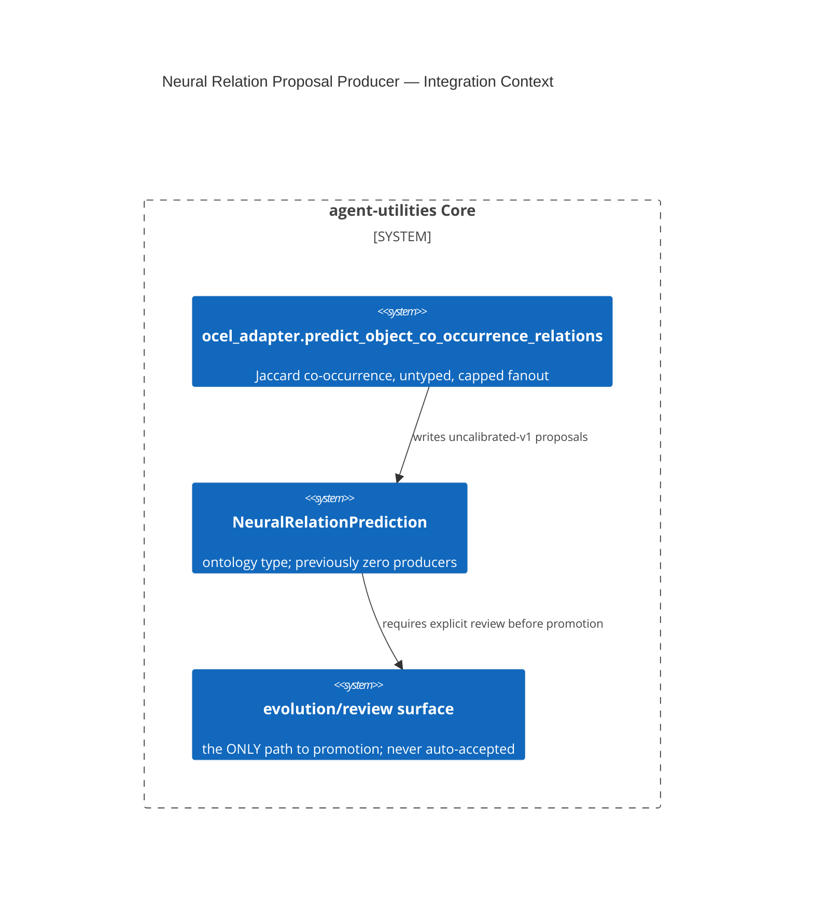

# Design Document: Honest Structural Neural-Relation-Prediction Producer (OCEL)

CONCEPT:AU-KG.evolution.neural-relation-proposal-producer

## KG Analysis (Required)

### Nearest Existing Concepts

| Concept ID | Name | Similarity | Pillar |
|---|---|---|---|
| `AU-KG.ontology.evolution-governed-loop` | sibling evolution-governance concept, different subsystem (ontology change vs. relation prediction) | 0.30 | KG |

### Extension Analysis

- **Primary Extension Point**: `knowledge_graph/ingestion/ocel_adapter.py`
  (`predict_object_co_occurrence_relations`).
- **Extension Strategy**: new producer for an existing ontology type
  (`NeuralRelationPrediction`) that previously had zero producers when this
  lane branched.
- **New Concept Required?**: Yes.

### New Concept Proposal

- **Proposed ID**: `CONCEPT:AU-KG.evolution.neural-relation-proposal-producer`
- **Augments Pillar**: KG (domain `evolution`)
- **15-Phase Pipeline Integration**: enrichment/evolution phase — proposes
  candidate relations for downstream review, never auto-promotes them.
- **Justification**: `NeuralRelationPrediction` (model + ontology class +
  SHACL shape) existed with no producer anywhere (D-OB-11). The obvious
  alternative — a relation-**aware** neural scorer predicting an actual
  predicate (ComplEx/RotatE-style) — was deliberately rejected because a
  sibling lane (D-73-6) confirmed no reviewed accept/reject label set exists
  for relation *types* anywhere in this codebase; building one now would be
  fabrication, not grounded prediction. This producer instead emits a
  structural, **untyped** co-occurrence signal (Jaccard similarity over
  OCEL event participation) — "these two objects are plausibly related,"
  never *how*. Deliberately excludes any object pair already asserted as a
  `QualifiedObjectRelationship` (never restates ground truth as a
  prediction), caps event fanout at 64 per pair for pairwise expansion
  (defensive against O(n²) blowup), and names its `model_ref` with an
  explicit `"...-uncalibrated-v1"` suffix so nothing downstream reads it as
  a validated probability.

## C4 Context Diagram

## Data Flow

1. **ORCH**: none directly.
2. **KG**: this IS the KG-pillar evolution/enrichment producer for a
   previously-unproduced ontology type.
3. **AHE**: proposals are structural signals, not yet a training/reward
   input — no calibrated label set exists to validate against.
4. **ECO**: none.
5. **OS**: fail-closed by omission — a pair already asserted as related is
   never restated as a "prediction."

## Risk Assessment

- **Blast Radius**: OCEL-ingested object pairs; downstream consumers of
  `NeuralRelationPrediction` nodes.
- **Backward Compatible**: Yes — new producer, no existing contract changed.
- **Breaking Changes**: None.
- **What would make this wrong later**: a **second**, independent producer
  for the same ontology type already exists (`LoopController.
  _mine_predicted_edges`, a real KAN link-predictor, documented in
  CHANGELOG — landed in a sibling commit of the same merge wave). This
  concept's original framing ("zero producers anywhere") is now stale post-
  merge, though it was accurate when this lane branched — a reader should
  not assume this is still the only producer. It would also go wrong if the
  downstream unified-Evidence `process_signal` channel (D-71-1, currently
  only on an unmerged branch) starts consuming this as a calibrated/labeled
  signal rather than the uncalibrated structural heuristic it explicitly is;
  or if the Jaccard co-occurrence approach is ever expected to also emit
  typed relations without the underlying label-set gap (D-73-6) ever being
  closed.
